# Phase 5 Architecture Proposal

## 1. Executive Summary

Phase 5 should introduce a governed knowledge layer that is structurally parallel to Phase 4, not blended into it.

Recommended architecture shape:

- keep **governed knowledge entities** in `public`
- keep **controlled vocabularies and provenance entities** in `public`
- keep **derived technical artifacts** such as chunks, search vectors, and embeddings in `private`
- expose future application/retrieval access through curated `api` surfaces rather than direct grants on implementation tables

Main recommendations:

1. Add a Phase 5 knowledge model centered on:
   - `knowledge_documents`
   - `knowledge_document_versions`
   - `knowledge_document_corpus_states`
   - `knowledge_source_objects`
   - `knowledge_document_version_source_objects`

2. Reuse existing Phase 4 canonical entities where appropriate:
   - `public.rental_types`
   - `public.venue_spaces`
   - `public.rule_catalogue.id` for exact rule-version relationships

3. Keep `public.source_registry` intact and introduce a **separate Phase 5 provenance model** with an optional bridge back to `source_registry`.

4. Recommend a **first-class logical-rule registry keyed by `rule_code`** as the least disruptive way to get true relational integrity for stable knowledge-to-rule relationships.
   - classification: `PHASE_4_ARCHITECTURE_DEPENDENCY`
   - rationale: exact rule-version links are already safe, and the existing stable business code can become the logical parent without adding a second surrogate identity

5. Defer generic tags in the initial Phase 5 implementation.
   - the known corpus is already well covered by category, audience, rental applicability, confidentiality, and rule relationships

6. Keep **corpus eligibility decisions** separate from logical document identity.
   - inclusion, deferral, and exclusion are mutable Phase 5 curation decisions, not document-defining facts

7. Treat chunks and embeddings as **deterministically regenerable indexing artifacts**, not governed truth.

8. Keep **technical pipeline state** out of governed document-version rows.
   - extraction, chunking, indexing, retry, and failure state belong in derived technical entities

9. Separate **confidentiality classification** from **personal-information presence**.
   - confidentiality describes shareability/access posture
   - personal-information presence is source metadata

10. Do **not** mirror Phase 4’s broad `anon` / `authenticated` grants.
   - Phase 5 knowledge is private organizational knowledge
   - default posture should be service-role only until curated access surfaces and authorization are reviewed

Recommended implementation status after this document:

- `PHASE_5_ARCHITECTURE_APPROVED_FOR_IMPLEMENTATION`

## 2. Evidence Inherited From 5.0A

Inherited repository facts that directly constrain Phase 5:

- `public.rule_catalogue.id` is an exact governed rule-version identity
- stable rule identity currently exists only as repeated `rule_code`
- there is no existing first-class logical-rule table
- `public.rental_types` and `public.venue_spaces` are canonical reusable tables
- `public.source_registry` is an existing controlled-source inventory, but not a document/version/source-object model
- Phase 4 uses:
  - `bigint generated by default as identity`
  - UTC timestamps
  - `touch_updated_at()` triggers
  - strong `CHECK`, `UNIQUE`, and FK constraints
  - immutable governed versioning patterns
  - pgTAP tests
  - curated read surfaces through `public.current_*` views and `api.*` functions
- there is currently:
  - no pgvector implementation
  - no pg_trgm implementation
  - no FTS implementation
  - no Phase 5 storage buckets
  - no knowledge-specific security architecture

These conventions should be preserved unless there is a strong repository-specific reason not to.

## 3. Corpus Requirements Inherited From 5.0B

Inherited corpus facts that directly constrain Phase 5:

- the governed corpus is broader than seeded `source_registry`
- some corpus entries are **logical documents without corresponding local physical files**
  - example: `CF-001`
- some corpus entries are **embedded subdocuments**
  - `OPS-003` inside `OPS-002`
  - `SERV-004` inside `SERV-003`
- some corpus entries are **combined logical documents sharing one physical file**
  - `TPL-007` + `TPL-008`
  - `TPL-009` + `TPL-010`
- some corpus entries have **master/export or duplicate-representation drift**
  - `CF-003` / `CF-004`
  - `CF-005` / `CF-006`
  - `COM-001-XLSM` / `COM-001-XLSX`
- the commercial workbook family is deferred
- the facilitator catalogue `SERV-002` is deferred
- older Studio/Full Venue PDF exports are excluded from current active corpus but remain historically relevant
- included documents vary materially in intended audience and confidentiality

Implication:

- Phase 5 must model **logical document**, **governed document version**, and **physical source representation** as separate concepts

## 4. Entity Boundaries

### 4.1 Governed entities

These represent business-governed knowledge truth:

- `knowledge_documents`
- `knowledge_document_versions`

### 4.2 Controlled vocabularies / classifications

These represent governed classification systems:

- `knowledge_categories`
- `knowledge_audiences`
- `knowledge_confidentiality_levels`
- `knowledge_source_object_roles`
- `knowledge_rule_relationship_types`

### 4.3 Corpus curation entities

These represent history-preserving Phase 5 corpus/eligibility decisions:

- `knowledge_document_corpus_states`

### 4.4 Provenance entities

These represent physical/documentary provenance:

- `knowledge_source_objects`
- `knowledge_document_version_source_objects`

### 4.5 Connectivity entities

These connect knowledge to reusable classifications and Phase 4 entities:

- `knowledge_document_version_audiences`
- `knowledge_document_version_rental_types`
- `knowledge_document_version_logical_rules`
- `knowledge_document_version_rule_versions`

### 4.6 Derived technical entities

These are machine-derived and regenerable:

- `knowledge_document_version_processing`
- `knowledge_chunk_sets`
- `knowledge_chunk_set_sources`
- `knowledge_chunk_sources`
- `knowledge_chunks`
- `knowledge_chunk_logical_rules`
- `knowledge_chunk_rule_versions`
- `knowledge_embedding_models`
- `knowledge_embeddings`

### 4.7 Deferred entities

Do not build in initial Phase 5:

- generic tags
- client-file storage entities
- example/case-library ingestion entities
- live retrieval orchestration entities

## 5. Final Proposed Table Architecture

Schema recommendation:

- `public`:
  - governed knowledge entities
  - controlled vocabularies
  - corpus curation entities
  - provenance entities
  - connectivity entities
- `private`:
  - document-version processing state
  - chunk generations
  - chunk extraction provenance
  - chunks
  - embedding-model registry
  - embeddings
  - other derived indexing artifacts
- `api`:
  - future curated access surfaces only

### Governed entities in `public`

#### `public.knowledge_documents`

Purpose:

- stable logical knowledge document identity across revisions

Classification:

- governed truth

#### `public.knowledge_document_versions`

Purpose:

- one governed versioned state of a logical knowledge document

Classification:

- governed truth

### Controlled vocabularies in `public`

#### `public.knowledge_categories`

Purpose:

- controlled document category taxonomy grounded in the 5.0B corpus

Classification:

- controlled classification

#### `public.knowledge_audiences`

Purpose:

- controlled intended-audience taxonomy

Classification:

- controlled classification

#### `public.knowledge_confidentiality_levels`

Purpose:

- controlled document confidentiality/access classification

Classification:

- controlled classification

#### `public.knowledge_source_object_roles`

Purpose:

- controlled roles for physical source representations linked to a document version

Classification:

- controlled classification

#### `public.knowledge_rule_relationship_types`

Purpose:

- controlled relationship semantics between knowledge and Phase 4 rules

Classification:

- controlled classification

### Corpus curation entities in `public`

#### `public.knowledge_document_corpus_states`

Purpose:

- history-preserving corpus eligibility/curation decisions for one logical document

Classification:

- corpus curation

### Provenance entities in `public`

#### `public.knowledge_source_objects`

Purpose:

- one physical or externally referenced source artifact

Classification:

- provenance

#### `public.knowledge_document_version_source_objects`

Purpose:

- relationship between a governed document version and one or more source objects

Classification:

- provenance/connectivity

### Connectivity entities in `public`

#### `public.knowledge_document_version_audiences`

Purpose:

- many-to-many audience classification

Classification:

- connectivity

#### `public.knowledge_document_version_rental_types`

Purpose:

- many-to-many rental applicability using canonical `public.rental_types`

Classification:

- connectivity

#### `public.knowledge_document_version_logical_rules`

Purpose:

- stable logical-rule relationships at document-version level

Classification:

- connectivity

Dependency:

- uses the approved logical-rule strategy

#### `public.knowledge_document_version_rule_versions`

Purpose:

- exact Phase 4 rule-version relationships at document-version level

Classification:

- connectivity

### Derived technical entities in `private`

#### `private.knowledge_document_version_processing`

Purpose:

- mutable technical processing and retry/error state for one governed document version

Classification:

- derived technical data

#### `private.knowledge_chunk_sets`

Purpose:

- one deterministic chunk-generation set for one governed document version

Classification:

- derived technical data

#### `private.knowledge_chunk_set_sources`

Purpose:

- exact provenance links from one chunk set to the version/source-object relationship rows used for extraction

Classification:

- derived provenance/connectivity

#### `private.knowledge_chunk_sources`

Purpose:

- exact source-provenance links for an individual chunk back to governed version/source-object relationships

Classification:

- derived provenance/connectivity

#### `private.knowledge_chunks`

Purpose:

- coherent semantic units generated from one document version under one chunking strategy

Classification:

- derived technical data

#### `private.knowledge_chunk_logical_rules`

Purpose:

- chunk-level stable logical-rule relationships

Classification:

- derived connectivity

Dependency:

- uses the approved logical-rule strategy

#### `private.knowledge_chunk_rule_versions`

Purpose:

- chunk-level exact Phase 4 rule-version relationships

Classification:

- derived connectivity

#### `private.knowledge_embedding_models`

Purpose:

- controlled registry of embedding provider/model/version/configuration families

Classification:

- derived technical data

#### `private.knowledge_embeddings`

Purpose:

- derived semantic-indexing artifacts for chunk content under one registered embedding model family

Classification:

- derived technical data

### Explicitly deferred

#### `knowledge_tags`

Recommendation:

- defer from initial Phase 5 architecture

Reason:

- the known corpus does not justify a second generic taxonomy system in addition to category, audience, confidentiality, rental applicability, and rule relationships

## 6. Logical Document / Version Model

### 6.1 Logical knowledge document definition

A logical knowledge document is the stable identity that survives revision.

Examples:

- `WNC Rental Agreement Template`
- `Studio Rental Terms`
- `WNC Venue Rental Operations Manual`
- `WNC Rental Services Catalogue`

Facts that remain true across versions belong here:

- stable document identity
- stable document code
- canonical title
- stable primary category
- stable logical owner role if ownership is genuinely document-level
- durable descriptive notes
- created/updated audit timestamps

Facts that do **not** belong here:

- corpus inclusion, deferral, or exclusion decisions
- version-specific authority nuance
- effective dates
- exact review/approval metadata
- confidentiality classification
- version-specific audiences
- version-specific rental applicability
- version-specific source representations
- ingestion/indexing state

### 6.2 Proposed `public.knowledge_documents`

Important columns:

- `id bigint primary key`
- `document_code text not null unique`
- `canonical_title text not null`
- `primary_category_id bigint not null references public.knowledge_categories(id)`
- `default_owner_role text`
- `notes text`
- `created_at timestamptz not null default timezone('utc', now())`
- `updated_at timestamptz not null default timezone('utc', now())`

Recommended constraints:

- `document_code` non-empty
- `canonical_title` non-empty

Recommended naming behavior:

- reuse stable corpus codes from 5.0B where they represent logical identity
- examples:
  - `CF-001` for the logical lookbook
  - `COM-001` for the logical commercial workbook
  - `OPS-003` for the embedded logical capacity/space-use rules source

### 6.3 Corpus eligibility belongs in a separate curation entity

Recommendation:

- place corpus decisions in a history-oriented `public.knowledge_document_corpus_states`

Reason:

- `include`, `defer`, and `exclude` are Phase 5 operational curation decisions
- a logical document does not become a different logical document when corpus scope changes
- source-object exclusion must also remain independent of document identity
- corpus decisions such as `defer -> include` should remain traceable over time

Proposed `public.knowledge_document_corpus_states` columns:

- `id bigint primary key`
- `document_id bigint not null references public.knowledge_documents(id) on delete cascade`
- `corpus_status text not null`
- `is_current boolean not null default false`
- `decided_at timestamptz`
- `decision_note text`
- `decided_by_role text`
- `created_at timestamptz not null default timezone('utc', now())`
- `updated_at timestamptz not null default timezone('utc', now())`

Recommended `corpus_status` check:

- `include`
- `defer`
- `exclude`

Recommended constraints:

- partial unique index on `(document_id)` where `is_current = true`
- at most one current corpus decision per logical document

Interpretation:

- `SERV-002` can move from `defer` to `include` without changing `knowledge_documents.id`
- the prior `defer` row remains in history
- current eligibility resolves only from the row where `is_current = true`
- an old PDF export can remain linked historically while a specific version/source relationship is marked excluded from extraction

### 6.4 Governed document version definition

A governed document version represents one reviewable knowledge state for one logical document.

It should preserve:

- immutable version numbering
- governance status
- authority classification
- effective windows when known
- supersession
- confidentiality classification
- version-specific ownership/approval metadata where known

It should **not** carry mutable technical pipeline state.

### 6.5 Future governed versions

Question:

- how should the schema represent a version that is already governed/approved, but should not be current yet?

Options considered:

1. Effective-date semantics only
   - mark the version `active` now and rely only on a future `effective_from`
2. Explicit approved/future status
   - keep the version governed but not current until activation

Recommendation:

- use an explicit `approved` governance state plus effective-date semantics

Why this is cleaner:

- preserves the invariant that only one `active` version exists per logical document
- distinguishes governed/finalized content from `draft`
- avoids overloading `active` to mean both “approved” and “currently in force”

Interpretation:

- `approved` means governed and finalized, but not yet current
- `active` means current and eligible for current retrieval if also inside the effective window
- a future version may be `approved` with a future `effective_from`, or `approved` with activation pending manual release
- a later review may update `last_reviewed_at` without requiring a new document version if the governed content is unchanged

### 6.6 Proposed `public.knowledge_document_versions`

Important columns:

- `id bigint primary key`
- `document_id bigint not null references public.knowledge_documents(id) on delete restrict`
- `version_number integer not null`
- `source_version_label text`
- `governance_status text not null`
- `authority_classification text not null`
- `lifecycle_note text`
- `confidentiality_level_id bigint not null references public.knowledge_confidentiality_levels(id)`
- `effective_from date`
- `effective_until date`
- `supersedes_version_id bigint references public.knowledge_document_versions(id) on delete restrict`
- `approved_at timestamptz`
- `approval_notes text`
- `last_reviewed_at timestamptz`
- `last_review_notes text`
- `version_owner_role text`
- `created_at timestamptz not null default timezone('utc', now())`
- `updated_at timestamptz not null default timezone('utc', now())`

Recommended `governance_status` check:

- `draft`
- `approved`
- `active`
- `superseded`
- `retired`

Recommended `authority_classification` check:

- `authoritative`
- `guidance`
- `reference_only`
- `unverified`

Recommended constraints:

- unique `(document_id, version_number)`
- date-range check like Phase 4
- one active version per document:
  - partial unique index on `(document_id)` where `governance_status = 'active'`
- `supersedes_version_id` must reference a version of the same `document_id`

Recommended interpretation:

- `governance_status` decides content governance lifecycle
- `lifecycle_note` preserves nuances like:
  - `current_export`
  - `historical_reference`
  - `current_conflict_flagged`
  - `approved_pending_launch`

### 6.7 SQL-shaped example

```sql
create table public.knowledge_document_versions (
  id bigint generated by default as identity primary key,
  document_id bigint not null references public.knowledge_documents(id) on delete restrict,
  version_number integer not null check (version_number > 0),
  source_version_label text,
  governance_status text not null check (
    governance_status in ('draft', 'approved', 'active', 'superseded', 'retired')
  ),
  authority_classification text not null check (
    authority_classification in ('authoritative', 'guidance', 'reference_only', 'unverified')
  ),
  lifecycle_note text,
  confidentiality_level_id bigint not null references public.knowledge_confidentiality_levels(id),
  effective_from date,
  effective_until date,
  supersedes_version_id bigint references public.knowledge_document_versions(id) on delete restrict,
  approved_at timestamptz,
  approval_notes text,
  last_reviewed_at timestamptz,
  last_review_notes text,
  version_owner_role text,
  created_at timestamptz not null default timezone('utc', now()),
  updated_at timestamptz not null default timezone('utc', now()),
  constraint knowledge_document_versions_doc_version_unique unique (document_id, version_number),
  constraint knowledge_document_versions_date_range_check
    check (effective_until is null or effective_from is null or effective_until >= effective_from)
);
```

## 7. Source-Object Provenance Model

### 7.1 Recommendation

Model source provenance separately from logical document identity.

Core idea:

- `knowledge_documents`
  - stable logical identity
- `knowledge_document_versions`
  - governed version state
- `knowledge_source_objects`
  - physical or externally referenced artifact
- `knowledge_document_version_source_objects`
  - what that artifact means to that governed version

This directly addresses:

- master/export pairs
- duplicate workbook representations
- embedded/combined corpus patterns
- missing local files with external references
- future storage buckets

### 7.2 Proposed `public.knowledge_source_objects`

Purpose:

- represent one physical artifact or externally referenced artifact

Important columns:

- `id bigint primary key`
- `source_registry_id bigint references public.source_registry(id) on delete restrict`
- `origin_type text not null`
- `external_uri text`
- `repository_relative_path text`
- `storage_bucket text`
- `storage_object_key text`
- `manual_reference_key text`
- `original_filename text`
- `mime_type text`
- `file_size_bytes bigint`
- `checksum_sha256 text`
- `content_hash text`
- `personal_information_status text not null default 'unknown'`
- `personal_information_notes text`
- `imported_at timestamptz`
- `created_at timestamptz not null default timezone('utc', now())`
- `updated_at timestamptz not null default timezone('utc', now())`

Recommended `origin_type` check:

- `repository_file`
- `supabase_storage`
- `external_uri`
- `manual_reference`

Recommended `personal_information_status` check:

- `yes`
- `no`
- `unknown`

Recommended locator invariant:

- at least one of:
  - `external_uri`
  - `repository_relative_path`
  - `(storage_bucket and storage_object_key)`
  - `manual_reference_key`

Recommended identity/idempotency behavior:

- source-object identity is locator-based, not checksum-based
- use origin-specific uniqueness:
  - unique `repository_relative_path` where `origin_type = 'repository_file'`
  - unique `(storage_bucket, storage_object_key)` where `origin_type = 'supabase_storage'`
  - unique `external_uri` where `origin_type = 'external_uri'`
  - unique `manual_reference_key` where `origin_type = 'manual_reference'`
- `checksum_sha256` should be indexed for duplicate analysis and idempotency support
- identical checksums must be allowed across distinct physical objects
- do not require a checksum when only a reference locator exists
- `personal_information_status = 'unknown'` is the safe default when no explicit assessment has yet been recorded

### 7.3 Proposed `public.knowledge_document_version_source_objects`

Purpose:

- connect one governed document version to one or more source objects and describe the role

Important columns:

- `id bigint primary key`
- `document_version_id bigint not null references public.knowledge_document_versions(id) on delete cascade`
- `source_object_id bigint not null references public.knowledge_source_objects(id) on delete restrict`
- `source_object_role_id bigint not null references public.knowledge_source_object_roles(id) on delete restrict`
- `source_usage_disposition text not null`
- `is_preferred_extraction_source boolean not null default false`
- `is_primary_representation boolean not null default false`
- `representation_notes text`
- `created_at timestamptz not null default timezone('utc', now())`

Recommended role vocabulary seed:

- `authoritative_editable_source`
- `export`
- `attachment`
- `supporting_source`

Recommended constraints:

- unique `(document_version_id, source_object_id, source_object_role_id)`
- `source_usage_disposition` closed by `CHECK`:
  - `eligible_for_extraction`
  - `supporting_only`
  - `excluded_from_extraction`
- at most one preferred extraction source per document version
  - and only on rows where `source_usage_disposition = 'eligible_for_extraction'`
- at most one primary representation per document version where such a distinction is needed

This keeps three concerns separate:

- document-level corpus curation
- version governance lifecycle
- source-object extraction eligibility or exclusion

### 7.4 Chunk-level provenance

Chunk provenance should be auditable at two levels:

- `knowledge_chunk_set_sources`
  - which governed source representations participated in generating the chunk set
- `knowledge_chunk_sources`
  - which exact governed source representation and locator justify one specific chunk

This allows the architecture to prove:

- `chunk`
- `document version`
- `exact source representation`
- `source locator`

without duplicating the source object itself.

### 7.5 Treatment of observed provenance patterns

Examples under this model:

- `CF-003` current editable master:
  - one logical document
  - one active document version
  - one source-object link with role `authoritative_editable_source`
- `CF-004` older PDF export:
  - either:
    - a source object linked to the same historical version as `CF-003` if evidence supports that
    - or a source object linked to a prior historical version if wording materially differs
- `COM-001-XLSM` and `COM-001-XLSX`:
  - two source objects
  - same logical document
  - deferred from active knowledge eligibility until provenance/conflict review is resolved
- `CF-001` missing local file:
  - document and version may exist
  - source object may be represented via `external_uri` even before local import

## 8. `source_registry` Integration Recommendation

### 8.1 Options compared

#### Option A: Separate systems with bridge

- `public.source_registry` remains the Phase 1–4 controlled source inventory
- Phase 5 provenance uses `knowledge_source_objects`
- where applicable, a source object may reference `source_registry.id`

#### Option B: Generalize `source_registry`

- expand `source_registry` into the broader document/source-object model

#### Option C: Hybrid with partial reuse

- keep `source_registry`
- reuse selected fields only
- still build distinct Phase 5 provenance entities

### 8.2 Recommendation

Recommend:

- **Option A with a light bridge**

Classification:

- `PHASE_5_ONLY_CHANGE`

### 8.3 Why Option A is best

Benefits:

- least disruptive to closed Phase 4 behavior
- preserves all existing Phase 4 FKs and seed semantics
- avoids contaminating `source_registry` with:
  - inventory-only logical docs
  - multiple source representations of one knowledge version
  - future storage-object metadata
  - derived storage paths/checksums/import timestamps
- cleanly supports corpus records not present in `source_registry`
- preserves the semantic difference between:
  - “existing governed source inventory row”
  - “actual source artifact used for a Phase 5 document version”

### 8.4 Why not Option B

Generalizing `source_registry` would:

- overload a closed Phase 4 table
- blur source inventory identity with physical-object identity
- force additional nullable metadata into a table that currently has clear semantics
- increase risk to existing Phase 4 expectations and tests

### 8.5 Bridging behavior

Where a Phase 5 source object is derived from an existing Phase 4 controlled source row:

- set `knowledge_source_objects.source_registry_id`

Where no `source_registry` row exists:

- do not manufacture one merely to satisfy Phase 5
- create the Phase 5 logical document / version / source object directly

## 9. Stable Logical-Rule Architecture Options

### 9.1 Problem statement

Phase 5 needs both:

- stable knowledge-to-logical-rule relationships
- exact knowledge-to-rule-version relationships

Today only the second is FK-safe.

### 9.2 Option A: Surrogate-key logical-rule parent

Concept:

- `public.logical_rules(id bigint primary key, rule_code text unique not null, ...)`
- `public.rule_catalogue.logical_rule_id -> public.logical_rules.id`
- stable knowledge links reference `logical_rules.id`
- exact links continue referencing `rule_catalogue.id`

Benefits:

- true FK integrity for stable logical-rule relationships
- familiar normalized parent/child shape

Costs:

- introduces a second identity for the same stable business rule
- requires backfill plus `rule_catalogue` schema change
- creates ongoing duplicate identity risk between `logical_rule_id` and `rule_code`
- tends to require synchronization logic or invariants to keep the two aligned
- impacts existing Phase 4 views/functions/tests more than necessary

### 9.3 Option B: Business-key logical-rule parent keyed by `rule_code`

Concept:

- `public.logical_rules(rule_code text primary key, rule_domain text not null, ...)`
- `public.rule_catalogue.rule_code -> public.logical_rules.rule_code`
- stable knowledge links reference `logical_rules.rule_code`
- exact links continue referencing `rule_catalogue.id`

Benefits:

- true FK integrity for stable logical-rule relationships
- uses the existing stable business identifier already present across Phase 4
- no second identity to synchronize
- lower migration/backfill impact than the surrogate-key option
- smaller effect on existing Phase 4 views/functions/tests because `rule_code` remains the same visible key
- consistent with the repository’s existing use of stable business codes such as rental type codes and document codes

Costs:

- still requires a Phase 4-adjacent normalization step
- `logical_rules.rule_domain` and `rule_catalogue.rule_domain` may need validation if both are retained during transition

### 9.4 Option C: Store `rule_code` text without FK

Benefits:

- simplest implementation
- no Phase 4 change

Costs:

- no relational integrity
- typo/drift risk
- harder maintenance
- weakest option for the repository’s governance standards

### 9.5 Comparison

Evaluation summary:

- **FK integrity**:
  - Option A and Option B both provide true relational integrity
  - Option C does not
- **migration/backfill complexity**:
  - Option B is lighter than Option A because it reuses the existing business key
- **impact on existing Phase 4 views/functions/tests**:
  - Option B is lighter because `rule_catalogue.rule_code` remains the visible stable identifier
- **duplicate identity risk**:
  - Option A introduces both `logical_rule_id` and `rule_code`
  - Option B keeps one stable identity
- **need for synchronization triggers**:
  - Option A is most likely to need identity-alignment logic
  - Option B does not need identity synchronization triggers because the FK uses the existing business key
- **future maintainability**:
  - Option B is simpler and closer to current repository patterns

## 10. Recommended Logical-Rule Architecture

### 10.1 Recommendation

Recommend:

- **Option B: add a first-class logical-rule registry keyed by `rule_code`**

Classification:

- `PHASE_4_ARCHITECTURE_DEPENDENCY`

### 10.2 Why this is a genuine Phase 4 architecture dependency

This is not a reopening of Phase 4 policy truth.

It is a structural normalization change to support:

- stable logical-rule FK integrity
- exact rule-version FK integrity
- future maintainable knowledge-to-rule relationships

Deterministic rule semantics remain unchanged.

### 10.3 Proposed conceptual Phase 4 normalization

Proposed new table:

- `public.logical_rules`

Important columns:

- `rule_code text primary key`
- `rule_domain text not null`
- `created_at timestamptz`
- `updated_at timestamptz`

Proposed `rule_catalogue` change:

- keep existing `rule_catalogue.rule_code`
- backfill `public.logical_rules` from distinct `rule_code`
- add FK `public.rule_catalogue.rule_code references public.logical_rules(rule_code)`
- keep exact historical relationships anchored on `public.rule_catalogue.id`

Proposed stable-relationship change:

- `knowledge_document_version_logical_rules.rule_code text not null references public.logical_rules(rule_code)`
- `knowledge_chunk_logical_rules.rule_code text not null references public.logical_rules(rule_code)`

### 10.4 Conceptual migration/backfill strategy

1. Create `public.logical_rules`.
2. Backfill one row per distinct `rule_code` from `public.rule_catalogue`.
3. Validate that each `rule_code` maps cleanly to one logical rule domain.
4. Add FK from `public.rule_catalogue.rule_code` to `public.logical_rules(rule_code)`.
5. Add stable knowledge-to-logical-rule link tables keyed by `rule_code`.
6. Update tests/views/functions only where they need awareness of the new parent table.
7. Optionally consider later deeper normalization if Phase 4 ever benefits from it, but do not require it for Phase 5 integrity.

### 10.5 Impact on existing Phase 4 behavior

No deterministic policy truth changes.

Expected impacts:

- existing views/functions can continue exposing `rule_code`
- existing tests need extension, not semantic rewrite
- provenance, typed rule tables, and API outputs remain conceptually unchanged
- no synchronization trigger is required merely to keep a surrogate and business code aligned, because the business code itself is the parent key

### 10.6 If human review does not approve Option B

Fallback:

- proceed with exact rule-version links only in 5.2
- defer stable logical-rule tables and relationship tables until a rule-normalization decision is approved

## 11. Exact Rule-Version Relationship Architecture

This part is already safe.

Recommendation:

- use `public.rule_catalogue.id` directly

Document-version exact links:

- `public.knowledge_document_version_rule_versions`

Chunk exact links:

- `private.knowledge_chunk_rule_versions`

Recommended columns:

- `id bigint primary key`
- `document_version_id` or `chunk_id`
- `rule_version_id bigint not null references public.rule_catalogue(id)`
- `relationship_type_id bigint not null references public.knowledge_rule_relationship_types(id)`
- `notes text`
- `created_at timestamptz`

Recommended exact relationship type seed:

- `specifically_reflects`
- `historically_explains`
- `superseded_because_rule_changed`

## 12. Category / Audience / Rental / Tag Architecture

### 12.1 Category architecture

Use the actual 5.0B corpus.

Recommendation:

- controlled category table
- single primary category per logical document
- no version-category many-to-many table in the initial Phase 5 schema

Reason:

- categories in the known corpus are stable document-family classifications
- they do not need version-level churn in the current design

Proposed `public.knowledge_categories` seed set:

- `governance_canonical`
- `client_facing_controlled_document`
- `operational_procedure`
- `technical_venue_reference`
- `service_supplier_guidance`
- `proposal_guidance`
- `communication_guidance`

Recommended columns:

- `id bigint primary key`
- `category_code text unique not null`
- `display_name text not null`
- `description text not null`
- `sort_order integer not null default 0`
- `is_active boolean not null default true`
- timestamps

### 12.2 Audience architecture

Recommendation:

- controlled audience table
- version-level many-to-many relationship

Reason:

- intended audience can vary by version
- audience classification is not the same as app authorization

Proposed `public.knowledge_audiences` initial seed concepts:

- `knowledge_owner`
- `rental_coordinator`
- `general_manager`
- `operations`
- `facilities`
- `event_lead`
- `finance`
- `marketing_brand`
- `client_facing_staff`
- `prospective_client`
- `confirmed_client`
- `supplier_coordinator`

Proposed join table:

- `public.knowledge_document_version_audiences`

Important constraint:

- unique `(document_version_id, audience_id)`

### 12.3 Rental applicability architecture

Recommendation:

- version-level many-to-many to `public.rental_types`
- represent “all rental types” as **explicit links to all applicable canonical rows**

Why not “absence of restrictions”:

- explicit links are deterministic
- explicit links are easier to test
- explicit links avoid ambiguous null semantics

Why not an `all` pseudo type:

- would introduce a fake canonical rental type
- the repo already has a clean finite set of real rental types

Proposed join table:

- `public.knowledge_document_version_rental_types`

Important constraint:

- unique `(document_version_id, rental_type_id)`

### 12.4 Tags

Recommendation:

- **defer tags**

Reason:

- the known corpus does not justify unrestricted or redundant tagging
- current needs are already covered by:
  - category
  - audience
  - rental applicability
  - confidentiality
  - rule relationships

Classification:

- `PHASE_5_ONLY_CHANGE`

Implementation note:

- omit `knowledge_tags` and `knowledge_document_version_tags` from initial 5.2 migrations

## 13. Confidentiality / Security Architecture

### 13.1 Confidentiality classification

Recommendation:

- controlled confidentiality table
- classification applied at document-version level

Proposed minimum taxonomy:

- `externally_shareable`
- `internal`
- `commercially_sensitive`
- `restricted`

Why version-level:

- a later version can become more or less shareable
- export/master and client-facing/internal nuances can differ by version

Proposed `public.knowledge_confidentiality_levels` columns:

- `id bigint primary key`
- `level_code text unique not null`
- `display_name text not null`
- `description text not null`
- `sort_order integer not null default 0`
- `is_active boolean not null default true`
- timestamps

### 13.2 Personal-information presence

Recommendation:

- keep personal-information presence as a separate metadata dimension
- reuse the existing source-level governance concept that a source may contain personal information
- model it on `knowledge_source_objects`, not inside the confidentiality taxonomy

Proposed source-level fields:

- `personal_information_status text not null default 'unknown'`
- `personal_information_notes text`

Recommended `personal_information_status` values:

- `yes`
- `no`
- `unknown`

Interpretation:

- confidentiality answers "who should this be shareable with?"
- personal-information presence answers "does this source contain personal information?"
- `unknown` means the source has not yet been conclusively assessed

Out of scope:

- client-file lifecycle
- GDPR retention workflows
- data-subject rights workflow architecture

### 13.3 Security posture

Recommendation:

- no `anon` access to Phase 5 implementation tables
- no default `authenticated` access to Phase 5 implementation tables
- service-role/server-side access only in initial implementation
- future app-facing access through curated `api` surfaces plus explicit authorization review
- prefer RLS for future authenticated app access rather than broad grants

Classification:

- `PHASE_5_ONLY_CHANGE`

### 13.4 Table placement and grants

Recommended posture:

- `public` Phase 5 tables:
  - no public grants beyond owner/default admin context
- `private` Phase 5 tables:
  - no grants except privileged/server access
- `api`:
  - future read surfaces only after approval

### 13.5 Why this differs from Phase 4

Phase 4 intentionally exposed current policy read surfaces broadly.

Phase 5 contains:

- internal procedures
- commercial guidance
- historical nuance
- operational checklists
- possibly personal-information-adjacent communication examples

Therefore it should not inherit the same broad posture.

## 14. Chunk Model

### 14.1 Recommendation

Treat chunks as deterministic derived artifacts of a governed document version, grouped into chunk-generation sets.

Why a chunk-generation set table is worth adding:

- chunking/parser logic will change
- chunk IDs are machine-derived, not governed
- regeneration should not mutate governed document-version rows

### 14.2 Proposed `private.knowledge_document_version_processing`

Purpose:

- track mutable pipeline state without mutating governed document-version rows

Important columns:

- `document_version_id bigint primary key references public.knowledge_document_versions(id) on delete cascade`
- `extraction_status text not null`
- `chunking_status text not null`
- `indexing_status text not null`
- `last_attempted_at timestamptz`
- `last_succeeded_at timestamptz`
- `retry_count integer not null default 0`
- `last_error_code text`
- `last_error_message text`
- `updated_at timestamptz not null default timezone('utc', now())`

Recommended status vocabulary:

- `not_started`
- `ready`
- `in_progress`
- `succeeded`
- `failed`
- `not_applicable`

Recommended interpretation:

- technical readiness can often be derived from chunk/embedding artifacts
- failure, retry, and in-progress state still need an explicit mutable processing row

### 14.3 Proposed `private.knowledge_chunk_sets`

Purpose:

- capture one chunk-generation event/configuration for one document version

Important columns:

- `id bigint primary key`
- `document_version_id bigint not null references public.knowledge_document_versions(id) on delete cascade`
- `chunking_strategy_code text not null`
- `chunking_strategy_version text not null`
- `parser_version text not null`
- `generation_status text not null`
- `generated_at timestamptz`
- `created_at timestamptz not null default timezone('utc', now())`

Recommended `generation_status` check:

- `pending`
- `current`
- `superseded`
- `failed`

Constraint:

- at most one current chunk set per document version

Diagnostic note:

- a free-text `source_fingerprint` may be stored if helpful for debugging, but it must not be the only extraction provenance

### 14.4 Proposed `private.knowledge_chunk_set_sources`

Purpose:

- prove exactly which version/source-object relationship rows produced a chunk set

Important columns:

- `id bigint primary key`
- `chunk_set_id bigint not null references private.knowledge_chunk_sets(id) on delete cascade`
- `document_version_source_object_id bigint not null references public.knowledge_document_version_source_objects(id) on delete restrict`
- `source_usage_role text not null`
- `created_at timestamptz not null default timezone('utc', now())`

Recommended `source_usage_role` check:

- `primary_extraction`
- `supporting_extraction`

Recommended constraints:

- unique `(chunk_set_id, document_version_source_object_id)`
- at most one `primary_extraction` row per chunk set
- a chunk set must have at least one linked source row before it can be marked `current`

This supports:

- one extraction source
- multiple extraction/supporting sources where legitimately required

### 14.5 Proposed `private.knowledge_chunk_sources`

Purpose:

- prove the exact source representation and source locator for an individual chunk

Important columns:

- `id bigint primary key`
- `chunk_id bigint not null references private.knowledge_chunks(id) on delete cascade`
- `document_version_source_object_id bigint not null references public.knowledge_document_version_source_objects(id) on delete restrict`
- `source_locator text not null`
- `is_primary_trace boolean not null default false`
- `created_at timestamptz not null default timezone('utc', now())`

Recommended constraints:

- unique `(chunk_id, document_version_source_object_id, source_locator)`
- at most one primary trace row per chunk where such a distinction is needed
- each linked `document_version_source_object_id` must belong to the same `document_version_id` as the chunk through its parent chunk set

Distinction:

- `knowledge_chunk_set_sources`
  - what source representations participated in generating the chunk set
- `knowledge_chunk_sources`
  - where one specific chunk is traceable inside the governed source material

### 14.6 Proposed `private.knowledge_chunks`

Important columns:

- `id bigint primary key`
- `chunk_set_id bigint not null references private.knowledge_chunk_sets(id) on delete cascade`
- `chunk_ordinal integer not null`
- `section_heading text`
- `heading_path text`
- `question_label text`
- `document_title_snapshot text`
- `body_text text not null`
- `source_locator text`
- `content_hash text not null`
- `token_count integer`
- `search_vector tsvector`
- `created_at timestamptz not null default timezone('utc', now())`

Recommended constraints:

- unique `(chunk_set_id, chunk_ordinal)`
- unique `(chunk_set_id, content_hash)`
- `body_text` non-empty
- `chunk_ordinal > 0`

### 14.7 Chunk regeneration / immutability

Recommendation:

- document versions are immutable governed rows
- chunk sets are regenerable derived rows
- a new parser/chunker version creates a new chunk set
- the previous chunk set becomes `superseded`
- retrieval surfaces use only the current eligible chunk set

This preserves deterministic regeneration without pretending chunks are governed artifacts.

### 14.8 Chunk-level rule relationships

Where a chunk directly explains a rule:

- use chunk-level link tables

When not needed:

- rely on document-version-level relationships only

Recommended principle:

- document version links capture broad topical governance
- chunk links capture precise retrievable explanation

## 15. Embedding Model

### 15.1 Recommendation

Embeddings are separate derived artifacts and should never alter:

- logical documents
- document versions
- chunk text

### 15.2 Proposed `private.knowledge_embedding_models`

Purpose:

- register one embedding provider/model/version/configuration family

Important columns:

- `id bigint primary key`
- `provider_code text not null`
- `model_code text not null`
- `model_version text`
- `embedding_dimensions integer not null`
- `config_fingerprint text not null`
- `configuration_json jsonb`
- `is_retrieval_approved boolean not null default false`
- `is_active boolean not null default true`
- `created_at timestamptz not null default timezone('utc', now())`
- `updated_at timestamptz not null default timezone('utc', now())`

Recommended uniqueness:

- unique `(provider_code, model_code, coalesce(model_version, ''), config_fingerprint)`

### 15.3 Proposed `private.knowledge_embeddings`

Important columns:

- `id bigint primary key`
- `chunk_id bigint not null references private.knowledge_chunks(id) on delete cascade`
- `embedding_model_id bigint not null references private.knowledge_embedding_models(id) on delete restrict`
- `input_content_hash text not null`
- `generated_at timestamptz not null`
- `embedding vector`
- `created_at timestamptz not null default timezone('utc', now())`

Recommended uniqueness:

- unique `(chunk_id, embedding_model_id, input_content_hash)`

Recommended behavior:

- new model or new chunk content creates a new embedding row
- obsolete embeddings can be deleted independently
- current retrieval can choose one approved model family

### 15.4 Multi-model practicality and dimensional correctness

Because the corpus is small, the initial architecture should optimize for clarity over extreme flexibility.

Recommendation:

- allow multiple embedding rows over time
- use `knowledge_embedding_models` to keep dimensions and configuration explicit
- assume one retrieval-approved embedding family for initial rollout
- if vector indexes are added later, build them only for one dimension-compatible embedding family at a time
- alternative model families may exist for evaluation, but do not need ANN complexity in the initial rollout

## 16. Search / Indexing Foundation

### 16.1 Keyword / FTS foundation

Recommendation:

- build FTS on `private.knowledge_chunks`

Recommended substrate:

- `tsvector`
- GIN index
- weighted fields

Recommended weighting:

- document title snapshot: `A`
- section heading / heading path: `B`
- question label: `B`
- body text: `D`

Recommended approach:

- store `document_title_snapshot` and other retrieval-relevant text on the chunk row
- maintain `search_vector` on the chunk row
- avoid join-dependent search-vector construction

Initial `pg_trgm` recommendation:

- defer

Reason:

- FTS is the clearer first foundation for the known corpus
- trigram can be added later if real fuzzy-matching gaps appear

### 16.2 Semantic search foundation

Recommendation:

- enable `vector` in the future Phase 5 implementation
- store vectors on `private.knowledge_embeddings`
- start with exact scan or a simple model-specific index strategy because corpus size is small

Index recommendation:

- do not over-engineer for approximate ANN in the first rollout
- keep future compatibility with approximate indexes, but start simple
- tie any future vector index to the retrieval-approved `embedding_model_id`, not to a mixed-dimension global pool

## 17. Current-Knowledge Eligibility Model

### 17.1 Distinction

Phase 5 must distinguish:

- **stored knowledge**
- **eligible current operational knowledge**

### 17.2 Recommended eligibility logic

A document version is eligible as current knowledge only if:

- the document's current corpus decision row has:
  - `knowledge_document_corpus_states.is_current = true`
  - `knowledge_document_corpus_states.corpus_status = 'include'`
- `knowledge_document_versions.governance_status = 'active'`
- `effective_from` is null or `<= current_date`
- `effective_until` is null or `>= current_date`

A chunk is eligible for current retrieval only if:

- its parent document version is eligible
- its parent chunk set has `generation_status = 'current'`

A future governed version may exist when:

- `knowledge_document_versions.governance_status = 'approved'`
- and the version is not yet activated for current retrieval

Source-object exclusion is separate:

- a `knowledge_document_version_source_object` row may remain historically linked
- while `source_usage_disposition = 'excluded_from_extraction'`
- and therefore never be selected through `knowledge_chunk_set_sources`

Chunk-level provenance is even more specific:

- a chunk may link to one or more `knowledge_chunk_sources` rows
- each such row proves the exact governed source representation and locator for that chunk

### 17.3 Deferred / excluded treatment

- deferred logical documents may be stored/catalogued, but never surface in current retrieval
- excluded historical exports may remain as source objects or historical version evidence, but not as current knowledge

### 17.4 Conceptual future read surfaces

Examples:

- `public.current_knowledge_document_versions`
- `private.current_knowledge_chunks`
- future `api.get_current_knowledge_chunks(...)`

These are conceptual only for now.

## 18. Storage Architecture

### 18.1 Bucket recommendation

Recommend two private buckets:

- `rental-knowledge`
- `rental-templates`

Bucket posture:

- both private

Reason:

- even client-shareable documents should not be made raw-public at storage level
- later app behavior can selectively expose approved assets

### 18.2 Bucket usage

Recommended scope:

- `rental-knowledge`
  - governance workbooks
  - client-facing controlled docs
  - operations manuals
  - technical/reference workbooks
  - service/supplier catalogues
- `rental-templates`
  - proposal templates
  - email templates
  - checklists

### 18.3 Path convention

Recommend immutable versioned object paths:

```text
<document_code>/v<version_number>/<source_role>/<checksum_prefix>__<original_filename>
```

Example:

```text
CF-007/v1/authoritative_editable_source/8d14c2a4__WNC_Rental_Agreement_Template.docx
```

### 18.4 Stored metadata

`knowledge_source_objects` should store:

- bucket
- object key
- original filename
- MIME type
- size
- checksum

### 18.5 Deferred buckets

Explicitly defer:

- `rental-examples`
- `rental-client-files`

## 19. ERD

Existing Phase 4 tables shown in all-caps without a `KNOWLEDGE_` prefix.
Proposed Phase 5 tables use `KNOWLEDGE_*`.

```mermaid
erDiagram
    KNOWLEDGE_CATEGORIES ||--o{ KNOWLEDGE_DOCUMENTS : classifies
    KNOWLEDGE_DOCUMENTS ||--o{ KNOWLEDGE_DOCUMENT_VERSIONS : versions
    KNOWLEDGE_DOCUMENTS ||--o{ KNOWLEDGE_DOCUMENT_CORPUS_STATES : corpus_decisions
    KNOWLEDGE_CONFIDENTIALITY_LEVELS ||--o{ KNOWLEDGE_DOCUMENT_VERSIONS : classifies
    KNOWLEDGE_DOCUMENT_VERSIONS ||--o| KNOWLEDGE_DOCUMENT_VERSIONS : supersedes

    KNOWLEDGE_DOCUMENT_VERSIONS ||--o{ KNOWLEDGE_DOCUMENT_VERSION_SOURCE_OBJECTS : sourced_by
    KNOWLEDGE_SOURCE_OBJECTS ||--o{ KNOWLEDGE_DOCUMENT_VERSION_SOURCE_OBJECTS : attached_to
    KNOWLEDGE_SOURCE_OBJECT_ROLES ||--o{ KNOWLEDGE_DOCUMENT_VERSION_SOURCE_OBJECTS : as_role
    SOURCE_REGISTRY ||--o{ KNOWLEDGE_SOURCE_OBJECTS : optional_bridge

    KNOWLEDGE_DOCUMENT_VERSIONS ||--o{ KNOWLEDGE_DOCUMENT_VERSION_AUDIENCES : audience_map
    KNOWLEDGE_AUDIENCES ||--o{ KNOWLEDGE_DOCUMENT_VERSION_AUDIENCES : audience

    KNOWLEDGE_DOCUMENT_VERSIONS ||--o{ KNOWLEDGE_DOCUMENT_VERSION_RENTAL_TYPES : rental_scope
    RENTAL_TYPES ||--o{ KNOWLEDGE_DOCUMENT_VERSION_RENTAL_TYPES : applies_to

    LOGICAL_RULES ||--o{ RULE_CATALOGUE : rule_code_parent
    KNOWLEDGE_RULE_RELATIONSHIP_TYPES ||--o{ KNOWLEDGE_DOCUMENT_VERSION_LOGICAL_RULES : logical_relation
    KNOWLEDGE_DOCUMENT_VERSIONS ||--o{ KNOWLEDGE_DOCUMENT_VERSION_LOGICAL_RULES : about_logical_rule
    LOGICAL_RULES ||--o{ KNOWLEDGE_DOCUMENT_VERSION_LOGICAL_RULES : logical_rule

    KNOWLEDGE_RULE_RELATIONSHIP_TYPES ||--o{ KNOWLEDGE_DOCUMENT_VERSION_RULE_VERSIONS : exact_relation
    KNOWLEDGE_DOCUMENT_VERSIONS ||--o{ KNOWLEDGE_DOCUMENT_VERSION_RULE_VERSIONS : about_rule_version
    RULE_CATALOGUE ||--o{ KNOWLEDGE_DOCUMENT_VERSION_RULE_VERSIONS : exact_rule_version

    KNOWLEDGE_DOCUMENT_VERSIONS ||--|| KNOWLEDGE_DOCUMENT_VERSION_PROCESSING : processing
    KNOWLEDGE_DOCUMENT_VERSIONS ||--o{ KNOWLEDGE_CHUNK_SETS : chunk_sets
    KNOWLEDGE_CHUNK_SETS ||--o{ KNOWLEDGE_CHUNK_SET_SOURCES : extracted_from
    KNOWLEDGE_DOCUMENT_VERSION_SOURCE_OBJECTS ||--o{ KNOWLEDGE_CHUNK_SET_SOURCES : supplied_by
    KNOWLEDGE_CHUNK_SETS ||--o{ KNOWLEDGE_CHUNKS : contains
    KNOWLEDGE_CHUNKS ||--o{ KNOWLEDGE_CHUNK_SOURCES : traced_to
    KNOWLEDGE_DOCUMENT_VERSION_SOURCE_OBJECTS ||--o{ KNOWLEDGE_CHUNK_SOURCES : traced_via
    KNOWLEDGE_EMBEDDING_MODELS ||--o{ KNOWLEDGE_EMBEDDINGS : config
    KNOWLEDGE_CHUNKS ||--o{ KNOWLEDGE_EMBEDDINGS : embedded_as

    KNOWLEDGE_RULE_RELATIONSHIP_TYPES ||--o{ KNOWLEDGE_CHUNK_LOGICAL_RULES : logical_chunk_relation
    KNOWLEDGE_CHUNKS ||--o{ KNOWLEDGE_CHUNK_LOGICAL_RULES : chunk_about_logical_rule
    LOGICAL_RULES ||--o{ KNOWLEDGE_CHUNK_LOGICAL_RULES : logical_rule

    KNOWLEDGE_RULE_RELATIONSHIP_TYPES ||--o{ KNOWLEDGE_CHUNK_RULE_VERSIONS : exact_chunk_relation
    KNOWLEDGE_CHUNKS ||--o{ KNOWLEDGE_CHUNK_RULE_VERSIONS : chunk_about_rule_version
    RULE_CATALOGUE ||--o{ KNOWLEDGE_CHUNK_RULE_VERSIONS : exact_rule_version

    SOURCE_REGISTRY {
      bigint id PK
      text source_code UK
    }

    RENTAL_TYPES {
      bigint id PK
      text rental_type_code UK
    }

    RULE_CATALOGUE {
      bigint id PK
      text rule_code FK
      integer rule_version
    }

    LOGICAL_RULES {
      text rule_code PK
      text rule_domain
    }

    KNOWLEDGE_DOCUMENTS {
      bigint id PK
      text document_code UK
      text canonical_title
      bigint primary_category_id FK
    }

    KNOWLEDGE_DOCUMENT_CORPUS_STATES {
      bigint id PK
      bigint document_id FK
      text corpus_status
      boolean is_current
      timestamptz decided_at
    }

    KNOWLEDGE_DOCUMENT_VERSIONS {
      bigint id PK
      bigint document_id FK
      integer version_number
      text governance_status
      text authority_classification
      bigint confidentiality_level_id FK
      bigint supersedes_version_id FK
      timestamptz approved_at
      timestamptz last_reviewed_at
    }

    KNOWLEDGE_SOURCE_OBJECTS {
      bigint id PK
      bigint source_registry_id FK
      text origin_type
      text storage_bucket
      text storage_object_key
      text external_uri
      text manual_reference_key
      text checksum_sha256
      text personal_information_status
    }

    KNOWLEDGE_DOCUMENT_VERSION_SOURCE_OBJECTS {
      bigint id PK
      bigint document_version_id FK
      bigint source_object_id FK
      bigint source_object_role_id FK
      text source_usage_disposition
      boolean is_preferred_extraction_source
    }

    KNOWLEDGE_CATEGORIES {
      bigint id PK
      text category_code UK
    }

    KNOWLEDGE_AUDIENCES {
      bigint id PK
      text audience_code UK
    }

    KNOWLEDGE_CONFIDENTIALITY_LEVELS {
      bigint id PK
      text level_code UK
    }

    KNOWLEDGE_SOURCE_OBJECT_ROLES {
      bigint id PK
      text role_code UK
    }

    KNOWLEDGE_RULE_RELATIONSHIP_TYPES {
      bigint id PK
      text relationship_type_code UK
      text target_scope
    }

    KNOWLEDGE_DOCUMENT_VERSION_AUDIENCES {
      bigint id PK
      bigint document_version_id FK
      bigint audience_id FK
    }

    KNOWLEDGE_DOCUMENT_VERSION_RENTAL_TYPES {
      bigint id PK
      bigint document_version_id FK
      bigint rental_type_id FK
    }

    KNOWLEDGE_DOCUMENT_VERSION_LOGICAL_RULES {
      bigint id PK
      bigint document_version_id FK
      text rule_code FK
      bigint relationship_type_id FK
    }

    KNOWLEDGE_DOCUMENT_VERSION_RULE_VERSIONS {
      bigint id PK
      bigint document_version_id FK
      bigint rule_version_id FK
      bigint relationship_type_id FK
    }

    KNOWLEDGE_DOCUMENT_VERSION_PROCESSING {
      bigint document_version_id PK, FK
      text extraction_status
      text chunking_status
      text indexing_status
    }

    KNOWLEDGE_CHUNK_SETS {
      bigint id PK
      bigint document_version_id FK
      text chunking_strategy_version
      text parser_version
      text generation_status
    }

    KNOWLEDGE_CHUNK_SET_SOURCES {
      bigint id PK
      bigint chunk_set_id FK
      bigint document_version_source_object_id FK
      text source_usage_role
    }

    KNOWLEDGE_CHUNKS {
      bigint id PK
      bigint chunk_set_id FK
      integer chunk_ordinal
      text section_heading
      text body_text
      text content_hash
    }

    KNOWLEDGE_CHUNK_SOURCES {
      bigint id PK
      bigint chunk_id FK
      bigint document_version_source_object_id FK
      text source_locator
      boolean is_primary_trace
    }

    KNOWLEDGE_CHUNK_LOGICAL_RULES {
      bigint id PK
      bigint chunk_id FK
      text rule_code FK
      bigint relationship_type_id FK
    }

    KNOWLEDGE_CHUNK_RULE_VERSIONS {
      bigint id PK
      bigint chunk_id FK
      bigint rule_version_id FK
      bigint relationship_type_id FK
    }

    KNOWLEDGE_EMBEDDING_MODELS {
      bigint id PK
      text provider_code
      text model_code
      text model_version
      integer embedding_dimensions
      text config_fingerprint
    }

    KNOWLEDGE_EMBEDDINGS {
      bigint id PK
      bigint chunk_id FK
      bigint embedding_model_id FK
      text input_content_hash
    }
```



## 20. Architecture Invariants

Phase 5 migrations and pgTAP should enforce at least these invariants:

1. Every `knowledge_document_version` belongs to exactly one `knowledge_document`.
2. `(document_id, version_number)` is unique.
3. `knowledge_document_corpus_states` preserves history as append-oriented corpus-decision rows, not as a single mutable document attribute.
4. Every logical document has at most one current corpus-decision row where `is_current = true`.
5. Current corpus eligibility resolves only against the current corpus-decision row, not against every historical row.
6. `supersedes_version_id` cannot point to a version from another logical document.
7. `effective_until` cannot be earlier than `effective_from`.
8. At most one `active` version exists per logical document.
9. `approved` versions may exist, but they are never current retrieval candidates until activated.
10. Approval and later review metadata remain separate:
   - `approved_at` does not mean the version was later reviewed
   - `last_reviewed_at` does not imply a new version was created
11. Rental applicability uses FK links to canonical `public.rental_types`.
12. `knowledge_document_version_audiences` has no duplicates.
13. `knowledge_document_version_rental_types` has no duplicates.
14. A `knowledge_source_object` must have at least one valid locator.
15. Source-object uniqueness is locator-based by origin family; identical `checksum_sha256` values are allowed across distinct objects.
16. `personal_information_status` must be one of `yes`, `no`, or `unknown`.
17. A document version cannot have more than one preferred extraction source.
18. Preferred extraction sources must be marked `eligible_for_extraction`.
19. Exact rule-version links must FK to `public.rule_catalogue.id`.
20. Stable logical-rule links must FK to `public.logical_rules.rule_code` once that strategy is approved.
21. `knowledge_chunk_sets` allow at most one current set per document version.
22. Every `knowledge_chunk_set` marked `current` must link to at least one `knowledge_chunk_set_sources` row.
23. At most one `primary_extraction` source exists per chunk set.
24. Chunk ordinals are unique within a chunk set.
25. Chunk content hashes are unique within a chunk set.
26. Every `knowledge_chunk_sources.document_version_source_object_id` must belong to the same `document_version_id` as the chunk through its parent chunk set.
27. Embeddings must reference the exact chunk, exact embedding model family, and exact input content hash used to generate them.
28. Any future vector index/search path must operate on one dimension-compatible `embedding_model_id` family at a time.
29. Current retrieval surfaces must exclude:
   - corpus documents not currently marked `include`
   - non-active versions
   - out-of-window versions
   - non-current chunk sets
30. Derived technical artifacts must be deletable/regenerable without mutating governed document-version content.

## 21. Risks

### 21.1 Duplicate truth between Phase 4 and Phase 5

Risk:

- client-facing or guidance docs may contain stale rule values

Mitigation:

- retain explicit Phase 4 rule relationships
- keep deterministic operational answering anchored to Phase 4, not free text
- mark high-overlap documents clearly in ingestion and testing

### 21.2 Source/master/export drift

Risk:

- old exports can look authoritative

Mitigation:

- separate logical documents, versions, and source objects
- preserve role-based provenance
- keep excluded/drifted exports out of current eligibility

### 21.3 Logical-rule normalization risk

Risk:

- Phase 5 cannot enforce stable logical-rule integrity cleanly without a proper parent entity

Mitigation:

- prefer the business-key `logical_rules.rule_code` parent so integrity is added with minimal Phase 4 disruption
- confirm the rule-domain backfill shape before 5.2

### 21.4 Corpus records missing from `source_registry`

Risk:

- relying only on `source_registry` would orphan real corpus records

Mitigation:

- make Phase 5 provenance separate
- bridge optionally to `source_registry`

### 21.5 Taxonomy overengineering

Risk:

- too many overlapping classification systems

Mitigation:

- keep categories small
- defer tags
- separate audience from authorization

### 21.6 Accidental public access

Risk:

- broad grants inherited from Phase 4 would expose internal knowledge

Mitigation:

- no `anon` access
- no default `authenticated` grants
- future curated surfaces only

### 21.7 Embedding-model drift

Risk:

- embeddings become stale when model or chunking changes

Mitigation:

- explicit model/version/dimensions metadata
- input content hash
- independent regeneration/deletion

### 21.8 Parser/chunker changes

Risk:

- new parsing logic silently changes chunk meaning

Mitigation:

- `knowledge_chunk_sets`
- parser/chunker version tracking
- current-set semantics

### 21.9 Duplicate ingestion / object duplication

Risk:

- same artifact imported multiple times

Mitigation:

- checksum/idempotency strategy
- immutable storage paths

### 21.10 Filesystem metadata treated as governance truth

Risk:

- modified dates or local filenames may be mistaken for official governance dates or identities

Mitigation:

- preserve explicit governance fields separately
- never infer official version/effective truth from filesystem timestamps alone

## 22. Architecture Decision Record

| Decision | Approved option | Alternatives considered | Consequences | Affects Phase 4? | Can 5.2 proceed without resolution? |
| --- | --- | --- | --- | --- | --- |
| Stable logical-rule entity strategy | Option B: first-class `logical_rules` parent keyed by `rule_code` | Option A surrogate-ID parent; Option C text only | True FK integrity with lower disruption and no duplicate identity sync | yes | partially; all non-logical-rule Phase 5 tables can proceed |
| `source_registry` relationship to Phase 5 provenance | Separate systems with optional bridge FK | Generalize `source_registry`; hybrid partial reuse | Least disruptive; clean semantics | no | yes |
| Category architecture | controlled table; single primary category on logical document | version-level categories; enum/check-only text | small stable taxonomy with no per-version noise | no | yes |
| Audience architecture | controlled table + version many-to-many | logical-document audience only; free text | supports multi-audience docs without coupling to auth | no | yes |
| Tags | defer | controlled tag table; free-form tags | avoids redundant taxonomy | no | yes |
| Corpus eligibility placement | history-preserving `knowledge_document_corpus_states` with one current row plus source-link extraction disposition | keep on `knowledge_documents`; put all exclusion on versions | preserves logical identity while retaining corpus-decision history | no | yes |
| Confidentiality/access taxonomy | controlled table at version level, with personal-information presence separate on sources | free text; blend privacy flags into confidentiality | clear classification without mixing access with data-presence metadata | no | yes |
| Security posture | service-role only initially; no anon/authenticated grants | Phase 4-style broad grants | safer default for private knowledge | no | yes |
| Future version lifecycle | `approved` plus effective-date semantics, with `active` reserved for current versions | effective dates only; broader status expansion | supports governed future versions without breaking one-active invariant | no | yes |
| Current-knowledge eligibility model | derived from corpus state + governance status + effective window + current chunk set | expose all stored rows equally | preserves history without polluting current retrieval | no | yes |
| Chunk regeneration/versioning strategy | immutable doc versions + regenerable chunk sets + exact chunk-set source links + chunk-level source traces | mutate chunks in place; provenance by free text only | deterministic, testable, extraction-auditable, and chunk-traceable | no | yes |
| Embedding/index strategy | embedding model registry + separate embedding rows; FTS first; vector search tied to one approved model family | tags-first search; ANN-first; free-form model metadata per embedding row | dimension-safe and future-compatible without over-engineering | no | yes |

## 23. Proposed Implementation Sequence For 5.2 Onward

Recommended sequence after architecture freeze:

1. Implement the approved stable logical-rule normalization strategy.
2. Implement Phase 5 governed/core tables:
   - `knowledge_documents`
   - `knowledge_document_corpus_states`
   - `knowledge_document_versions`
   - classification tables
   - provenance tables
   - rental/audience connectivity
3. Implement source-object metadata and version/source usage disposition, including personal-information presence metadata.
4. Implement business-key logical-rule link tables.
5. Implement exact rule-version link tables.
6. Add storage-bucket configuration support.
7. Load/catalogue initial included logical documents and current versions, without chunking yet.
8. Implement processing-state, chunk-generation, chunk-set-source provenance, and chunk-level source-provenance tables.
9. Add FTS substrate on chunks.
10. Add embedding-model registry and embedding table with `vector` substrate.
11. Add curated current-knowledge views/functions and security review.
12. Add pgTAP coverage for all invariants and current-eligibility rules.

## 24. Architecture Freeze Status

Status:

- `PHASE_5_ARCHITECTURE_APPROVED_FOR_IMPLEMENTATION`

Frozen entity list for Task 5.2 implementation:

- `public.knowledge_documents`
- `public.knowledge_document_corpus_states`
- `public.knowledge_document_versions`
- `public.knowledge_categories`
- `public.knowledge_audiences`
- `public.knowledge_confidentiality_levels`
- `public.knowledge_source_object_roles`
- `public.knowledge_rule_relationship_types`
- `public.knowledge_source_objects`
- `public.knowledge_document_version_source_objects`
- `public.knowledge_document_version_audiences`
- `public.knowledge_document_version_rental_types`
- `public.knowledge_document_version_logical_rules`
- `public.knowledge_document_version_rule_versions`
- `private.knowledge_document_version_processing`
- `private.knowledge_chunk_sets`
- `private.knowledge_chunk_set_sources`
- `private.knowledge_chunk_sources`
- `private.knowledge_chunks`
- `private.knowledge_chunk_logical_rules`
- `private.knowledge_chunk_rule_versions`
- `private.knowledge_embedding_models`
- `private.knowledge_embeddings`

This frozen architecture is the implementation handoff baseline for Task 5.2.
