# ERD

This ERD shows the implemented Phase 4 foundation plus the booking-fee, payment-rule, expedited-surcharge, cancellation, capacity, space-access, operational-requirements, catering-supplier, technical-capability, and service-facilitator slices. Other typed-rule tables remain evaluated only.

```mermaid
erDiagram
    SOURCE_REGISTRY ||--o{ RULE_SOURCE_LINKS : documents
    RULE_CATALOGUE ||--o{ RULE_SOURCE_LINKS : provenanced_by
    RULE_CATALOGUE ||--o| RULE_CATALOGUE : supersedes
    RENTAL_TYPES ||--o{ BOOKING_FEE_RULES : scopes
    RULE_CATALOGUE ||--|| BOOKING_FEE_RULES : typed_values
    RULE_CATALOGUE ||--|| PAYMENT_RULES : typed_values
    RULE_CATALOGUE ||--|| EXPEDITED_SURCHARGE_RULES : typed_values
    RULE_CATALOGUE ||--|| CANCELLATION_RULES : typed_values
    VENUE_SPACES ||--o{ CAPACITY_RULES : scopes
    RENTAL_TYPES ||--o{ CAPACITY_RULES : scopes
    RULE_CATALOGUE ||--|| CAPACITY_RULES : typed_values
    RENTAL_TYPES ||--o{ SPACE_ACCESS_RULES : scopes
    VENUE_SPACES ||--o{ SPACE_ACCESS_RULES : scopes
    RULE_CATALOGUE ||--|| SPACE_ACCESS_RULES : typed_values
    RENTAL_TYPES ||--o{ OPERATIONAL_REQUIREMENTS : scopes
    VENUE_SPACES ||--o{ OPERATIONAL_REQUIREMENTS : scopes
    RULE_CATALOGUE ||--|| OPERATIONAL_REQUIREMENTS : typed_values
    RULE_CATALOGUE ||--|| CATERING_SUPPLIER_RULES : typed_values
    SOURCE_REGISTRY ||--o{ TECHNICAL_EQUIPMENT_INVENTORY : traces
    TECHNICAL_EQUIPMENT_INVENTORY ||--o{ TECHNICAL_CAPABILITY_RULES : supports
    RULE_CATALOGUE ||--|| TECHNICAL_CAPABILITY_RULES : typed_values
    RULE_CATALOGUE ||--|| SERVICE_RULES : typed_values
    RULE_CATALOGUE ||--|| FACILITATOR_REQUIREMENT_RULES : typed_values

    SOURCE_REGISTRY {
      bigint id PK
      text source_code UK
      text title
      text authority_level
      text lifecycle_status
      text original_filename
      text relative_source_path UK
      date effective_date
    }

    RENTAL_TYPES {
      bigint id PK
      text rental_type_code UK
      text display_name
      boolean is_active
    }

    VENUE_SPACES {
      bigint id PK
      text space_code UK
      text display_name
      integer sort_order
      boolean is_active
    }

    RULE_CATALOGUE {
      bigint id PK
      text rule_code
      text rule_domain
      text rule_kind
      integer rule_version
      text status
      date effective_from
      date effective_until
      bigint supersedes_rule_id FK
    }

    RULE_SOURCE_LINKS {
      bigint id PK
      bigint rule_id FK
      bigint source_id FK
      text relation_type
      text citation_locator
    }

    BOOKING_FEE_RULES {
      bigint rule_id PK,FK
      bigint rental_type_id FK
      integer duration_min_hours
      integer duration_max_hours
      boolean is_fee_charged
      numeric fee_ex_vat
      text currency_code
      numeric vat_rate
      boolean is_refundable
      boolean waiver_allowed
    }

    PAYMENT_RULES {
      bigint rule_id PK,FK
      text payment_stage
      text payment_plan_option
      numeric percentage_due
      text payment_basis
      text deadline_type
      integer deadline_value
      integer booking_lead_time_min_days
      integer booking_lead_time_max_days
      boolean required_for_confirmation
      boolean confirms_booking
      boolean records_terms_acceptance
    }

    EXPEDITED_SURCHARGE_RULES {
      bigint rule_id PK,FK
      integer lead_time_min_days
      integer lead_time_max_days
      numeric percentage_rate
      text calculation_basis
      numeric vat_rate
      boolean waiver_allowed
    }

    CANCELLATION_RULES {
      bigint rule_id PK,FK
      text cancellation_scenario
      text cost_category
      integer lead_time_min_days
      integer lead_time_max_days
      text treatment
      boolean requires_manual_review
    }

    CAPACITY_RULES {
      bigint rule_id PK,FK
      bigint venue_space_id FK
      bigint rental_type_id FK
      text configuration_type
      text capacity_type
      integer max_guests
      boolean requires_confirmation
    }

    SPACE_ACCESS_RULES {
      bigint rule_id PK,FK
      bigint rental_type_id FK
      bigint venue_space_id FK
      text access_status
      text access_mode
      text space_function
      boolean included_by_default
      boolean requires_preparation
      boolean requires_confirmation
    }

    OPERATIONAL_REQUIREMENTS {
      bigint rule_id PK,FK
      bigint rental_type_id FK
      bigint venue_space_id FK
      text requirement_type
      text context_code
      text outcome
      integer timing_minutes
      text timing_reference
      text timing_purpose
      text multi_day_scope
      text responsible_party
      boolean requires_confirmation
      boolean requires_preparation
      boolean manual_review_required
    }

    CATERING_SUPPLIER_RULES {
      bigint rule_id PK,FK
      text catering_arrangement
      text rule_type
      text context_code
      text outcome
      boolean external_supplier_required
      boolean included_by_default
      boolean wnc_coordination_available
      boolean wnc_coordination_included
      text kitchen_use_scope
      text kitchen_use_status
      text vat_category
      numeric vat_rate
      boolean requires_split_lines
      boolean requires_confirmation
      boolean manual_review_required
    }

    TECHNICAL_EQUIPMENT_INVENTORY {
      bigint id PK
      text equipment_code UK
      text source_item_code UK
      text equipment_category
      text equipment_name
      integer quantity_numeric
      text quantity_display
      text primary_location
      text availability_status
      boolean normally_included
      boolean exact_count_guaranteed
      bigint source_id FK
    }

    TECHNICAL_CAPABILITY_RULES {
      bigint rule_id PK,FK
      text rule_type
      text technical_area
      text capability_code
      text requirement_code
      bigint equipment_inventory_id FK
      text support_status
      boolean included_in_base_rental
      boolean internal_equipment_exists
      boolean internal_support_sufficient
      boolean client_may_self_organise
      boolean wnc_can_coordinate
      boolean coordination_fee_possible
      boolean requires_confirmation
      boolean manual_review_required
    }

    SERVICE_RULES {
      bigint rule_id PK,FK
      text service_level
      text service_type
      text availability_status
      boolean included_by_default
      boolean requires_confirmation
      boolean requires_written_scope
      boolean manual_quote_required
      boolean external_supplier_required
      boolean client_approval_required
      boolean wnc_coordination_required
      boolean manual_review_required
    }

    FACILITATOR_REQUIREMENT_RULES {
      bigint rule_id PK,FK
      text facilitator_arrangement
      text arrangement_status
      text responsible_party
      boolean client_commitment_requires_facilitator_confirmation
      boolean requires_availability_confirmation
      boolean requires_scope_confirmation
      boolean requires_technical_confirmation
      boolean client_provided_allowed
      boolean wnc_coordination_available
      boolean wnc_coordination_required
      boolean requires_confirmation
      boolean manual_review_required
    }
```

## Canonical Entities

- `rental_types` and `venue_spaces` come directly from the approved Data Dictionary and are safe to seed now.
- service and facilitator concepts are now seeded through typed rule tables that preserve the current controlled vocabulary boundary.

## Rule Governance

- `rule_catalogue` owns stable `rule_code`, version number, lifecycle status, effective dating, and supersession.
- `booking_fee_rules`, `payment_rules`, `expedited_surcharge_rules`, `cancellation_rules`, `capacity_rules`, `space_access_rules`, `operational_requirements`, `catering_supplier_rules`, `technical_capability_rules`, `service_rules`, and `facilitator_requirement_rules` validate the split between governance metadata and domain-specific values.
- `technical_equipment_inventory` is intentionally current-state reference data with direct source traceability rather than rule-version governance.

## Source Provenance

- `source_registry` tracks the controlled source record.
- `rule_source_links` supports primary, supporting, governance, and conflict-oriented citations per rule version.
- one rule may cite multiple sources.

## Effective Dating And Versioning

- each logical rule keeps a stable `rule_code`
- each policy change creates a new `rule_version`
- old versions are preserved
- supersession is explicit, not implied by in-place updates

## Cardinalities

- one rule can have many source links
- one source can support many rules
- one typed booking-fee rule row corresponds to exactly one rule-catalogue row
- one typed payment rule row corresponds to exactly one rule-catalogue row
- one typed expedited-surcharge rule row corresponds to exactly one rule-catalogue row
- one typed cancellation rule row corresponds to exactly one rule-catalogue row
- one typed capacity rule row corresponds to exactly one rule-catalogue row
- one typed space-access rule row corresponds to exactly one rule-catalogue row
- one typed operational-requirements row corresponds to exactly one rule-catalogue row
- one typed catering-supplier row corresponds to exactly one rule-catalogue row
- one typed technical-capability rule row corresponds to exactly one rule-catalogue row
- one typed service-rule row corresponds to exactly one rule-catalogue row
- one typed facilitator-requirement row corresponds to exactly one rule-catalogue row
- one technical-equipment inventory row traces to exactly one current authoritative source row
- one rule version may supersede at most one prior version

## Current-Rule Retrieval

The current application paths are:

1. find the typed table row through `rule_catalogue`
2. filter by `status = 'active'` for the current view, or by `as_of_date` for the API function
3. apply domain-specific matching logic such as whole-hour duration normalization, payment-stage applicability, or calendar lead-time evaluation
4. return provenance from `rule_source_links`
5. return no row when required inputs are missing for a contingent rule, or return an explicit non-binary applicability status where the domain stores policy but still needs date facts
6. allow multiple stage-specific payment rules to coexist, while still rejecting ambiguous overlaps within the same payment stage
7. derive expedited-surcharge applicability from confirmation-date to event-date calendar lead time without calculating live euro totals
8. allow cancellation retrieval to return multiple category-specific consequences for one scenario while still rejecting overlapping rows within the same scenario and cost category
9. keep exact capacity-rule lookup separate from guest-count evaluation so missing configuration can return `insufficient_information` instead of a guessed maximum
10. keep exact space-access lookup separate from evaluated access status so preparation-sensitive included spaces and circulation-only spaces remain explicit instead of being flattened
11. allow operational-requirements retrieval to return multiple applicable rows while still preserving `insufficient_information` when required scope facts such as rental type or multi-day status are missing
12. allow catering-supplier retrieval to return arrangement-specific and global catering rules together while preserving missing-input semantics for arrangement, kitchen-use, and VAT classification questions
13. keep technical inventory retrieval separate from capability evaluation so physical stock facts do not masquerade as broader support promises
14. allow technical capability retrieval to distinguish direct capability status from evaluated requirement support, while returning explicit `insufficient_information` or `no_applicable_rule` instead of guessing
15. keep service-level lookup separate from service-item lookup so the current schema does not flatten service scope into one mixed vocabulary
16. keep facilitator-arrangement lookup separate from live facilitator booking so availability confirmation can be modeled without storing individual facilitator records

## Boundaries With Future Phases

- booking fees, payment rules, expedited surcharge rules, cancellation rules, capacity rules, space access rules, operational requirements, catering supplier rules, technical capability rules, service rules, and facilitator requirement rules are the currently implemented typed rule domains
- no live rental facts are modeled yet
- no intake pipeline exists yet
- no embeddings or document chunking exist
- no general rules engine or Phase 7 API exists yet
- no separate pairwise `space_compatibility_rules` table exists yet because the approved sources do not yet justify one
- no individual facilitator catalogue exists yet because the current approved slice only structures arrangement rules, not facilitator records
