# Phase 6 Historical Case Architecture Proposal

Date: August 7, 2026

## 1. Executive Summary

Recommended architecture:

- introduce a dedicated Phase 6 stable historical case entity
- version curated case knowledge immutably under that stable case identity
- reuse `public.knowledge_source_objects` for source-artifact identity only
- add a new Phase 6 evidence-association layer rather than reusing `knowledge_document_version_source_objects`
- model curated narrative, responsibilities, historical decisions, lessons, and precedent topics as governed Phase 6 content
- keep raw evidence separate from curated case knowledge
- keep all historical retrieval separate from `private.current_knowledge_chunks`

Recommended core entities:

- `historical_cases`
- `historical_case_aliases`
- `historical_case_versions`
- `historical_case_version_source_objects`
- `historical_precedent_topics`
- `historical_case_version_topics`
- `historical_case_version_rental_types`
- `historical_case_version_spaces`
- `historical_case_version_responsibilities`
- `historical_case_version_decisions`
- `historical_case_version_lessons`
- `historical_case_rule_relationship_types`
- `historical_case_version_logical_rules`
- `historical_case_version_rule_versions`
- `historical_case_knowledge_relationship_types`
- `historical_case_version_knowledge_documents`
- `historical_case_version_knowledge_document_versions`

Strongest reuse decisions:

- reuse `public.logical_rules.rule_code` for stable Phase 4 concept references
- reuse `public.rule_catalogue.id` for exact Phase 4 historical rule-version references
- reuse `public.knowledge_documents` and `public.knowledge_document_versions` as Phase 5 reference targets only
- reuse `public.knowledge_source_objects` as the cross-phase artifact identity layer
- reuse `public.knowledge_confidentiality_levels` and the existing private/RLS posture

Chosen governance model:

- Option B: stable case identity plus immutable governed case versions
- drafts may be edited until activation
- active case versions become immutable and are superseded by new versions rather than overwritten

Security posture:

- curated case knowledge remains private and server-side by default
- raw evidence may carry stricter confidentiality than the curated case version
- curated case versions reuse the existing confidentiality taxonomy
- evidence associations carry independent confidentiality classification and evidence-sensitivity metadata

Retrieval boundary:

- Phase 5 current governed knowledge remains in its current retrieval pool unchanged
- Phase 6 later uses a separate historical retrieval pool
- shared infrastructure patterns may be reused later, but shared result surfaces may not

Major tradeoffs:

- separate case-version governance adds more tables than a mutable note store, but it preserves auditability and authority separation
- separate decision/lesson/responsibility tables are more explicit than a single generic statement table, but they better fit the corpus and reduce semantic ambiguity
- version-level Phase 4 and Phase 5 references keep the schema minimal, while statement-level contamination handling is handled through explicit statement metadata rather than per-statement link tables

## 2. Inputs and Constraints

Decisive findings from `6.0A`:

- no existing entity represents one stable historical case
- `public.knowledge_source_objects` is reusable as generic artifact identity
- `public.knowledge_document_version_source_objects` is semantically tied to Phase 5 governed documents and must not be reused for cases
- Phase 4 references already exist at stable logical-rule and exact rule-version levels
- Phase 5 references already exist at stable document and exact document-version levels
- current retrieval surfaces assume current governed knowledge only

Decisive findings from `6.0B`:

- the corpus contains `9` stable precedents
- one source artifact currently contains all nine cases
- `7` cases are substantial narratives and `2` are thinner precedents
- no exact event dates are currently evidenced
- the corpus is narrative-first rather than artifact-rich
- historical-value-only details recur and are materially dangerous if misread as current truth
- raw evidence, if later introduced, is likely more sensitive than the curated narrative

Existing repository conventions that this proposal intentionally follows:

- immutable supersession instead of in-place overwrite from [ADR-003-immutable-rule-versioning.md](../phase-04/architecture/adr/ADR-003-immutable-rule-versioning.md)
- stable identity separated from exact version identity in Phase 4 and Phase 5
- generic source-object identity separated from governed content identity
- private retrieval and revoked direct access for implementation tables
- reuse of `public.knowledge_confidentiality_levels`:
  - `externally_shareable`
  - `internal`
  - `commercially_sensitive`
  - `restricted`

## 3. Architecture Principles

1. Phase 6 records historical precedent, not current authority.
2. Stable case identity is independent of any one source artifact.
3. Curated historical case knowledge is governed content and must be versioned immutably once activated.
4. Raw evidence is a different layer from curated case knowledge.
5. Generated material never becomes governed case fact without explicit human promotion.
6. Historical-value-only content must remain preservable without being mistaken for current operational truth.
7. Phase 4 and Phase 5 are referenced, not duplicated or re-owned by Phase 6.
8. Retrieval infrastructure may be shared later, but retrieval meaning must remain separated by source layer.
9. The schema should model recurring corpus structure, not speculative future workflows.

## 4. Stable Case Identity Design

### Decision

Phase 6 should introduce a dedicated first-class stable historical case entity.

### What one case represents

One case represents one stable historical rental precedent or cautionary precedent that WNC intends to preserve as a reusable unit of historical knowledge.

A case is not:

- a source artifact
- a Phase 5 knowledge document
- a live rental record
- an event-management instance table

### Stable identity

Stable identity is anchored by:

- machine-readable `case_code` such as `HC-001`
- stable canonical display title
- explicit alias handling for alternate labels

This lets a case survive:

- additional source artifacts later
- better dates later
- refined narrative later
- corrected lessons later

without changing the case identity.

### Required stable-case fields

The stable case identity layer should hold:

- `case_code`
- `canonical_title`
- stable internal note or identity note if needed
- creation/update audit fields

Alternate labels should not be stored as ad hoc text on the stable case row. They should live in a separate alias layer because the corpus already shows:

- `British Embassy / GreenTech`
- `MOOI / Little Wonderland`
- `Vanessa / Lululemon`

### Alias design

Introduce a case-alias layer so one case can carry:

- client label
- brand label
- event label
- shorthand label

without forcing one source-era naming choice to be the only identity.

### Unknown dates

Stable case identity does not require an exact date.

Temporal fields belong on the governed case version, not on the stable case row, because date interpretation may improve later while identity remains the same.

### Distinction from Phase 5 knowledge document

`knowledge_documents` represent current governed knowledge artifacts.

`historical_cases` represent historical precedents reconstructed from evidence.

The latter are not merely another document family because:

- one source artifact may contain many cases
- a case may later draw from many artifacts
- case identity is semantic and historical, not document-centric

## 5. Case Governance / Versioning Design

### Decision

Choose Option B: stable case identity plus immutable governed case versions.

### Why Option B

It best matches the repository’s existing auditability pattern while fitting the actual corpus:

- the curated narrative may be refined later
- responsibilities, decisions, and lessons may be corrected later
- new evidence may support stronger or weaker interpretation later
- the case identity must remain stable while the governed reconstruction evolves

### Rejected alternatives

Option A: mutable case row plus immutable evidence

- rejected because it weakens auditability for historical interpretation
- later edits could silently alter precedent meaning

Option C: stable case plus independently versioned narrative only

- rejected because the corpus contains structured governed content beyond narrative alone
- separate version tracks for narrative and facts add complexity the current corpus does not justify

### Governed versus editable lifecycle

Recommended concept:

- drafts are editable
- active case versions are immutable
- changes create a new case version that supersedes the previous active version
- superseded versions remain preserved
- retired versions remain queryable historically but are not active precedent

### Version-scope content

One case version owns the full governed interpretation snapshot for that case at a point in time, including:

- temporal interpretation
- precedent type
- evidence strength
- curated narrative
- responsibilities
- decisions
- lessons
- topic links
- Phase 4 links
- Phase 5 links
- evidence associations
- contamination-protection metadata

### Recommended version lifecycle vocabulary

Use Phase-5-like governance status:

- `draft`
- `active`
- `superseded`
- `retired`

Add separate case-availability semantics on the active version rather than collapsing everything into governance status:

- `active`
- `limited`
- `held`
- `archived`

Reason:

- a case can be actively preserved precedent while still being limited
- “historical” does not mean inactive

### Overall case strength and type

Keep these as governed version metadata:

- `precedent_type`
- `evidence_strength`

because they may legitimately change as a better reconstruction becomes available.

## 6. Evidence & Provenance Design

### Reuse decision

Reuse `public.knowledge_source_objects` for source-artifact identity.

### Why reuse is correct

`knowledge_source_objects` already models exactly the artifact-level concerns Phase 6 needs:

- repository file identity
- Supabase Storage identity
- external URI identity
- manual reference identity
- checksum
- MIME type
- file size
- personal-information tri-state
- optional bridge to `public.source_registry`

That matches Phase 6 evidence needs without redefining artifact identity.

### What must remain separate

Do not reuse `public.knowledge_document_version_source_objects`.

That table answers:

- what a source object means to one governed Phase 5 document version

Phase 6 instead needs to answer:

- how a source object supports one governed historical case version

Those are different semantics and must remain separate.

### New Phase 6 evidence-association layer

Introduce a dedicated association between:

- `historical_case_versions`
- `knowledge_source_objects`

This association should be version-scoped, not stable-case-scoped, because provenance belongs to the governed reconstruction snapshot.

### Evidence association responsibilities

The case-evidence association should be able to record:

- evidence role
- primary versus secondary support
- evidence strength
- source locator or section reference
- whether the source supports identity
- whether the source supports date
- whether the source supports responsibility/decision/lesson interpretation
- relationship notes
- confidentiality level for the evidence usage in Phase 6

### Evidence role model

Use a controlled small role vocabulary, for example:

- `curated_case_library_source`
- `primary_supporting_evidence`
- `secondary_supporting_evidence`
- `context_only_support`

This should be Phase-6-specific and not reused from Phase 5 source-object role vocabulary, because:

- `authoritative_editable_source`
- `export`
- `attachment`
- `supporting_source`

describe document-representation semantics, not historical evidence semantics.

### Confidentiality on evidence associations

Because `knowledge_source_objects` currently do not hold a reusable confidentiality classification, the Phase 6 evidence association should carry its own `knowledge_confidentiality_levels` reference.

This allows:

- raw evidence to be more restricted than the curated case version
- the same underlying artifact identity to remain generic
- Phase 6 security posture to be explicit without redesigning the generic source-object layer

## 7. Curated Case Content Model

### Design choice

Phase 6 should use:

- one governed case version as the parent reconstruction record
- one curated longform narrative on that version
- separate structured governed child layers for recurring semantic content

### Narrative

Each case version should include one governed curated narrative text that preserves the human-owned reconstruction as a coherent whole.

This narrative is:

- governed
- human-curated
- versioned with the case version
- distinct from raw evidence
- distinct from generated summaries

### Structured first-class content

The following belong as first-class governed structured content because they recur across the actual corpus and matter for retrieval/comparison:

- rental-type applicability
- spaces affected
- responsibilities
- historical decisions
- lessons and warnings
- precedent topics
- Phase 4 links
- Phase 5 links

### Content that should remain narrative-first

Do not attempt to normalize:

- every event detail
- every prose nuance
- every sentence from the historical library

The architecture should preserve a narrative body and add structure only where the corpus shows repeated value.

### Responsibility model

Use a dedicated responsibility table rather than burying responsibilities inside generic notes.

Each row should support:

- `actor_type`
  - `wnc`
  - `client`
  - `external_supplier`
- optional topic/category
- responsibility statement text
- evidence-basis or confidence metadata
- notes

One case must allow many responsibility rows per actor.

### Historical decisions

Use a dedicated decision table.

Each row should support:

- decision description
- optional historical context note
- evidence basis
- confidence strength
- contamination risk
- current-authority disposition
- `historical_value_only` flag

This makes “what was decided” first-class without turning it into a current rule.

### Lessons and warnings

Use a dedicated lessons table because the corpus explicitly distinguishes:

- explicit lesson from source
- curated human lesson
- analyst inference
- caution/warning

Each lesson row should support:

- lesson text
- lesson kind
- evidence basis
- confidence
- contamination risk
- optional `historical_value_only`

Recommended controlled `lesson_kind` values:

- `source_explicit`
- `curated_lesson`
- `analyst_inference`
- `caution_warning`

### Analyst inference

Analyst inference must never be stored in the same undifferentiated field as evidence-supported lessons.

It should remain explicitly typed and later excluded by default from any future governed “facts only” retrieval if needed.

### Operational complexities

Do not create a dedicated “complexity rows” table in the initial architecture.

Reason:

- complexities are well represented by the combination of:
  - narrative
  - controlled precedent topics
  - responsibilities
  - decisions
  - lessons

That is sufficient for the current corpus.

## 8. Historical Applicability / Contamination Protection

### Core decision

Historical-value-only handling must be explicit at the statement level, not only at the case level.

### Why statement-level is required

The corpus mixes:

- broadly reusable precedent
- historically useful but now dangerous values

within the same case.

Examples:

- `HC-003` contains strong production-support precedent and also a historical `€300` storage detail
- `HC-007` contains strong timing precedent and also a highly specific material incident
- `HC-009` contains a cautionary lesson whose historical solution must not be treated as current law

Therefore case-level-only classification is too coarse.

### Chosen mechanism

Use a three-part contamination-protection pattern on governed decision and lesson rows:

- `historical_value_only` boolean
- `contamination_risk_level`
  - `low`
  - `medium`
  - `high`
- `current_authority_disposition`

Recommended `current_authority_disposition` vocabulary:

- `no_current_rule_implication`
- `check_phase_4`
- `check_phase_5`
- `check_phase_4_and_5`
- `potential_conflict_with_current_knowledge`
- `current_status_unknown`

### Case-level summary flag

Also store a case-version-level summary flag such as:

- `contains_historical_value_only_content`

This supports later filtering and UI warnings without replacing statement-level truth.

### What this avoids

This design avoids:

- deleting historically useful facts
- pretending the whole case is unusable because one statement is risky
- duplicating current rule values into Phase 6

## 9. Phase 4 Connectivity

### Decision

Follow the Phase 5 pattern and keep separate association tables for:

- stable logical rule references
- exact rule-version references

### Why separate tables are preferable

This preserves semantic clarity:

- `public.logical_rules.rule_code` means stable concept
- `public.rule_catalogue.id` means exact historical rule version

One generic table with nullable dual targets would weaken integrity and make exactness ambiguous.

### Stable logical-rule links

Use a dedicated case-version-to-logical-rule association table keyed to `public.logical_rules.rule_code`.

Appropriate relationship semantics:

- `relevant_to`
- `illustrates`
- `historical_precedent_for`
- `encountered_issue_related_to`

These are non-authoritative by design.

### Exact rule-version links

Use a separate case-version-to-rule-version association table keyed to `public.rule_catalogue.id`.

Use this only when the historical evidence supports exactness.

Because the current corpus lacks exact dates, exact rule-version links will often remain absent initially. The model must allow that without penalty.

### Relationship-type control

Introduce a dedicated Phase 6 relationship-type vocabulary, not a reuse of `knowledge_rule_relationship_types`, because Phase 5’s semantics are tied to current knowledge content such as:

- `governed_by`
- `explains`
- `operational_context_for`

Those are wrong for historical cases.

## 10. Phase 5 Connectivity

### Decision

Use separate association tables for:

- stable current-knowledge document references
- exact current-knowledge document-version references

### Stable document references

Target `public.knowledge_documents` when the case should stay connected to the current knowledge area over time.

Examples:

- “current full-venue terms to consult”
- “current catering/supplier guidance relevant to this precedent”

### Exact document-version references

Target `public.knowledge_document_versions` only when preserving the exact version reviewed at a specific point matters.

Given the present corpus is artifact-thin and date-thin, these exact-version references will likely be rare in the first implementation.

### Relationship semantics

Recommended stable/current relationship semantics:

- `current_guidance_to_consult`
- `current_context_relevant_to_case`
- `current_authority_supersedes_historical_practice`
- `current_document_for_interpretation`

Again, these must remain reference semantics. They do not make the case part of Phase 5 governance.

### Why not reuse Phase 5 relationship tables

Phase 5 relationship tables define how governed documents relate to rules and sources.

Phase 6 needs to define how a historical case points outward to current knowledge for interpretation. That is a different semantic layer.

## 11. Confidentiality & Personal-Information Design

### Curated case layer

Each governed case version should carry:

- `knowledge_confidentiality_levels` reference
- curated-case personal-information tri-state
  - `yes`
  - `no`
  - `unknown`

Why curated cases need their own PI indicator:

- the curated case may mention named individuals even when raw evidence is absent
- the case layer itself may therefore require handling above pure topic-level sensitivity

### Raw evidence layer

Each case-evidence association should carry:

- `knowledge_confidentiality_levels` reference
- optional stricter visibility than the case version
- evidence notes about sensitivity if needed

Raw evidence is expected to be more sensitive because it may later contain:

- names
- emails
- attachments
- schedules
- pricing discussions
- internal operational failures

### Reuse decision

Reuse the existing confidentiality taxonomy:

- `externally_shareable`
- `internal`
- `commercially_sensitive`
- `restricted`

Do not create a competing Phase 6 taxonomy.

### Access-separation principle

Curated case knowledge and raw evidence must be separately classifiable.

The architecture must allow:

- a curated case version to be `internal`
- a linked raw evidence item to be `restricted`

for the same case.

## 12. Storage Boundary

### Decision

Use separate future storage boundaries for:

- raw historical/client evidence
- any future stored derived historical artifacts

Do not use the current reserved name `rental-examples` for the governed curated case layer.

### Name assessment

`rental-client-files`

- remains appropriate for raw client-origin or case-evidence artifacts

`rental-examples`

- is too vague and too weakly governed for Phase 6 curated precedent material
- “examples” understates both confidentiality and governance requirements

### Chosen recommendation

- retain `rental-client-files` for raw historical/client evidence if later implemented
- do not use `rental-examples` as the bucket for governed curated case knowledge
- if a future storage location is needed for curated case attachments or historical-case exports, use a more explicit name such as `rental-historical-cases` or `rental-precedents`

### Rationale

Curated case knowledge should live primarily in governed database content, not in a loosely named bucket.

Raw evidence storage should remain separate because:

- evidence sensitivity is higher
- evidence may contain PI
- evidence is not the same thing as the curated case layer

## 13. Governed vs Derived Model

### Governed / canonical Phase 6 content

- stable case identity
- case aliases
- governed case versions
- curated narrative
- rental-type links
- space links
- topic links
- responsibility statements
- historical decisions
- lessons and warnings
- evidence associations
- Phase 4 references
- Phase 5 references
- statement-level contamination-protection metadata

### Source evidence

- reused `knowledge_source_objects`
- raw emails
- proposals
- agreements
- handovers
- schedules
- case-library file itself
- future supporting artifacts

### Derived / generated

- generated summaries
- generated topic suggestions
- generated similarity hints
- derived searchable units
- chunks
- embeddings
- indexes
- retrieval-ranking artifacts

### Promotion boundary

Generated material may become governed only through explicit human review and publication into a new immutable case version.

No generated artifact may silently overwrite:

- narrative
- decisions
- lessons
- responsibilities
- contamination flags

## 14. Retrieval Boundary

### Decision

Future Phase 6 retrieval should use a separate historical retrieval pool, while reusing shared infrastructure patterns only where helpful.

### What stays unchanged

`private.current_knowledge_chunks` remains semantically:

- current governed knowledge only

Phase 6 content must never enter that surface.

### Recommended later retrieval architecture

Use:

- separate governed historical retrieval surfaces
- separate derived historical chunk/unit tables
- separate historical embedding rows
- separate historical retrieval views/functions

Shared patterns may later be reused:

- processing-state pattern
- chunk-set pattern
- provenance-trace pattern
- embedding-model registry pattern
- private search-function posture

### Required metadata in any future historical retrieval

- source layer = `historical_precedent`
- `case_code`
- `case_title`
- `precedent_type`
- `evidence_strength`
- `historical_value_only`
- `contamination_risk_level`
- confidentiality level
- source provenance

### Searchable unit decision

Future historical retrieval should search:

- governed case narrative sections
- governed decision rows
- governed lesson rows
- governed responsibility rows

Do not search entire cases only.

Do not default to raw evidence retrieval.

Reason:

- the large cases are multi-section narratives
- the smaller precedents are short and should still remain distinct
- statement-level retrieval supports precise precedent recall without losing case context

### Context preservation

Every future retrieved historical unit must resolve back to:

- stable case
- active case version
- parent case narrative context
- evidence lineage

## 15. Proposed Database Object Set

| Proposed Object | Purpose | Governance Class | Schema | Reuses Existing? | Notes |
| --- | --- | --- | --- | --- | --- |
| `historical_cases` | Stable historical case identity | governed | `public` | no | One row per stable case identity |
| `historical_case_aliases` | Alternate labels for the same case | governed | `public` | no | Supports dual-label cases without identity drift |
| `historical_case_versions` | Immutable governed case snapshots | governed | `public` | no | Versioned parent for all curated Phase 6 content |
| `historical_case_version_source_objects` | Version-scoped evidence association to source artifacts | governed association | `public` | reuses `knowledge_source_objects` | Replaces any temptation to reuse `knowledge_document_version_source_objects` |
| `historical_precedent_topics` | Controlled precedent-topic vocabulary | governed lookup | `public` | no | Phase-6-specific controlled topic model |
| `historical_case_version_topics` | Many-to-many case-topic assignment | governed association | `public` | reuses topic table | Allows multiple topics per case version |
| `historical_case_version_rental_types` | Canonical rental-type applicability | governed association | `public` | reuses `public.rental_types` | Optional because not every case will map cleanly |
| `historical_case_version_spaces` | Canonical venue-space applicability or affected spaces | governed association | `public` | reuses `public.venue_spaces` | Supports space-aware precedent |
| `historical_case_version_responsibilities` | Actor-specific responsibility statements | governed | `public` | no | Supports WNC/client/external-supplier split |
| `historical_case_version_decisions` | Historical decisions made in the case | governed | `public` | no | Carries contamination and authority-disposition metadata |
| `historical_case_version_lessons` | Lessons, warnings, and analyst inference | governed | `public` | no | Explicitly distinguishes evidence-backed lessons from inference |
| `historical_case_rule_relationship_types` | Controlled non-authoritative Phase 4 relationship semantics | governed lookup | `public` | no | Separate from Phase 5 relationship semantics |
| `historical_case_version_logical_rules` | Case-to-stable-Phase-4 concept links | governed association | `public` | reuses `public.logical_rules` | Stable concept references |
| `historical_case_version_rule_versions` | Case-to-exact-Phase-4-version links | governed association | `public` | reuses `public.rule_catalogue` | Optional exactness when supported |
| `historical_case_knowledge_relationship_types` | Controlled current-knowledge reference semantics | governed lookup | `public` | no | Separate from Phase 5 document governance semantics |
| `historical_case_version_knowledge_documents` | Case-to-stable-Phase-5 current knowledge area links | governed association | `public` | reuses `public.knowledge_documents` | Stable current-document references |
| `historical_case_version_knowledge_document_versions` | Case-to-exact-Phase-5 version links | governed association | `public` | reuses `public.knowledge_document_versions` | Rare, but supported |
| `historical_case_version_processing` | Processing state for later derived work | derived control | `private` | conceptually reuses Phase 5 pattern | No public meaning |
| `historical_case_search_units` | Later materialized searchable historical units | derived | `private` | no | Built from case narrative plus governed statement rows |
| `historical_case_unit_sources` | Traceability from search units to evidence associations | derived provenance | `private` | no | Mirrors Phase 5 provenance approach |
| `historical_case_embeddings` | Later semantic embeddings for historical search units | derived | `private` | conceptually reuses embedding pattern | Must not share result surfaces with Phase 5 current knowledge |

## 16. Conceptual Relationship Diagram

```mermaid
erDiagram
    HISTORICAL_CASES ||--o{ HISTORICAL_CASE_ALIASES : has
    HISTORICAL_CASES ||--o{ HISTORICAL_CASE_VERSIONS : versions
    HISTORICAL_CASE_VERSIONS ||--o{ HISTORICAL_CASE_VERSION_SOURCE_OBJECTS : supported_by
    KNOWLEDGE_SOURCE_OBJECTS ||--o{ HISTORICAL_CASE_VERSION_SOURCE_OBJECTS : reused_artifact

    HISTORICAL_CASE_VERSIONS ||--o{ HISTORICAL_CASE_VERSION_TOPICS : tagged_with
    HISTORICAL_PRECEDENT_TOPICS ||--o{ HISTORICAL_CASE_VERSION_TOPICS : classifies

    HISTORICAL_CASE_VERSIONS ||--o{ HISTORICAL_CASE_VERSION_RENTAL_TYPES : scoped_to
    RENTAL_TYPES ||--o{ HISTORICAL_CASE_VERSION_RENTAL_TYPES : canonical_scope

    HISTORICAL_CASE_VERSIONS ||--o{ HISTORICAL_CASE_VERSION_SPACES : affects
    VENUE_SPACES ||--o{ HISTORICAL_CASE_VERSION_SPACES : canonical_space

    HISTORICAL_CASE_VERSIONS ||--o{ HISTORICAL_CASE_VERSION_RESPONSIBILITIES : records
    HISTORICAL_CASE_VERSIONS ||--o{ HISTORICAL_CASE_VERSION_DECISIONS : records
    HISTORICAL_CASE_VERSIONS ||--o{ HISTORICAL_CASE_VERSION_LESSONS : records

    HISTORICAL_CASE_RULE_RELATIONSHIP_TYPES ||--o{ HISTORICAL_CASE_VERSION_LOGICAL_RULES : typed_as
    HISTORICAL_CASE_VERSIONS ||--o{ HISTORICAL_CASE_VERSION_LOGICAL_RULES : links_to
    LOGICAL_RULES ||--o{ HISTORICAL_CASE_VERSION_LOGICAL_RULES : referenced_concept

    HISTORICAL_CASE_RULE_RELATIONSHIP_TYPES ||--o{ HISTORICAL_CASE_VERSION_RULE_VERSIONS : typed_as
    HISTORICAL_CASE_VERSIONS ||--o{ HISTORICAL_CASE_VERSION_RULE_VERSIONS : links_to
    RULE_CATALOGUE ||--o{ HISTORICAL_CASE_VERSION_RULE_VERSIONS : exact_historical_rule

    HISTORICAL_CASE_KNOWLEDGE_RELATIONSHIP_TYPES ||--o{ HISTORICAL_CASE_VERSION_KNOWLEDGE_DOCUMENTS : typed_as
    HISTORICAL_CASE_VERSIONS ||--o{ HISTORICAL_CASE_VERSION_KNOWLEDGE_DOCUMENTS : references
    KNOWLEDGE_DOCUMENTS ||--o{ HISTORICAL_CASE_VERSION_KNOWLEDGE_DOCUMENTS : current_knowledge_area

    HISTORICAL_CASE_KNOWLEDGE_RELATIONSHIP_TYPES ||--o{ HISTORICAL_CASE_VERSION_KNOWLEDGE_DOCUMENT_VERSIONS : typed_as
    HISTORICAL_CASE_VERSIONS ||--o{ HISTORICAL_CASE_VERSION_KNOWLEDGE_DOCUMENT_VERSIONS : references
    KNOWLEDGE_DOCUMENT_VERSIONS ||--o{ HISTORICAL_CASE_VERSION_KNOWLEDGE_DOCUMENT_VERSIONS : exact_current_doc_version

    HISTORICAL_CASE_VERSIONS ||--o{ HISTORICAL_CASE_SEARCH_UNITS : derived_into
    HISTORICAL_CASE_SEARCH_UNITS ||--o{ HISTORICAL_CASE_UNIT_SOURCES : traced_to
    HISTORICAL_CASE_VERSION_SOURCE_OBJECTS ||--o{ HISTORICAL_CASE_UNIT_SOURCES : lineage
    HISTORICAL_CASE_SEARCH_UNITS ||--o{ HISTORICAL_CASE_EMBEDDINGS : embedded_as
```

Authority direction:

- Phase 4 and Phase 5 are upstream authority/reference surfaces
- Phase 6 points to them but does not govern them
- derived retrieval artifacts sit downstream of governed Phase 6 content

## 17. Architecture Invariants

- `P6-INV-001 — Authority Separation`
  - Phase 6 never overrides Phase 4 or Phase 5.
- `P6-INV-002 — Stable Case Identity`
  - A historical case has stable identity independent of any one source artifact.
- `P6-INV-003 — Evidence Separation`
  - Raw evidence is not the same thing as curated case knowledge.
- `P6-INV-004 — Historical Applicability`
  - Historical commercial or operational values cannot be interpreted as current rules without current-authority lookup.
- `P6-INV-005 — Provenance`
  - Every governed historical claim intended for retrieval must remain traceable to case and source provenance.
- `P6-INV-006 — Derived Artifact Boundary`
  - Generated summaries, topics, chunks, and embeddings do not become governed case facts automatically.
- `P6-INV-007 — Retrieval Role`
  - Historical precedent must remain distinguishable from current governed knowledge.
- `P6-INV-008 — Confidentiality Separation`
  - Raw evidence may be more restricted than curated case knowledge.
- `P6-INV-009 — Version Supersession`
  - Active historical case knowledge is replaced only by superseding immutable versions, never by in-place rewrite.
- `P6-INV-010 — Statement-Level Contamination Control`
  - `historical_value_only` and contamination risk attach to governed statements, not only to cases overall.

## 18. Architecture Decision Records

### Decision: Dedicated historical case entity

### Chosen approach

Introduce `historical_cases` as a first-class stable identity layer.

### Alternatives considered

- treat each case as another `knowledge_document`
- treat the historical library file as the case entity

### Why chosen

- one source artifact contains many cases
- one case may later use many artifacts
- case identity is semantic, not document-representation identity

### Consequences

- adds a new Phase 6 identity layer
- avoids semantic overloading of Phase 5

### Decision: Case governance/versioning

### Chosen approach

Stable case identity plus immutable `historical_case_versions`.

### Alternatives considered

- mutable case row
- separately versioned narrative only

### Why chosen

- supports auditability
- supports refined reconstruction over time
- matches existing repository governance posture

### Consequences

- later migrations need supersession rules
- active versions become immutable

### Decision: Evidence/source-object reuse

### Chosen approach

Reuse `knowledge_source_objects` plus a new `historical_case_version_source_objects` association.

### Alternatives considered

- duplicate source-object identity in Phase 6
- reuse `knowledge_document_version_source_objects`

### Why chosen

- generic artifact identity already exists
- Phase 5 document-version association semantics are wrong for cases

### Consequences

- one cross-phase artifact registry can serve both knowledge and cases
- association semantics stay explicit

### Decision: Responsibility representation

### Chosen approach

Dedicated responsibility rows with explicit actor type.

### Alternatives considered

- narrative-only responsibilities
- generic statement table for all semantics

### Why chosen

- the corpus repeatedly distinguishes WNC, client, and external supplier responsibility
- explicit actor typing improves retrieval and review

### Consequences

- separate table required
- still supports many responsibilities per case

### Decision: Historical decision and lesson representation

### Chosen approach

Separate decision rows and lesson rows.

### Alternatives considered

- single generic statement table
- narrative-only storage

### Why chosen

- decisions and lessons have different meaning
- lessons also need explicit inference and warning distinction

### Consequences

- clearer semantics
- more tables than a generic note store

### Decision: Historical-value-only handling

### Chosen approach

Statement-level `historical_value_only` plus contamination risk plus current-authority disposition.

### Alternatives considered

- case-level-only warning
- no explicit applicability field

### Why chosen

- one case may mix reusable precedent and dangerous outdated specifics

### Consequences

- later implementation must enforce explicit flags on risky statements

### Decision: Phase 4 connectivity

### Chosen approach

Separate logical-rule and exact rule-version association tables with Phase-6-specific relationship types.

### Alternatives considered

- one polymorphic rule link table
- only stable logical-rule links

### Why chosen

- exactness matters sometimes
- separate tables preserve integrity and semantic clarity

### Consequences

- exact version links may remain sparse initially

### Decision: Phase 5 connectivity

### Chosen approach

Separate stable-document and exact-document-version reference tables.

### Alternatives considered

- stable documents only
- exact versions only

### Why chosen

- both reference modes are legitimate
- the corpus currently needs mostly stable references, but architecture should not block exactness

### Consequences

- version-level exact document links can remain optional initially

### Decision: Confidentiality separation

### Chosen approach

Curated case versions and evidence associations each carry independent confidentiality classification.

### Alternatives considered

- case-level confidentiality only
- generic source-object confidentiality only

### Why chosen

- raw evidence may be stricter than curated narrative
- generic source-object layer currently lacks explicit confidentiality

### Consequences

- evidence association becomes a real security boundary

### Decision: Retrieval separation

### Chosen approach

Separate Phase 6 retrieval pool using shared infrastructure patterns only conceptually.

### Alternatives considered

- merge historical cases into Phase 5 current pool
- whole-case-only retrieval

### Why chosen

- authority separation
- case and statement retrieval both matter

### Consequences

- later implementation needs separate derived search tables and functions

## 19. Migration Sequencing Recommendation

Recommended implementation order:

1. stable case identity foundation
2. case alias and version governance layer
3. case-evidence association layer reusing `knowledge_source_objects`
4. structured scope and topic layers
5. responsibility, decision, and lesson layers
6. Phase 4 and Phase 5 reference layers
7. confidentiality and storage-boundary implementation
8. derived processing and historical search-unit foundation
9. historical corpus loading and validation
10. later historical retrieval and embedding work

## 20. Testing Strategy

Later Phase 6 implementation should prove at minimum:

- stable `case_code` uniqueness
- one stable case can have multiple aliases
- one stable case can have multiple versions
- only one active version exists per case
- active versions are not rewritten in place
- exact date is not required
- one source object can support many cases
- one case version can link to many source objects
- evidence associations can carry stricter confidentiality than the case version
- `historical_value_only` statements are explicitly marked
- contamination risk levels are present where required
- analyst inference remains distinguishable from evidence-supported lesson
- case-to-rule links cannot use authoritative semantics
- case-to-current-knowledge references remain external references only
- Phase 5 `private.current_knowledge_chunks` remains unchanged
- later active historical retrieval excludes superseded or retired case versions

## 21. Open Questions

Only implementation-level questions remain:

1. Whether the future implementation names the evidence-role lookup `historical_case_evidence_roles` or `historical_case_source_roles`.
2. Whether later derived historical retrieval units are implemented as one unified `historical_case_search_units` table or as multiple derived views over narrative and statement rows.
3. Whether any future curated-case export bucket should use `rental-historical-cases` or `rental-precedents` if storage is needed beyond database-governed content.

None of these questions should force architecture redesign.

## 22. Architecture Readiness Decision

`READY_FOR_PHASE_6_IMPLEMENTATION`

Reason:

- the case/governance/evidence/connectivity/security/retrieval architecture is now explicitly defined
- the proposed object set is minimal but sufficient
- no architecture blocker remains unresolved
