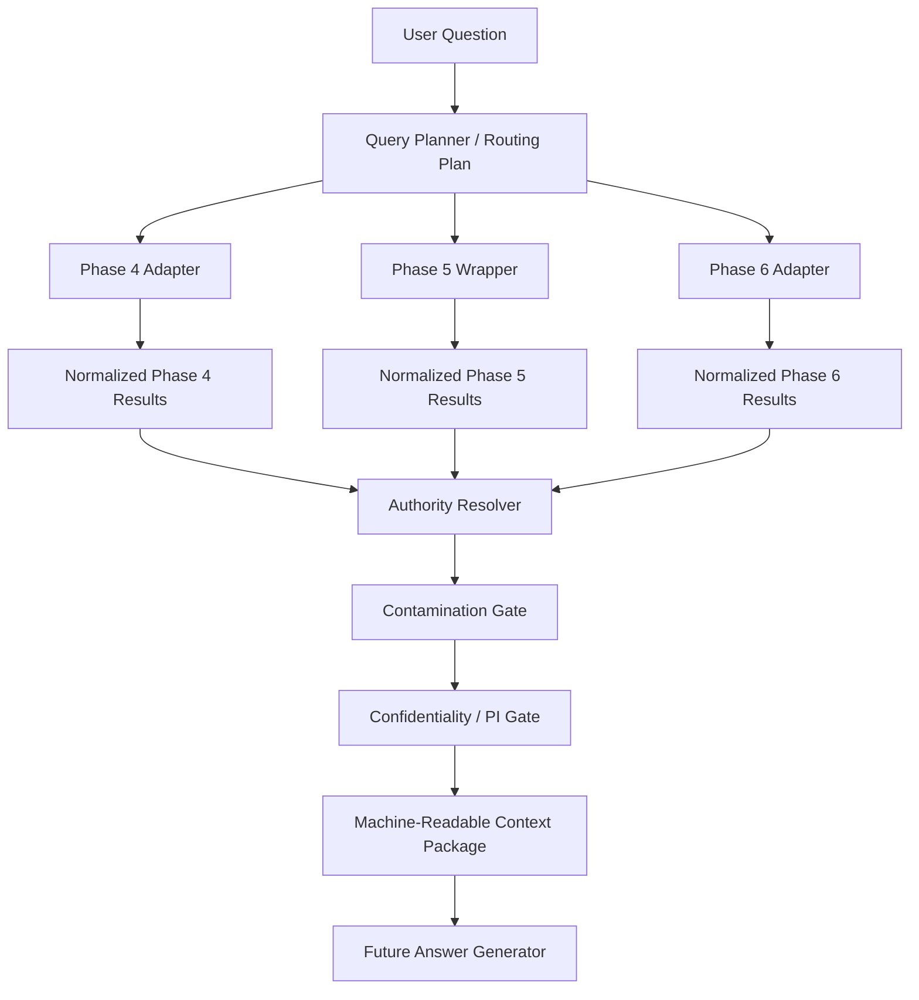

# Phase 7 Authority-Aware Reasoning Architecture

Date: August 8, 2026

## 1. Executive Summary

Phase 7 should be implemented as a stateless application-layer context assembly system that sits above:

- Phase 4 deterministic current-rule APIs
- Phase 5 current governed-knowledge retrieval
- Phase 6 historical precedent retrieval

The recommended architecture is:

- hybrid selective routing
- a registry-based Phase 4 adapter
- a stable Phase 5 integration wrapper with explicit retrieval-mode labeling and metadata enrichment
- a thin Phase 6 normalization adapter over the existing stable historical retrieval contract
- a normalized cross-layer result envelope with layer-specific payload preservation
- a machine-readable context package that is the only allowed input to future answer generation
- deterministic authority resolution, contamination protection, unresolved-authority handling, and confidentiality gating before any LLM sees content

Key decisions:

- do not call all three layers for every question
- do not flatten heterogeneous layer outputs into one ranked list
- do not let retrieval rank imply authority
- do not let Phase 6 fill current-authority gaps
- keep initial Phase 7 runtime stateless
- keep orchestration in the application layer, not in SQL

This document intentionally freezes the architecture boundary for context-layer implementation only. It does not implement adapters, wrappers, routing, prompts, or answer generation.

## 2. Inputs & Constraints

This architecture is constrained by:

- [PHASE_7_DOWNSTREAM_DEPENDENCY_READINESS_AUDIT.md](/Users/serinya/Documents/WNC%20Rental%20Automation/docs/phase-07/PHASE_7_DOWNSTREAM_DEPENDENCY_READINESS_AUDIT.md)
- [PHASE_7_REASONING_SCENARIO_EVALUATION_MATRIX.md](/Users/serinya/Documents/WNC%20Rental%20Automation/docs/phase-07/PHASE_7_REASONING_SCENARIO_EVALUATION_MATRIX.md)

Decisive findings from `7.0A`:

- Phase 4 is callable today, but only through domain-specific `api.*` functions.
- Phase 5 has validated retrieval surfaces, but no single downstream integration contract.
- Phase 6 already has a stable downstream integration contract at `tools.phase_06_search.historical_retrieval.retrieve_historical_precedents(...)`.
- No current repository blocker prevents Phase 7 context-layer design.

Decisive findings from `7.0B`:

- the benchmark contains `40` scenarios
- selective routing is required
- deterministic current truth remains the most important authority source
- unresolved-authority outcomes are common enough to be first-class
- contamination attacks are explicit test cases, not edge cases
- degraded-mode honesty and confidentiality escalation are required before generation

Repository constraints that govern the architecture:

- authority order is fixed:
  - `Phase 4 deterministic current truth`
  - `Phase 5 current governed knowledge`
  - `Phase 6 historical precedent`
- no Phase 7 implementation code is in scope here
- no new Phase 7 persistence is justified at this architecture stage

## 3. Architecture Principles

1. Route selectively, not exhaustively.
2. Keep authority separate from retrieval relevance.
3. Normalize contracts without flattening layer semantics.
4. Preserve unresolved and confirmation-bound states explicitly.
5. Treat historical precedent as contextual, never self-authorizing.
6. Apply contamination controls before answer generation.
7. Apply strictest-wins confidentiality before answer generation.
8. Separate retrieval execution state from authority/result state.
9. Preserve structured provenance in the context package.
10. Freeze the context package as the boundary between retrieval/reasoning and future answer generation.

## 4. Query Routing Architecture

### 4.1 Options assessed

| Option | Assessment | Decision |
| --- | --- | --- |
| Always call all layers | Unsafe for deterministic questions, increases contamination exposure, adds noise and latency | reject |
| Fully deterministic routing only | Auditable, but too brittle for natural-language ambiguity and mixed questions | reject as sole strategy |
| Model-assisted routing only | Flexible, but too risky if the model omits a required authority layer | reject as sole strategy |
| Hybrid routing | Keeps deterministic safety overrides while allowing bounded ambiguity handling | choose |

### 4.2 Chosen routing strategy

Phase 7 should use `hybrid selective routing`:

1. deterministic safety overrides run first
2. deterministic heuristics and registry-based cues attempt to classify the query
3. a constrained ambiguity resolver may run only when deterministic routing remains under-specified
4. post-classification safety augmentation forces required layers before execution

This means:

- simple current truth questions do not call Phase 6
- pure precedent questions do not automatically call Phase 4
- mixed or contamination-risk questions may force additional current-authority layers
- no model is allowed to make final authority decisions on its own

### 4.3 Routing principles

- If the user asks for a current deterministic claim, Phase 4 is mandatory.
- If the user asks for explanation/process/communication, Phase 5 is usually required.
- If the user asks whether something happened before, Phase 6 is usually required.
- If a query references history while asking for a present answer, current authority must also be considered before prescriptive output is allowed.
- When routing remains ambiguous, broaden safely toward current authority before broadening toward historical precedent.

## 5. Routing Taxonomy & Output Contract

### 5.1 Runtime query taxonomy

Phase 7 should use the minimum useful runtime classes below rather than mirroring evaluation categories A-J directly:

| Query Class | Purpose | Typical Layers |
| --- | --- | --- |
| `deterministic_current` | asks for a current rule, value, eligibility, or status | `P4`, optional `P5` |
| `current_guidance` | asks for process, explanation, checklist, or communication guidance | `P5`, optional `P4` |
| `precedent_discovery` | asks whether WNC has handled something similar before | `P6`, optional current layer only if the user also asks what to do now |
| `mixed_current_and_precedent` | asks for both current answer and historical context | `P4/P5/P6` as needed |
| `authority_verification` | asks whether a historical or informal claim is official now | current authority mandatory, precedent optional |
| `unresolved_authority` | asks for a definitive current claim in an area likely to be confirmation-bound or insufficiently governed | current layers mandatory; outcome may remain unresolved |

Degraded operation is not a query class. It is an execution-state outcome.

### 5.2 Routing output contract

The router should emit a machine-readable retrieval plan similar to:

```json
{
  "query_text": "Can we use what we did before for ADE this year?",
  "query_class": "authority_verification",
  "routing_confidence": "medium",
  "ambiguity_flags": ["historical_reference_with_current_policy_request"],
  "required_layers": ["phase_5", "phase_6"],
  "optional_layers": [],
  "phase_4": {
    "required": false,
    "domains": []
  },
  "phase_5": {
    "required": true,
    "needs_guidance": true,
    "filters": {}
  },
  "phase_6": {
    "required": true,
    "filters": {}
  },
  "safety_overrides": [
    "historical_reference_requires_current_authority_before_prescriptive_answer"
  ],
  "reason_codes": [
    "query_mentions_historical_reuse",
    "query_requests_current_action"
  ]
}
```

Required routing-plan fields:

- `query_text`
- `query_class`
- `routing_confidence`
- `ambiguity_flags`
- `required_layers`
- `optional_layers`
- `phase_4.domains`
- layer-specific filter intents where relevant
- `safety_overrides`
- `reason_codes`

### 5.3 Routing safety overrides

The following overrides should be deterministic:

- current `price`, `fee`, `rate`, `VAT`, `capacity`, `payment`, `cancellation`, `access`, `setup timing`, `technical support`, `service eligibility` -> force `Phase 4`
- asks to reuse or validate something historical now -> force current authority before prescriptive output
- asks for communication/process/checklist/explanation -> force `Phase 5`
- asks only for precedent discovery without current action -> do not force `Phase 4`
- high-risk historical commercial or legal query -> force current authority check or unresolved outcome

## 6. Phase 4 Adapter Architecture

### 6.1 Decision

Phase 7 should implement a `registry-based Phase 4 adapter`, not a giant conditional router and not direct ad hoc SQL calls from the orchestrator.

### 6.2 Why a registry

Phase 4 already has stable callable APIs, but they differ by domain, signature, and result shape. A small adapter registry allows:

- auditable domain-to-handler mapping
- reuse of the exact Phase 4 RPCs
- preservation of typed values
- per-domain normalization without flattening

### 6.3 Conceptual domain registry

| Domain Code | Primary RPC(s) | Notes |
| --- | --- | --- |
| `booking_fee` | `api.get_booking_fee_rule(text, integer, date)` | direct lookup |
| `payment` | `api.get_payment_rules(text, text, integer, date)` | rule rows by payment stage/plan |
| `expedited_surcharge` | `api.get_expedited_surcharge_rule(date, date, date)` | direct lookup |
| `cancellation` | `api.get_cancellation_rules(text, date, date, text, date)` | multi-parameter evaluation |
| `capacity` | `api.get_capacity_rule(...)`, `api.evaluate_capacity(...)` | direct rule and evaluated fit |
| `space_access` | `api.get_space_access_rule(...)`, `api.evaluate_space_access(...)` | direct rule and evaluated applicability |
| `operational_requirements` | `api.get_operational_requirements(...)` | requirement-oriented |
| `catering_supplier` | `api.get_catering_supplier_rules(...)` | rule and confirmation-sensitive output |
| `technical_inventory` | `api.get_technical_equipment_inventory(...)`, `api.evaluate_technical_equipment_quantity(...)` | inventory and quantity fit |
| `technical_capability` | `api.get_technical_capability(...)`, `api.evaluate_technical_requirement(...)` | capability and requirement fit |
| `service_rules` | `api.get_service_rules(...)` | service-level boundaries |
| `facilitator_requirements` | `api.get_facilitator_requirements(...)` | confirmation-bound cases likely |

### 6.4 Adapter responsibilities

The adapter must:

1. accept a routing plan with resolved Phase 4 domains
2. map each domain to the correct handler/RPC call
3. keep the original typed Phase 4 payload intact
4. add a normalized header around the payload
5. label every result as `source_layer_role=deterministic_rule`
6. preserve `rule_code`, `rule_version`, `rule_id`, `status`, `effective_from`, `effective_until`
7. preserve `primary_source_codes`, `governance_source_codes`, `supporting_source_codes`
8. normalize uncertainty without erasing original domain statuses

### 6.5 Adapter output model

Each adapter result should contain:

- a shared envelope header
- a `phase_4_payload` object with the original typed result
- a normalized `reasoning_state`
- a separate `execution_state`
- structured provenance

### 6.6 Provenance enrichment decision

Phase 4 callable outputs expose source codes but not locator-level provenance. The adapter should therefore support `selective provenance enrichment` against:

- `public.rule_catalogue`
- `public.rule_source_links`
- `public.source_registry`

This enrichment should happen only for Phase 4 items actually selected into the final context package. It should not force deep provenance joins for every intermediate routing attempt.

## 7. Phase 4 Uncertainty / No-Result Semantics

### 7.1 Separate execution state from reasoning state

Phase 7 must not collapse Phase 4 outcomes into one generic `unknown` state.

The architecture should use two axes:

| Axis | Purpose |
| --- | --- |
| `execution_state` | whether the adapter call itself succeeded |
| `reasoning_state` | what the returned domain result means semantically |

### 7.2 Normalized Phase 4 execution states

- `not_requested`
- `success`
- `failed`

### 7.3 Normalized Phase 4 reasoning states

| Reasoning State | Meaning |
| --- | --- |
| `resolved` | current deterministic authority answered the question |
| `requires_confirmation` | current authority explicitly says confirmation is required |
| `insufficient_information` | the query lacks facts needed to evaluate |
| `no_applicable_rule` | current deterministic layer has no rule for the request |
| `manual_review_required` | current authority explicitly routes to manual review |

Original domain-specific fields such as:

- `restricted`
- `unsupported`
- `insufficient_quantity`
- `must_confirm`
- `applicability_status`

must remain preserved inside the layer-specific payload.

### 7.4 No-result rule

Phase 7 must formalize this invariant:

> A missing or non-applicable Phase 4 match never authorizes Phase 6 to become current truth.

Required distinctions:

- `no_applicable_rule` != `failed`
- `insufficient_information` != `no_applicable_rule`
- `requires_confirmation` != `insufficient_current_authority`
- `manual_review_required` != `historical precedent exists`

## 8. Phase 5 Integration Wrapper Architecture

### 8.1 Decision

Phase 7 should define a stable `Phase 5 integration wrapper` over the existing validated hybrid retrieval stack rather than calling Phase 5 SQL or CLI directly from orchestration.

### 8.2 Reuse boundary

The wrapper should reuse the validated Python hybrid tooling centered on:

- `tools.phase_05_search.search_hybrid.run_hybrid_search(...)`

It should not redesign:

- query normalization
- approved retrieval strategy
- current hybrid ranking policy

### 8.3 Wrapper responsibilities

The wrapper must:

1. accept query text, limits, and supported filters
2. normalize the query
3. resolve the active embedding model
4. generate a query embedding when healthy hybrid is available
5. run current hybrid retrieval
6. run explicit FTS fallback when hybrid cannot run safely
7. label retrieval mode explicitly
8. normalize rows into the shared cross-layer envelope
9. label all results `source_layer_role=current_governed_knowledge`
10. enrich retrieved rows with confidentiality and PI metadata
11. optionally enrich selected rows with Phase 4 rule-relationship metadata for downstream conflict analysis

### 8.4 Source-role decision

The stable architecture-level Phase 5 source role is:

- `current_governed_knowledge`

This source role must be explicit in wrapper output, not inferred from which underlying function was called.

### 8.5 Confidentiality / PI gap decision

Chosen option: `Option A — augment retrieval rows with confidentiality and PI metadata in the Phase 5 wrapper`.

Reason:

- strictest-wins confidentiality must be enforceable before generation
- context assembly should not have to rediscover sensitivity from unrelated side channels
- Phase 5 already has the underlying governed metadata; the gap is in wrapper exposure, not data existence

Consequence:

- the wrapper becomes the stable contract boundary for Phase 5 sensitivity metadata
- the underlying SQL retrieval function does not need to be redesigned immediately

### 8.6 Rule relationship gap decision

Phase 7 should not require rule relationships on every raw retrieval row returned by the underlying search function.

Chosen approach:

- retrieve base Phase 5 rows first
- enrich only the bounded retrieved set selected by the wrapper/context assembler
- expose relationship summaries only when conflict analysis or explanation linking needs them

This avoids over-bloating the core retrieval surface while still enabling current-rule explanation and conflict logic.

### 8.7 Explicit Phase 5 fallback contract

The wrapper must expose:

- `retrieval_mode_requested = hybrid`
- `retrieval_mode_used = hybrid | fts_fallback | unavailable`
- `fallback_used = true | false`
- `fallback_reason = ... | null`

Phase 5 execution states:

- `not_requested`
- `success`
- `fallback`
- `unavailable`
- `failed`
- `no_results`

Phase 5 reasoning state is separate from execution state. A successful but empty guidance result is different from wrapper unavailability.

### 8.8 Phase 5 result limits

Result limits should be orchestrator configuration, not adapter constants.

Recommended initial architecture defaults:

- Phase 5 retrieval limit: mirror current validated tooling default `5`
- internal retrieved set may exceed generator-visible set
- final answer-generation subset should be further curated by the context assembler

## 9. Phase 6 Integration Architecture

### 9.1 Decision

Phase 7 should use `Option B — a thin Phase 7 adapter around the existing Phase 6 contract`.

### 9.2 Why a thin adapter instead of direct raw use

Phase 6 already has a stable, validated retrieval contract. No retrieval redesign is needed.

However, a thin adapter is still useful to:

- normalize Phase 6 results into the shared envelope
- align execution-state reporting with the other layers
- keep orchestration independent from raw historical result shape details

### 9.3 Reuse boundary

The adapter should call:

- `tools.phase_06_search.historical_retrieval.retrieve_historical_precedents(...)`

and preserve its safety fields exactly, including:

- `source_layer_role`
- `historical_value_only`
- `contamination_risk_level`
- `current_authority_disposition`
- `precedent_availability`
- confidentiality metadata
- PI metadata
- fallback metadata

### 9.4 Result limits

Result limits should remain orchestration config, not embedded in contamination logic.

Recommended initial default:

- Phase 6 result limit: mirror the validated contract default `5`

The context assembler may select a smaller generator-visible subset later.

## 10. Cross-Layer Source Roles

Every normalized result entering the Phase 7 context package must carry one stable source-layer role:

| Source Role | Meaning |
| --- | --- |
| `deterministic_rule` | Phase 4 current deterministic authority |
| `current_governed_knowledge` | Phase 5 current governed explanatory/procedural/contextual knowledge |
| `historical_precedent` | Phase 6 historical case precedent |

Authority must never be inferred later from:

- rank
- text
- document title
- result source module name

### 10.1 Authority tier

Phase 7 should also carry a minimal separate authority field:

| Authority Tier Code | Priority |
| --- | ---: |
| `current_deterministic` | 1 |
| `current_governed` | 2 |
| `historical_precedent` | 3 |

This supports deterministic dominance rules without replacing reasoning semantics.

## 11. Normalized Layer Result Envelope

### 11.1 Decision

Phase 7 should use a `shared metadata header + layer-specific payload` envelope.

Do not over-normalize all layers into one text-first record.

### 11.2 Conceptual shape

```json
{
  "source_layer_role": "deterministic_rule",
  "authority_tier_code": "current_deterministic",
  "authority_priority": 1,
  "stable_identity": {},
  "exact_identity": {},
  "content_kind": "rule_result",
  "execution_state": "success",
  "reasoning_state": "resolved",
  "summary_text": null,
  "provenance": {},
  "sensitivity": {},
  "retrieval": {},
  "layer_payload": {}
}
```

### 11.3 Shared fields

- `source_layer_role`
- `authority_tier_code`
- `authority_priority`
- `stable_identity`
- `exact_identity`
- `content_kind`
- `execution_state`
- `reasoning_state`
- `summary_text`
- `provenance`
- `sensitivity`
- `retrieval`
- `layer_payload`

### 11.4 Layer-specific preservation

Fields that must remain layer-specific include:

- Phase 4 typed values, applicability, and rule-state details
- Phase 5 retrieval ranks, document/chunk identities, and authority classification
- Phase 6 precedent availability, contamination metadata, authority disposition, and lesson metadata

Do not replace these with one generic `confidence` field.

## 12. Context Package Architecture

The context package is the midpoint contract between retrieval/reasoning preparation and future answer generation.

### 12.1 Required structure

1. `query`
2. `routing_plan`
3. `layer_execution`
4. `phase_4_context`
5. `phase_5_context`
6. `phase_6_context`
7. `authority_resolution`
8. `uncertainty_state`
9. `confidentiality_state`
10. `degraded_retrieval_state`
11. `grounding`
12. `generator_policy`

### 12.2 Context package rules

- keep layers separated
- do not flatten all evidence into one ranked list
- preserve both included items and excluded/suppressed reasons when relevant
- retain enough metadata for future citation rendering

### 12.3 Context size principles

- Phase 4: include all controlling or materially relevant current rule results for selected domains
- Phase 5: include a bounded set of current guidance results; retrieve more than the generator eventually sees if needed for conflict analysis
- Phase 6: include only the bounded set of materially relevant precedents; suppress redundant low-value precedent

Default layer-specific limits belong in orchestration config, not the envelope schema.

## 13. Authority Resolution

### 13.1 Decision

Authority and conflict resolution should be an explicit application-layer module between layer retrieval and final context packaging.

### 13.2 Required outputs

The authority resolver should emit:

- `resolved_current_truths`
- `current_guidance_findings`
- `historical_precedent_findings`
- `overall_outcome_classification`
- `conflict_records`
- `contamination_annotations`
- `unresolved_authority_records`

### 13.3 Outcome classes

The architecture should reuse the evaluated outcome vocabulary from `7.0B`:

- `DETERMINISTIC_CURRENT`
- `CURRENT_GUIDANCE`
- `HISTORICAL_PRECEDENT`
- `MIXED_WITH_CURRENT_PRIORITY`
- `REQUIRES_CONFIRMATION`
- `INSUFFICIENT_CURRENT_AUTHORITY`

### 13.4 Conflict representation

The architecture should keep the benchmark conflict types as runtime vocabulary because they are already specific, tested, and useful:

- `TYPE_A_P4_BEATS_P6`
- `TYPE_B_P5_BEATS_P6`
- `TYPE_C_P6_EXISTS_BUT_CURRENT_MISSING`
- `TYPE_D_P4_REQUIRES_CONFIRMATION`
- `TYPE_E_P5_FAILURE_P4_SURVIVES`
- `TYPE_F_LIMITED_OR_UNKNOWN_PRECEDENT`
- `TYPE_G_CONFIDENTIALITY_ESCALATION`

Each conflict record should contain:

- `type_code`
- `controlling_layer`
- `affected_item_ids`
- `severity`
- `resolution_action`
- `notes`

## 14. Historical Contamination Protection

### 14.1 Decision

Historical contamination protection must be deterministic application logic, not only answer-prompt guidance.

### 14.2 Contamination gate inputs

The pre-generation contamination gate must inspect:

- `historical_value_only`
- `contamination_risk_level`
- `current_authority_disposition`
- `precedent_availability`
- `lesson_kind`

### 14.3 Core gate behavior

| Historical Posture | Context Treatment |
| --- | --- |
| `historical_value_only = true` | never usable as current value authority |
| `contamination_risk_level = high` | annotate strongly; require current-authority support before prescriptive use |
| `current_authority_disposition = potential_conflict_with_current_knowledge` | mark as context/caution only unless current authority explicitly supports the claim |
| `current_authority_disposition = current_status_unknown` | cannot support a definitive current claim |
| `precedent_availability = limited` | keep as limited precedent, not full current guidance |
| `lesson_kind = analyst_inference` | preserve as lesson/inference, not evidence-backed fact |

### 14.4 Forbidden-inference gate

Phase 7 should represent the highest-risk patterns as rule-based gate checks plus context annotations:

- `historical_price_to_current_price`
- `historical_person_capability_to_current_service`
- `historical_concession_to_current_policy`
- `historical_legal_solution_to_current_guidance`
- `historical_overtime_handling_to_current_rate`
- `historical_room_use_to_current_access_right`

Each flag should specify:

- triggering pattern
- implicated Phase 6 items
- whether current authority was consulted
- whether prescriptive output must be blocked or downgraded

## 15. Unresolved / Confirmation Handling

### 15.1 First-class unresolved states

Phase 7 must expose, not hide:

- `requires_confirmation`
- `manual_review_required`
- `insufficient_information`
- `no_applicable_rule`
- `current_status_unknown`
- `insufficient_current_authority`

### 15.2 Required distinction

| Outcome | Meaning |
| --- | --- |
| `REQUIRES_CONFIRMATION` | current authority explicitly says confirmation is required |
| `INSUFFICIENT_CURRENT_AUTHORITY` | the current system lacks enough governed authority to make the requested definitive claim |

Examples:

- custom technical support -> usually `REQUIRES_CONFIRMATION`
- florals, storage price, discount policy, historical overtime rate conversion -> usually `INSUFFICIENT_CURRENT_AUTHORITY`

### 15.3 Context behavior

The context package must carry unresolved authority as structured state, not as absence.

The future generator may explain unresolved state, but may not replace it with invention.

## 16. Retrieval Failure / Degraded Mode

### 16.1 Execution-state model

Every layer should expose:

- `not_requested`
- `success`
- `fallback`
- `unavailable`
- `failed`
- `no_results`

This is separate from authority/result semantics.

### 16.2 Required degraded behaviors

| Condition | Required Behavior |
| --- | --- |
| Phase 6 hybrid unavailable | allow `fts_fallback` precedent if returned; keep fallback metadata visible |
| Phase 5 unavailable | allow Phase 4 truth to survive; do not substitute Phase 6 for missing current guidance |
| Phase 4 failed | expose deterministic-layer failure explicitly; do not let Phase 5/6 impersonate deterministic truth |
| Phase 4 `no_applicable_rule` | represent as current deterministic non-match, not system failure |

### 16.3 Degraded retrieval state in context

The context package should have a dedicated `degraded_retrieval_state` section with:

- per-layer execution summary
- per-layer fallback summary
- generator-visible warnings

## 17. Confidentiality / PI Architecture

### 17.1 Confidentiality decision

Phase 7 should enforce:

> effective context confidentiality = strictest confidentiality among all included context items

### 17.2 Confidentiality levels

The reused confidentiality taxonomy already includes:

- `internal`
- `commercially_sensitive`
- `restricted`

### 17.3 Phase 4 participation

Phase 4 does not currently expose explicit confidentiality metadata. The architecture should therefore assign a documented default:

- Phase 4 adapter outputs default to `internal` unless future explicit layer metadata says otherwise

Reason:

- Phase 4 results are internal application-layer structured authority objects
- defaulting them to `internal` is safer than treating them as sensitivity-free

### 17.4 PI handling decision

PI should be minimized before generation:

- if historical PI is not materially necessary, pass only metadata flags and de-identified summaries
- if precedent remains useful without names, omit names
- if restricted/PI-bearing detail is essential but unsupported for the target generation path, block or downgrade generation rather than leak detail

### 17.5 LLM gate inputs

Before any answer generator is called, Phase 7 must know:

- effective confidentiality level
- PI presence
- included source layers
- suppressed items
- de-identification requirements
- whether generation is allowed, restricted, or blocked

## 18. Provenance / Grounding

The context package must be citation-ready even though user-facing citation formatting is not designed yet.

### 18.1 Required provenance by layer

| Layer | Minimum Grounding |
| --- | --- |
| Phase 4 | `rule_code`, `rule_version`, `rule_id`, source codes, enriched locator when selected |
| Phase 5 | `document_code`, document version, chunk identity, source locator |
| Phase 6 | `case_code`, case version, search-unit identity, source locator |

### 18.2 Provenance decision

Phase 4 adapter enrichment is required for generator-ready grounding because source-code arrays alone are too shallow for later citation rendering.

Phase 5 and Phase 6 already carry sufficient locator-oriented provenance in their retrieval rows once normalized and enriched.

## 19. LLM Security Boundary

Phase 7 must treat future answer generation as a distinct security boundary.

The generator input contract should include:

- original question
- resolved context package
- authority outcome
- conflict records
- unresolved state
- degraded-mode state
- confidentiality decision
- provenance
- generator policy

The generator must be permitted to:

- synthesize
- explain
- compare
- express uncertainty

The generator must not be permitted to:

- perform independent retrieval
- invent deterministic values
- promote precedent to current policy
- override conflict state
- erase confirmation requirements
- fill missing authority gaps

## 20. Database vs Application Responsibility

### 20.1 Database-side responsibilities

- existing current rule lookup
- existing retrieval
- existing structured governance storage
- existing provenance joins where already implemented
- existing Phase 6 strictest-wins helper logic

### 20.2 Application-side responsibilities

- query routing and planning
- Phase 4 adapter orchestration
- Phase 5 wrapper orchestration and metadata augmentation
- Phase 6 normalization adapter
- cross-layer envelope normalization
- context assembly
- authority resolution
- contamination logic
- confidentiality merge
- generator gating

### 20.3 Boundary decision

Do not move Phase 7 orchestration into SQL.

The database should remain the source of governed facts and retrieval surfaces. Phase 7 reasoning belongs in the application layer because it spans:

- multiple existing contracts
- routing logic
- security policy
- cross-layer conflict resolution

## 21. Runtime State / Persistence Decision

Phase 7 context-layer implementation should be `stateless` initially.

No new persistent runtime tables are justified now for:

- query plans
- context packages
- orchestration snapshots
- evaluation execution

Reason:

- the benchmark can be executed deterministically without persistence
- the main unresolved work is logic and contracts, not storage
- audit logging can be added later if operational requirements emerge

## 22. Evaluation Architecture

The implementation should preserve four separable evaluation stages:

| Stage | Question |
| --- | --- |
| `Stage 1 — Routing` | were the correct layers/domains selected? |
| `Stage 2 — Retrieval` | did the required rules/chunks/precedents appear? |
| `Stage 3 — Context reasoning` | were authority, conflict, uncertainty, contamination, and confidentiality resolved correctly? |
| `Stage 4 — Answer generation` | did the final answer express the resolved context correctly? |

Deterministic checks should be preferred wherever possible:

- exact rule/value checks
- layer-selection checks
- source Hit@k checks
- conflict-code checks
- forbidden-inference checks
- degraded-mode checks

## 23. Proposed Component Set

| Proposed Component | Layer | Purpose | Persistent? | Reuses Existing? |
| --- | --- | --- | --- | --- |
| `query_planner` | application | classify query and emit routing plan | no | no |
| `phase4_adapter` | application | normalize Phase 4 domain RPCs into one contract | no | yes |
| `phase5_wrapper` | application | provide stable current-guidance retrieval contract | no | yes |
| `phase6_adapter` | application | normalize the existing historical retrieval contract | no | yes |
| `normalized_result_types` | application | define shared cross-layer envelopes | no | no |
| `context_assembler` | application | build the machine-readable context package | no | no |
| `authority_resolver` | application | compute outcome and conflict state | no | no |
| `contamination_gate` | application | enforce historical non-authority rules | no | yes, from Phase 6 metadata |
| `confidentiality_gate` | application | compute strictest sensitivity and PI posture | no | yes, from existing metadata |
| `future_answer_generator` | application | synthesize user-facing output from the context package only | no | no |

## 24. Conceptual Data Flow



## 25. Architecture Invariants

- `P7-INV-001 — Deterministic Authority`: Phase 4 controls current deterministic truth.
- `P7-INV-002 — Current Guidance Subordination`: Phase 5 may explain but never override Phase 4 deterministic truth.
- `P7-INV-003 — Historical Non-Authority`: Phase 6 precedent never becomes current policy automatically.
- `P7-INV-004 — Relevance Is Not Authority`: retrieval rank never determines authority priority.
- `P7-INV-005 — Uncertainty Preservation`: confirmation, insufficient-information, no-rule, and unresolved states remain explicit.
- `P7-INV-006 — No Historical Gap Filling`: historical precedent cannot fill a missing current-authority gap.
- `P7-INV-007 — Layer Identity`: every normalized item retains explicit source-layer identity.
- `P7-INV-008 — Provenance`: material context items remain traceable to governed sources.
- `P7-INV-009 — Confidentiality Escalation`: combined context inherits the strictest applicable sensitivity.
- `P7-INV-010 — Degraded-Mode Honesty`: fallback and missing-layer states remain visible through context and generation.
- `P7-INV-011 — Retrieval Before Generation`: the answer model cannot independently retrieve or redefine authority.
- `P7-INV-012 — Application-Layer Reasoning`: cross-layer authority and contamination logic remain outside SQL retrieval functions.

## 26. Architecture Decision Records

### ADR-001 — Selective vs all-layer routing

- Decision: use selective routing
- Alternatives: always call all layers
- Reason: benchmark shows many simple single-layer questions and explicit contamination risk
- Consequences: routing must be explicit and testable

### ADR-002 — Routing strategy

- Decision: hybrid routing with deterministic overrides and bounded ambiguity handling
- Alternatives: fully deterministic only; model-only
- Reason: balances auditability with natural-language ambiguity
- Consequences: routing confidence and safety overrides become required outputs

### ADR-003 — Phase 4 adapter design

- Decision: registry-based adapter over existing `api.*` functions
- Alternatives: direct ad hoc orchestrator calls; SQL flattening; vectorizing Phase 4
- Reason: preserves typed truth while avoiding giant conditional logic
- Consequences: Phase 4 domain registry becomes a core implementation artifact

### ADR-004 — Phase 5 wrapper design

- Decision: stable wrapper over validated hybrid tooling with explicit fallback and metadata augmentation
- Alternatives: direct raw SQL use; direct CLI use; retrieval redesign
- Reason: Phase 5 lacks a stable downstream contract today
- Consequences: wrapper becomes the authoritative current-guidance dependency

### ADR-005 — Phase 6 integration approach

- Decision: thin normalization adapter over `retrieve_historical_precedents(...)`
- Alternatives: direct raw consumption; retrieval redesign
- Reason: Phase 6 already has a validated stable contract
- Consequences: Phase 6 safety metadata must be preserved exactly

### ADR-006 — Normalized result envelope

- Decision: shared metadata header plus layer-specific payload
- Alternatives: one flat generic row shape
- Reason: avoids semantic flattening while still enabling cross-layer assembly
- Consequences: consumers must understand both shared and layer-specific fields

### ADR-007 — Conflict-resolution placement

- Decision: application-layer authority resolver
- Alternatives: LLM-only resolution; SQL-only conflict logic
- Reason: authority rules are deterministic, cross-layer, and security-sensitive
- Consequences: conflict records become explicit context artifacts

### ADR-008 — Unresolved-authority handling

- Decision: first-class structured unresolved outcomes
- Alternatives: null/empty fallback; generic unknown state
- Reason: benchmark contains many scenarios where certainty is unsafe
- Consequences: answer generation must consume explicit unresolved state

### ADR-009 — Confidentiality merge strategy

- Decision: strictest-wins across included materials; Phase 4 defaults to `internal`
- Alternatives: layer-by-layer independent handling; no Phase 4 classification
- Reason: combined context is the actual security boundary
- Consequences: sensitivity and PI must be computed before generation

### ADR-010 — Database vs application boundary

- Decision: keep retrieval/data lookups in DB-side systems; keep orchestration and reasoning in the application
- Alternatives: move orchestration into SQL
- Reason: multi-layer routing and conflict logic are easier to test and evolve in application code
- Consequences: Phase 7 implementation is primarily app-layer

### ADR-011 — Stateless vs persistent runtime

- Decision: stateless initial runtime
- Alternatives: new Phase 7 runtime tables
- Reason: no benchmark or repository fact currently requires persistence
- Consequences: implementation may proceed without migrations or runtime storage

### ADR-012 — Answer-generation boundary

- Decision: generator consumes the context package only and may not retrieve independently
- Alternatives: generator-driven retrieval
- Reason: authority, confidentiality, and contamination checks must precede generation
- Consequences: context package becomes the stable handoff contract for later phases

## 27. Implementation Sequence

Recommended controlled implementation sequence after architecture approval:

| Step | Scope |
| --- | --- |
| `7.2A` | shared contracts/types, routing taxonomy, query-plan schema |
| `7.2B` | query planner with deterministic overrides and routing tests |
| `7.2C` | Phase 4 adapter and provenance-enrichment path |
| `7.2D` | Phase 5 wrapper with explicit mode labeling and sensitivity augmentation |
| `7.2E` | Phase 6 thin adapter and envelope normalization |
| `7.2F` | context assembler plus authority/conflict/unresolved-state logic |
| `7.2G` | confidentiality/PI gate plus degraded-mode packaging |

Hard stop after `7.2G` for context-layer review.

Future answer generation should begin only after the context layer is complete and validated.

## 28. Testing Strategy

### Router

- 40-scenario layer selection
- forced-layer override coverage
- no unnecessary historical retrieval for simple deterministic cases

### Phase 4 adapter

- typed-value preservation
- rule identity/version preservation
- uncertainty-state preservation
- provenance enrichment

### Phase 5 wrapper

- healthy hybrid behavior
- explicit FTS fallback behavior
- unavailable-state behavior
- source-role labeling
- confidentiality/PI augmentation
- relationship enrichment on bounded result sets

### Phase 6 adapter

- safety-metadata preservation
- fallback-metadata preservation
- no semantic flattening

### Context assembler / authority resolver

- authority ordering
- conflict classification
- contamination gating
- unresolved-authority classification
- no source flattening

### Confidentiality gate

- strictest-wins behavior
- PI minimization
- blocked/downgraded generator paths

### Degraded mode

- missing Phase 5 with surviving Phase 4 truth
- Phase 6 FTS fallback visibility
- Phase 4 `no_applicable_rule` versus failure distinction

## 29. Open Questions

- What exact application-layer config surface should hold per-layer default limits and override policies?
- What exact structured format should later user-facing citations render from the already-preserved provenance?
- What exact de-identification transformations should be applied when PI-bearing historical context is allowed in reduced form?

These are implementation details that do not require architecture redesign.

## 30. Readiness Decision

`READY_FOR_PHASE_7_CONTEXT_LAYER_IMPLEMENTATION`
