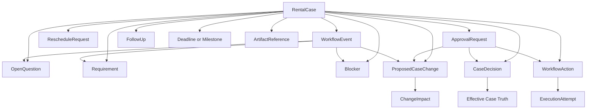

# Phase 8 Workflow Domain Model

Date:

- August 9, 2026

Status:

- `PHASE_8_0B_DOMAIN_MODEL_FROZEN`

## Purpose

Freeze the canonical workflow domain model for rental execution without implementing persistence or runtime behavior.

This document defines:

- the aggregate root
- the supporting entities and records
- relationship boundaries
- audit and replay posture
- where case truth may and may not live

## Canonical Aggregate Root

Chosen aggregate root:

- `RentalCase`

Reason:

- one rental opportunity or booking evolves through inquiry, proposal, confirmation, delivery, and close-out
- the business needs one canonical case anchor for lifecycle, case revision, and downstream projections
- case-specific truth must remain scoped to one rental unless separately promoted through governance

## Architectural Shape

Recommended persistence shape:

- current-state records for canonical operational entities
- append-only `WorkflowEvent` history
- append-only transition, approval, action, and execution histories
- explicit supersession links for mutable workflow records

This is a practical hybrid rather than pure event sourcing.

## Domain Map



## Entity Catalog

| Entity or record | Role | Mutability posture | Canonical authority |
| --- | --- | --- | --- |
| `RentalCase` | Aggregate root and canonical lifecycle anchor. | Current-state row plus append-only transition history. | Application lifecycle engine. |
| `WorkflowEvent` | Append-only fact log of what happened. | Immutable append-only. | Event ingestion and lifecycle engine. |
| `OpenQuestion` | Structured unknown still requiring answer. | Mutable current state with status history. | Workflow evaluation based on structured evidence. |
| `Requirement` | Something that must be satisfied, waived, or declared not applicable. | Mutable current state with status history. | Application policy plus Phase 4/5/7 supported reasoning. |
| `Blocker` | Explicit prevention of transition, action, readiness, or decision. | Mutable current state with resolution history. | Deterministic guard evaluation. |
| `CaseDecision` | Case-scoped waiver, exception, override, or special rule. | Mutable current state with supersession history. | Approval-controlled application logic. |
| `ProposedCaseChange` | Material inbound change candidate not yet activated. | Mutable current state with resolution history. | Extraction plus deterministic review. |
| `RescheduleRequest` | Specialized date-change workflow. | Mutable current state with history. | Change evaluation and confirmation workflow. |
| `ApprovalRequest` | Interface-independent approval record. | Mutable current state with decision history. | Approval service. |
| `WorkflowAction` | Structured intent to do something. | Mutable current state with append-only state history. | Workflow engine. |
| `ExecutionAttempt` | One adapter execution try for one action. | Append-only. | Action runtime or adapter service. |
| `FollowUp` | Waiting posture and revisit cadence. | Mutable current state with attempt history. | Follow-up service. |
| `Deadline` or `Milestone` | Time-based checkpoint independent of lifecycle state. | Mutable current state with history. | Scheduling and evaluation logic. |
| `ArtifactReference` | Projection metadata for proposal, agreement, summaries, tasks, and sync targets. | Mutable current state with freshness history. | Artifact service and sync runtime. |
| `ManualOverride` | Not a separate truth silo; modeled as auditable event plus target mutation record. | Append-only event plus affected record history. | Authorized operator action. |

## `RentalCase`

`RentalCase` owns:

- canonical lifecycle state
- case reference and identity
- current active event date or date range
- rental type and service scope snapshot
- client and primary contact references
- case revision
- high-level commercial and operational summary posture
- current artifact references

`RentalCase` does not directly inline:

- open questions
- requirements
- blockers
- approvals
- decisions
- actions
- execution attempts
- follow-up cadence

## `WorkflowEvent`

`WorkflowEvent` is the canonical answer to:

> what happened?

Core rules:

- append-only
- source-aware
- actor-aware
- timestamped
- payload-backed
- never treated as an instruction

Examples:

- `inquiry_received`
- `proposal_sent`
- `payment_received`
- `client_response_received`
- `event_completed`
- `manual_close_requested`

## `OpenQuestion`

`OpenQuestion` answers:

> what do we still need to know?

It remains distinct from a requirement because a requirement may exist even when nobody has asked a literal question yet.

Recommended status set:

- `open`
- `answered_pending_validation`
- `resolved`
- `closed_not_needed`
- `superseded`

## `Requirement`

`Requirement` answers:

> what must become true?

Examples:

- confirmation payment required
- signed agreement required
- final information required
- staffing confirmation required
- permit or compliance requirement applies

Recommended status set:

- `not_applicable`
- `required`
- `in_progress`
- `satisfied`
- `waived`
- `unresolved`

## `Blocker`

`Blocker` answers:

> what prevents safe progression right now?

Examples:

- unresolved authority
- approval still open
- payment pending
- missing client information
- stale action after a material case change

Recommended status set:

- `open`
- `resolved`
- `superseded`
- `cancelled`

## `CaseDecision`

`CaseDecision` is the only sanctioned place for case-specific exception truth.

Use it for:

- booking fee waiver
- custom access arrangement
- case-specific payment term
- unusual supplier exception
- approved special commercial handling

Recommended status set:

- `proposed`
- `pending_approval`
- `active`
- `rejected`
- `superseded`
- `withdrawn`

## Effective Case Truth

Deterministic precedence:

```text
Phase 4 baseline
+ active approved CaseDecision for the declared scope
= effective case truth
```

Rules:

1. If no active `CaseDecision` exists, the Phase 4 baseline remains effective.
2. Only `active` `CaseDecision` rows may affect case truth.
3. `pending_approval` does not change case truth.
4. Conflicting active decisions in the same scope fail closed and create a blocker.
5. Case truth is scoped to one `RentalCase`; it does not rewrite Phase 4.

## `ProposedCaseChange`

`ProposedCaseChange` preserves inbound change before activation.

It is required because:

- extraction is not authority
- client requests are not automatically committed truth
- change impact may require pricing, approval, or readiness re-evaluation

Recommended status set:

- `proposed`
- `under_review`
- `accepted`
- `rejected`
- `superseded`
- `withdrawn`

## `ChangeImpact`

`ChangeImpact` is best modeled as structured evaluation attached to a proposed change rather than a free-floating state.

Recommended classification:

- `low_impact`
- `material_impact`
- `fundamental_scope_change`

It should preserve:

- affected domains
- required re-evaluation scope
- approval need
- readiness consequence
- artifact staleness consequence

## `RescheduleRequest`

`RescheduleRequest` is a specialized workflow record rather than only a generic field change.

Reason:

- rescheduling is negotiated
- multiple candidate dates may exist
- confirmation timing matters
- downstream impacts are usually multi-domain

Recommended status set:

- `proposed`
- `evaluating`
- `offered`
- `awaiting_client_confirmation`
- `confirmed`
- `rejected`
- `withdrawn`
- `superseded`

## `ApprovalRequest`

`ApprovalRequest` is the interface-independent approval primitive.

Targets may include:

- `CaseDecision`
- `ProposedCaseChange`
- `WorkflowAction`
- closure
- waiver

Recommended status set:

- `open`
- `approved`
- `rejected`
- `expired`
- `cancelled`
- `superseded`

## `WorkflowAction`

`WorkflowAction` is structured operational intent.

It must exist before external execution or human send steps.

Recommended status set:

- `proposed`
- `awaiting_approval`
- `approved`
- `ready_to_execute`
- `executing`
- `succeeded`
- `failed`
- `cancelled`
- `superseded`

Non-goals for `WorkflowAction`:

- it is not business truth
- it is not the same thing as execution
- it does not itself advance lifecycle state without verified success and re-evaluation

## `ExecutionAttempt`

`ExecutionAttempt` is an append-only child of `WorkflowAction`.

It captures:

- attempt number
- adapter code
- external reference
- timing
- normalized result
- retry eligibility

Recommended status set:

- `started`
- `succeeded`
- `failed`
- `timeout`
- `cancelled`

## Idempotency Identity

Every externally executable action requires stable semantic identity.

Recommended composition:

```text
rental_case_id
+ action_type
+ target_adapter_code
+ semantic_subject_hash
+ source_case_revision
+ optional target_scope_key
```

This belongs to `WorkflowAction`, while each `ExecutionAttempt` reuses that identity on retries.

## `FollowUp`

`FollowUp` is structured waiting state.

It preserves:

- who the case is waiting on
- when to re-engage
- urgency
- cadence policy
- attempt count
- escalation threshold

Recommended status set:

- `scheduled`
- `due`
- `overdue`
- `escalated`
- `completed`
- `cancelled`

## `Deadline` and `Milestone`

Time matters independently of lifecycle state.

Examples:

- proposal follow-up due
- confirmation payment due
- final information target
- readiness review due
- event start
- event complete
- close-out target

Recommended status set:

- `scheduled`
- `reached`
- `completed`
- `missed`
- `superseded`

## `ArtifactReference`

Artifacts are projections, not the source of truth.

Examples:

- proposal
- agreement
- internal event brief
- readiness summary
- staffing plan
- external task projection
- calendar projection

Recommended freshness status set:

- `current`
- `stale`
- `refresh_required`
- `superseded`

Required freshness anchors:

- `derived_from_case_revision`
- optional `relevant_scope_fingerprint`

## Relationships And Ownership Rules

1. `RentalCase` owns lifecycle state and case revision.
2. `WorkflowEvent` may cause re-evaluation but does not directly mutate truth by itself.
3. `ProposedCaseChange` may update `RentalCase` only after review or approval resolution.
4. `CaseDecision` may alter effective case truth only when active.
5. `ApprovalRequest` may unblock change, decision, action, or closure targets.
6. `WorkflowAction` may create `ExecutionAttempt` children but must survive failed attempts.
7. `ArtifactReference` becomes stale when material case truth changes.

## Audit And Replay Model

The audit chain must remain reconstructable:

```text
WorkflowEvent
-> observation or proposed update
-> question, requirement, blocker, or change
-> approval if needed
-> action
-> execution attempt
-> lifecycle transition or artifact refresh consequence
```

The recommended hybrid model supports:

- operationally simple current-state reads
- append-only history for reconstruction
- deterministic replay of state transitions
- explicit reasoning and approval provenance

## Manual Override Model

Manual override is not a hidden side channel.

Every manual override must:

1. create a `WorkflowEvent`
2. preserve actor and reason
3. identify the affected record or transition
4. preserve prior and new values where relevant
5. remain compatible with the same audit and replay chain

Manual override may:

- correct state
- close a blocker
- approve or reject a target
- cancel or supersede an action
- manually close a rental

Manual override may not:

- silently rewrite Phase 4 baseline truth
- erase history
- bypass audit requirements

## Frozen Conclusion

The Phase 8 workflow domain model is now frozen as:

- one `RentalCase` aggregate root
- append-only `WorkflowEvent` history
- explicit question, requirement, blocker, change, decision, approval, action, and execution models
- case-scoped truth overrides through `CaseDecision` only
- projection-style artifacts with freshness tracking
- auditable manual overrides and replay posture

This is the canonical 8.0B domain model for workflow foundation implementation.
