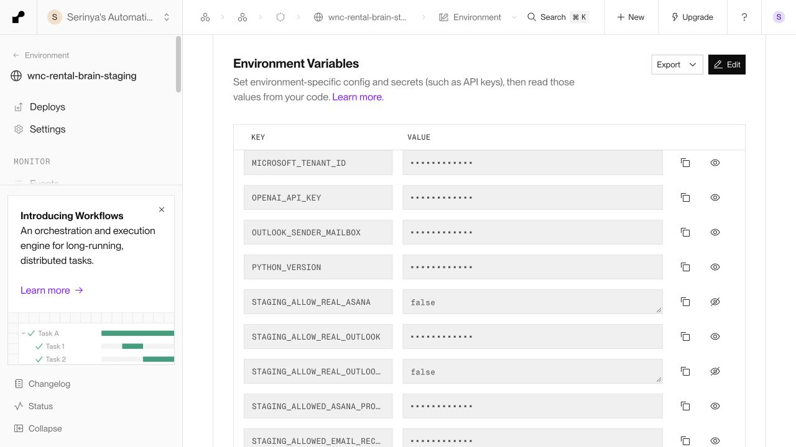

# Existing Asana Architecture

The audit found the existing Asana config/transport, CREATE_INTERNAL_TASK_ITEM action, task_surface mapping, Phase 8 orchestration and execution journal, project allowlist and provider gates. The old adapter created standalone tasks only. It had no master update, subtask lifecycle, custom-field mapping, provider read reconciliation or inbound completion sync. Existing action replay protection was retained; unsafe retry on POST server errors was corrected.

The full implementation map and design are in [asana-rental-projection.md](../../phase-08/implementation/asana-rental-projection.md).

# Master Rental Task Design

One master per canonical rental case. A deterministic, immutable projection action renders client, event, timing, scope, guests, minimal operational status, unresolved matters and next actions. Native completion represents terminal closure; human-readable status is in the body. No custom fields, assignee, due date or Outlook URL is fabricated.

# Internal Work Projection

CLIENT obligations stay in the summary. WNC_INTERNAL, EXTERNAL_PARTY and GOVERNED_DECISION work becomes subtasks with ownership retained in canonical bindings. Explicit same-owner grouping lets three supplier obligations share one subtask. All member semantic keys and source action IDs remain auditable. Explicit resolution completes existing work; omission cannot silently resolve work or create replacement duplicates. History is preserved.

# Idempotency / Reconciliation

The normal Phase 8 execution runtime persists action/attempt identity and the master/subtask GIDs. A database case lock fences overlapping, crashed and ambiguous projection attempts across revisions. Existing bindings are read and verified before update. A confirmed master survives a later retryable rate limit; retry reuses it. Timeouts, 5xx mutation outcomes, malformed success and inconclusive verification are nonretryable.

Read-only reconciliation paginates within the configured project and parent task, uses exact reference markers, and checks content and provider scope. Missing or duplicate candidates fail closed. Human edits/completion are recorded as observations and stop outbound overwrites. They cannot silently change price, availability, client facts, booking status, decisions or policy. Automatic adoption, inbound truth sync and release of an ambiguity fence are intentionally unsupported.

# Provider-Free Certification

All fifteen requested checks passed through the real application execution/orchestration path with a stateful fake Asana transport. Persistence was also exercised against local PostgreSQL with rolled-back fixtures and migration DDL.

| Requested proof | Evidence |
| --- | --- |
| One master and canonical case/project/action binding | Creation + persisted binding tests, including PostgreSQL |
| Master replay and repeated open-work deduplication | Same action reused, one attempt; no new objects |
| Appropriate human work | Three subtasks from five non-client obligations, client question in summary |
| Changed request and new work | Guest update reuses master; technical work added once |
| Resolved work and history | Venue subtask completed; existing objects and attempts preserved |
| Useful human content | Exact UI review below; no raw reasoning or JSON |
| Provider IDs canonical | Attempt binding snapshots and master reference in console |
| Retry safety | 429 before create and after confirmed master; persisted objects reused |
| Ambiguity | Accepted create followed by timeout/malformed response, plus 5xx; all later writes fenced |
| Safe provider lookup | Paginated reads, duplicates, wrong workspace/parent and missing objects checked |
| Human edit boundary | Name/description/completion changes become review evidence only |
| Production excluded | Local/production, disabled gate, wrong project/workspace and alternate API origin blocked |

# Proposed Real Synthetic Task

Canonical staging case **585**, action **1626**. The action is ready_to_execute with **zero execution attempts**. Repeating the hosted preparation endpoint returned the same action and exactly the same canonical content; no provider was called.

The exact task name, complete master description, custom-field values, full subtask bodies, statuses and ownership appear in [EXACT_TASK_PREVIEW.md](EXACT_TASK_PREVIEW.md) and machine-readable [exact_task_preview.json](exact_task_preview.json).


SYNTHETIC TEST — WNC Operations — team workshop — 12 November 2026

```text
CLIENT
SYNTHETIC TEST — WNC Operations

EVENT
team workshop
Requested timing: 12 November 2026, 14:00 CET to 12 November 2026, 18:00 CET
Requested venue / scope: studio space
Guests: 24

CURRENT STATUS
Decision required
Client response is waiting on internal work.

OPEN ITEMS
- WNC follow-up with external party: Confirm supplier logistics
- WNC governed decision review: Review the requested fee adjustment
- WNC internal check: Confirm studio availability for the requested time
- Client to answer: Confirm the preferred room layout

NEXT ACTIONS
Complete the checks below and record their outcomes for review.

OUTLOOK
No verified conversation link is available for this case.

WNC reference: RC-20261003152913292 / 6db3e9eacf60
```

Custom fields: none (`{}`). Native completed: false. Assignee: unassigned. Due date: none.

## Subtasks

### Confirm supplier logistics

Ownership: `EXTERNAL_PARTY`. Native completed: false. Assignee: unassigned.

```text
WNC follow-up with external party

To do: Confirm supplier arrival timing
To do: Confirm handover arrangements
To do: Confirm the loading route

Record the outcome for governed review before treating it as confirmed.

WNC reference: RC-20261003152913292 / 6db3e9eacf60 / work d27d45b61c7a
```

### Review the requested fee adjustment

Ownership: `GOVERNED_DECISION`. Native completed: false. Assignee: unassigned.

```text
WNC governed decision review

To do: Review the requested fee adjustment

Record the outcome for governed review before treating it as confirmed.

WNC reference: RC-20261003152913292 / 6db3e9eacf60 / work 4c7e41cf0455
```

### Confirm studio availability for the requested time

Ownership: `WNC_INTERNAL`. Native completed: false. Assignee: unassigned.

```text
WNC internal check

To do: Confirm studio availability for the requested time

Record the outcome for governed review before treating it as confirmed.

WNC reference: RC-20261003152913292 / 6db3e9eacf60 / work fda5b0d1ab9f
```


# Tests

- Focused Asana + safety suite: **50 passed**, **11 subtests passed**.
- Phase 8: **594 passed**, **126 subtests passed**.
- Full repository: **811 passed**, **160 subtests passed**.
- No test failures or skips in the final runs. Existing collection warnings remain.
- `git diff --check`: passed.

Counts overlap: the focused and Phase 8 suites are subsets of the full repository suite. XML and logs are saved alongside this report.

The first broad run hit duplicate test module names; importlib collection resolved that. A subsequent run selected another local project's Supabase container through the repository's legacy first-container discovery. The final reproducible harness explicitly selects WNC's local database/container. No authority, retrieval, drafting or provider configuration was changed to satisfy tests. External HTTP was blocked during the certification suites.

# Safety

Graph calls = **0**. Outlook sends = **0**. Real Asana calls/mutations = **0**. New staging execution attempts = **0**. OpenAI calls = **0**. Production changes = **0**.

Cases **424** and **584**, including their actions, approvals, attempts, draft revisions and workflow events, match the saved Outlook closure evidence exactly. The accepted drafting implementation and Outlook certification were not reopened.

The starting-posture audit found the pre-existing Asana gate true and health reporting configured. Only STAGING_ALLOW_REAL_ASANA was changed to false. The application was redeployed with that gate disabled; hosted health verifies Asana configured_but_disabled and Outlook configured_draft_only. Outlook's send gate stayed false throughout.

Staging-only changes: migration **20261003000200**, synthetic canonical case **585**, projection action **1626**, the Asana gate reduction, and application deployment **dep-db0i008u01pc73afcjng** at commit **59e3a033eeed150c974b964b8da86cf7b1cd621d**. Code was pushed to **codex/final-drafting-closure**; origin/main was not changed. Render's specific-commit deployment disables automatic deploys; the staged runtime is pinned to this tested SHA.



# Marker

**ASANA_REAL_STAGING_READY_FOR_HUMAN_AUTHORIZATION**

Stopped before the first real Asana mutation, as required by the user's HUMAN CHECKPOINT. The next authorization covers one master plus three initial subtasks, then one synthetic governed update (24 → 30 guests, complete venue check, add one technical subtask), read/reconciliation and replay verification. Any ambiguous outcome stops mutation work. Disable the staging Asana gate again at closure.

No real operational certification is claimed yet.
