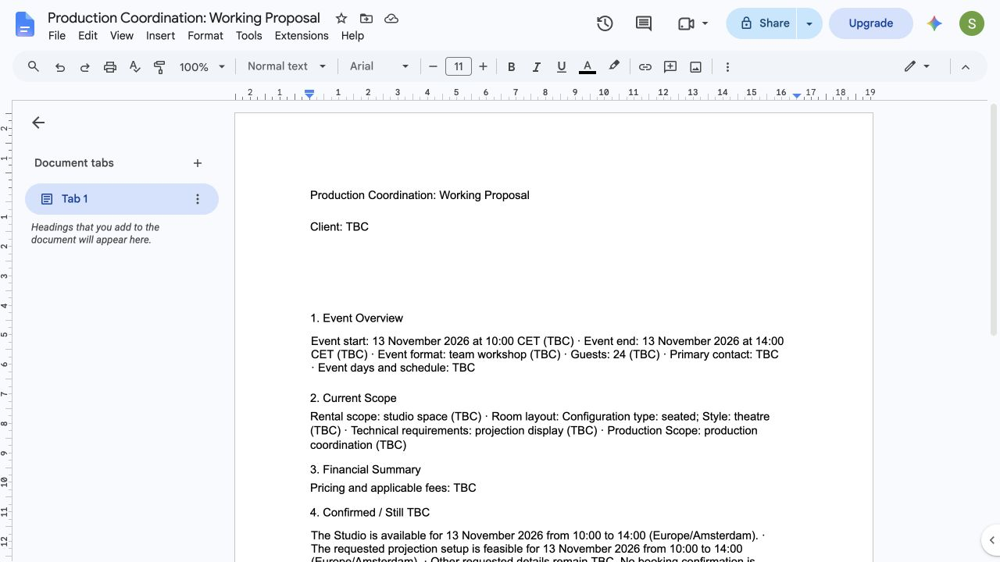
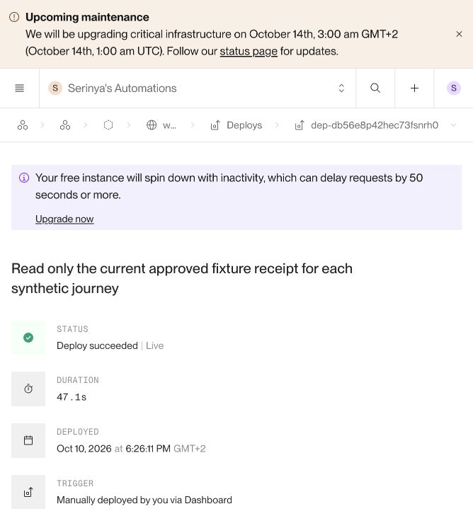

# Google Provider Scope

**Closed: real Google proposal updating and all three bounded synthetic integrated staging journeys passed.** Closure date: 10 October 2026. Real Outlook, Asana and Google providers were exercised. Client writing used the explicitly selected free deterministic staging fixture; **zero OpenAI calls** were made. This certificate covers the governed staging runtime and provider integrations, not model writing quality or production readiness.

Dedicated Google project: `vaulted-bazaar-511214-f4`, account `serinya00@gmail.com`, app **WNC STAGING Proposal Runtime**. Effective grant: **`https://www.googleapis.com/auth/drive.file` only**. Dedicated app-owned folder: `1TGb2-GpP18Hu-mkuxbovHKLt8MWyCNW3`. The negative metadata test for the known production document returned 404; no production document content was accessed. Folder, application identity and exact case/proposal binding were checked.

Replacement client secret and refresh token are stored in macOS Keychain and the secured staging Render environment. Temporary credential export files were removed after successful hosted verification. Current secret/token values are excluded from closure artifacts. No Google billing account, paid plan, trial or upgrade was activated; the Render service remains Free and the existing Asana plan was unchanged.

Evidence: [scope verification](google_scope_verification.json), [folder receipt](google_folder_receipt.json), [no billing proof](google_no_billing.png).

# Proposal Create / Update / Reconciliation

Standalone case **587**, revision **2**, has exactly one native Google Doc: [Studio working proposal](https://docs.google.com/document/d/1AK5btRR8zTM1wM2TxQ8SUJoX4slKgREIOWOxFUK6hvQ/edit).

Initial action **1641**, attempt **30**, created the document but strict verification rejected additional blank paragraphs inserted during Google's Word import. Provider mutations stopped. Read-only reconciliation verified the exact nonempty managed content, native file identity, app/folder/case binding and projection hash; reconciliation event **17188** replayed without creating another document or changing canonical facts. The original failed ambiguous attempt remains intact and non-retryable.

The repair tolerates empty import paragraphs while retaining exact managed-text and structural checks. After the governed guest count changed from 12 to 18, action **1642**, attempt **31**, updated the **same document ID**, succeeded and reconciled as `MATCHES_PROJECTION`. Replay created no new attempt or provider mutation. Bound source revision, proposal identity, projection hash, provider revision and document fingerprint persisted through the normal action journal.

Evidence: [known receipt reconciliation](live_cert_known_receipt_reconciliation.json), [update proof](live_cert_update_proof.json).

# Human Edit / Drift Safety

A clearly labelled synthetic manual-edit marker was appended to case 587's document. Observation detected `DRIFT_DETECTED`; replay did not overwrite the edit, create another attempt or change canonical business truth. Only the test marker was then removed with a provider-revision guard. The exact original fingerprint was restored and reconciliation returned `MATCHES_PROJECTION`.

There were **two explicit manual fixture mutations**, not automatic round-trip import. Supabase remains canonical. Evidence: [drift proof](live_cert_human_drift_proof.json).

# Scenario A

**Case 590, final canonical revision 4.** Simple Studio workshop: requested 12 guests, 12 November 2026, 10:00–14:00 Europe/Amsterdam. Inbox source **3114** created the case through the normal staging inbound path. Existing structured WNC capacity knowledge and the Phase 7 consumption path were exercised without an OpenAI call.

One [Asana master](https://app.asana.com/1/1208455784737302/project/1217642260793817/task/1219375388060735) and one [Studio Google proposal](https://docs.google.com/document/d/10AYCm04SGmLw-XE3BwMPFsRZevqbqYzGsItoL9ORKho/edit) retained their identities. The Admin availability check completed after an explicit synthetic operator availability outcome; this is controlled test evidence, not a real calendar check or booking.

Exact draft **388**, approval **467**, action **1682** was sent once to `serinya@whennaturecalls.nl`. Read-only Sent/Inbox correlation verified the approved subject/body/sole recipient and matching Internet message ID. Original attempt **51** remains ambiguous/non-retryable; separate delivery reconciliation event **17444** made the action succeeded. Confirmation replay returned that same event.

Evidence: [surface proof](integrated/surface_A.json), [receipt](integrated/outbound_A_receipt.json).

# Scenario B

**Case 589, final canonical revision 9.** Requested Studio workshop for 24 guests on 13 November 2026, 10:00–14:00 Europe/Amsterdam, with production coordination and projection display. Requested load-in 09:00 and load-out 15:00 remain TBC. Production days, responsibilities, pricing, payment and agreement are not invented or treated as confirmed.

One [Asana master](https://app.asana.com/1/1208455784737302/project/1217642260793817/task/1219375388080237) and one [production-coordination Google proposal](https://docs.google.com/document/d/1WkdwiO-oZIX4xKu_LH6OelAs4ZWJD3tF1zSImnRLnX8/edit) persisted. The proposal uses the repository's existing Production Coordination template while distinguishing the **Studio venue** from the **requested production service**. Applicable production/technical/access details appear in Asana and the proposal; irrelevant supplier or commercial boilerplate is omitted from the email.

A conditional technical draft was retained as evidence and was blocked from approval while its operator check remained unresolved. Explicit synthetic operator outcomes then established scoped Studio availability and projection feasibility. No external supplier was contacted: the governed request uses WNC's projection capability and did not require invented supplier work. Existing bound technical work retains its original parent and identity; retired work remains historical.

Final draft **393**, approval **472**, action **1697** was sent once internally. Exact Sent/Inbox receipt was verified. Original attempt **55** remains ambiguous/non-retryable; delivery reconciliation event **17445** succeeded and replayed as the same event.

Evidence: [surface proof](integrated/surface_B.json), [receipt](integrated/outbound_B_receipt.json).

# Scenario C

**Case 588, final canonical revision 10.** Original source **3112** requested 18 guests on 14 November, 10:00–14:00. Follow-up source **3115**, in the **same Outlook conversation and same case**, requested 24 guests on 15 November, 11:00–16:00, and added projection display. This live journey exercises date, count and technical changes; a venue change was covered by provider-free tests rather than represented as a live venue change.

The [same Asana master](https://app.asana.com/1/1208455784737302/project/1217642260793817/task/1219375248402798) and [same Google Doc](https://docs.google.com/document/d/1TDmwRBeF5SUjP9wPoRD7d5cu1OIOehMOxfAs3ALFoKI/edit) updated to the new request. The governed guest-count change was accepted through the existing proposed-change contract. Old availability and resolved/superseded blocker work were retired/completed, retaining their bound task IDs and evidence. A new date-specific availability task and current technical work appeared under the applicable Admin/Logistics structure. Historical tasks are retained; no second active copy or replay-created task was introduced.

The original date's availability confirmation was not reused for the new date. The new date and projection stayed pending until separate, scoped synthetic operator outcomes were accepted. Final draft **394**, approval **473**, action **1698** was sent once internally. Exact receipt was verified; original ambiguous attempt **56** remains non-retryable, and separate reconciliation event **17446** replayed unchanged.

Evidence: [surface proof](integrated/surface_C.json), [follow-up ingestion](integrated/sync_followup.json), [receipt](integrated/outbound_C_receipt.json).

# Cross-Surface Consistency

| Journey | Canonical case/revision | Guests | Requested Amsterdam time | Stable Doc | Stable Asana master |
|---|---|---|---|---|---|
| A | 590 / 4 | 12 | 12 Nov, 10:00–14:00 | `10AYCm04SGmLw-XE3BwMPFsRZevqbqYzGsItoL9ORKho` | `1219375388060735` |
| B | 589 / 9 | 24 | 13 Nov, 10:00–14:00 | `1WkdwiO-oZIX4xKu_LH6OelAs4ZWJD3tF1zSImnRLnX8` | `1219375388080237` |
| C | 588 / 10 | 24 | 15 Nov, 11:00–16:00 | `1TDmwRBeF5SUjP9wPoRD7d5cu1OIOehMOxfAs3ALFoKI` | `1219375248402798` |

Native document managed text matched the current deterministic public projection exactly, with one document per case. Asana provider observations matched the expected master, work identities, completion states, parents and proposal URL. Client emails communicated the newly governed answers; omitted summary details were not contradicted. No unapproved amount, booking, production service commitment, payment or signed agreement was asserted. Requested details remain TBC independently of scoped availability/feasibility evidence.

After delivery reconciliation, fresh provider-free projections still matched the final Asana plans and Google hashes. The case revisions, exact approval targets, approved content hashes and original attempts were unchanged. The three case conversations contain sources A:3114, B:3113, C:3112/3115 respectively. A clickable Outlook conversation link was **not** certified; Asana accurately says none is bound.

Evidence: [final audit](integrated/final_audit.json), [post-delivery authority check](integrated/post_delivery_surface_authority.json).

# Failure / Idempotency

| Check | Evidence / result |
|---|---|
| Google create ambiguity | Live known-receipt reconciliation; one document, original ambiguity preserved, no repeated create. |
| Google update ambiguity / revision races | Provider-free transport and PostgreSQL tests; no blind update retry. |
| Stale revision, missing document, wrong case/folder, duplicate identity | Provider-free fail-closed tests. No live document was destructively deleted for this test. |
| Human drift | Live controlled edit detected; no canonical import or automatic overwrite. |
| Successful Asana/Google replay | All six final action replays returned `action_already_succeeded`; zero new attempts/provider mutations. |
| Synthetic message replay | All four fixed fixtures blocked before provider calls. |
| Send ambiguity | Each send stopped at inconclusive immediate verification. Exact read-only Sent/Inbox proof resolved provider identity before further mutations; no send was retried. |
| Delivery confirmation replay | Same events 17444 / 17445 / 17446; zero provider calls/new attempts. |
| Delivered send replay | Blocked as `INQUIRY_DRAFT_NOT_APPROVED` because delivered revisions are no longer sendable; exact approvals/content/attempts unchanged. |
| Changed drafting context | Readiness rejected stale B/C drafts before Graph calls; fresh exact drafts were generated and approved after final reconciliation. |

Small repairs retained the existing architecture: blank import-paragraph handling; safe known-receipt recovery; technical department classification with sticky bound parents; UTC-instant comparison to prevent false reschedules; retirement of old work with correct observation of intentionally omitted unbound completed items; scoped free-fixture wording; venue/service distinction in proposal and Asana summaries. The timestamp repair reconciled only derived duplicate request statuses, preserving immutable source evidence and canonical revisions.

Evidence: [projection replay proof](integrated/projection_replay_proof.json), [schedule reconciliation](integrated/schedule_request_reconciliation.json), [final audit](integrated/final_audit.json).

# Tests

**1,089 passed, 45 existing warnings**, zero failures, in the final full suite. Meaningful focused checks also passed for operational drafting, editorial selection, Asana retirement/observation, Google projection, timestamp normalization and bounded delivery receipts. PostgreSQL tests ran against the isolated local fixture database; provider calls in tests were mocked/blocked.

The live campaign created **four native proposal Docs** (one standalone certification case plus three journeys), **three journey Asana masters**, and sent **seven synthetic internal messages** (three enquiries, one follow-up, three exact approved responses). No actual customer message or external-party communication was sent. Exactly one send attempt remains per final response. **Zero OpenAI calls and no new paid plan/billing activation.**

Evidence: [final full test log](certification_full_suite.log), [current test summary](test_summary.json).

# Staging Deployment

Free staging service: `srv-da2m6qdg1s2s73d10ro0`, [staging application](https://wnc-rental-brain-staging.onrender.com), branch `codex/asana-live-working-document`. Final deployed code commit: **`c87b1c9068beeafb08d287086977aa7206d4d0fe`**. Render displayed **Deploy succeeded | Live** after applying the saved gate closure; hosted authenticated health then independently verified all seven disabled.

The initial additive Google migration and known-receipt repair were applied only to staging, with canonical counts unchanged during migration. No production migration or deployment occurred.

# Final Gate State

| Gate | Final state |
|---|---|
| Global real providers | OFF |
| Asana execution | OFF |
| Google proposal mutation | OFF |
| Outlook execution | OFF |
| Outlook send | OFF |
| Outlook inbound | OFF |
| Outlook inbound preflight | OFF |

Providers report `configured_but_disabled`. Gate closure preceded the three final delivery reconciliation events. Those events use the existing application state `human_confirmed_delivered`; the evidence explicitly states that **no human Inbox observation is asserted**. They are authorized synthetic operator attestations backed by exact Graph receipts, while the original automated ambiguity remains preserved.

Evidence: [final hosted health](integrated/health_final.json), [final audit](integrated/final_audit.json).

# Production State

**Production untouched.** No production deployment, environment/gate edit, database mutation, customer traffic, provider action or new production access occurred in this resumed certification. The earlier production baseline was not refreshed by opening production during closure. Historical case 424 and prior certified case 586 were not targeted by any campaign data mutation. No production traffic was started.

# Remaining Blockers

No blocker remains for this bounded staging certificate. Continuous unattended use still needs a Google OAuth lifecycle decision: the app remains External **Testing**, whose refresh credentials expire after seven days for this scope ([Google OAuth documentation](https://developers.google.com/identity/protocols/oauth2)). Re-consent is available without purchasing a plan. Revocation of the older exposed Google client-secret value was requested but was not independently verified; the working replacement credential is secured.

Paid OpenAI model behavior was not evaluated because the user requires the free route. This is a coverage boundary, not evidence that production autonomous writing is certified. Production execution requires a separate authorized campaign.

`WNC_COMPLETE_LIVE_WORKFLOW_STAGING_CERTIFIED`
