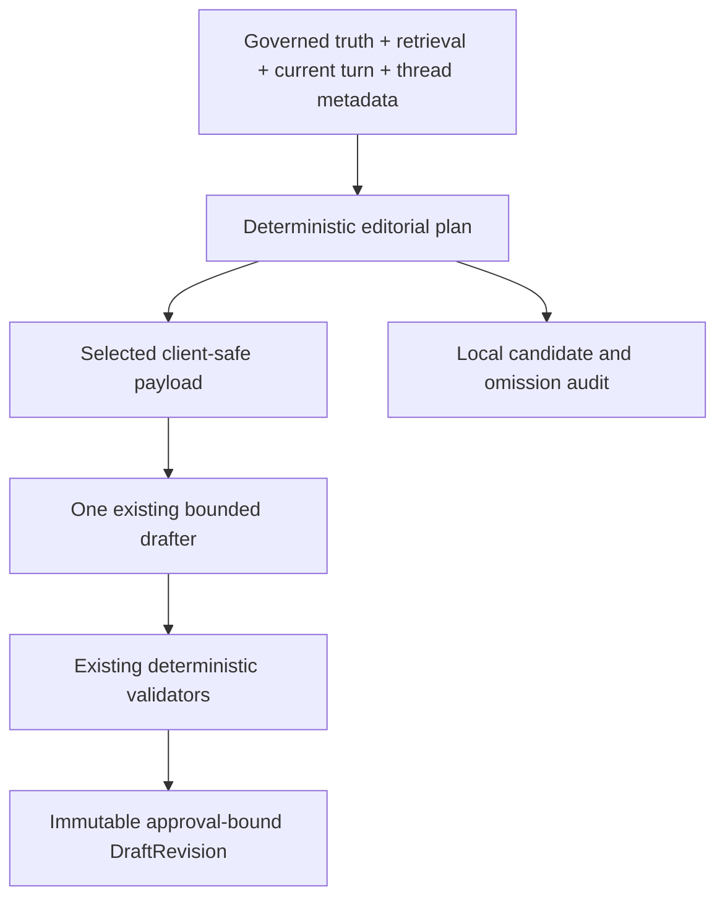

# Editorial Planner Architecture

The deterministic planner sits inside DraftContract → ClientGenerationPayload, after governed case truth, current factual retrieval and ownership/intent resolution, and before the existing single bounded OpenAI drafter. The full contract remains local for the existing validators. Planning does not create policy, pricing, permissions, approvals, availability or workflow truth.

Two implementation passes completed: 19/21 drafts persisted; continuity 6/7; accepted grades 14 A / 5 B / 0 C / 0 D. 2 candidates were rejected, not counted as accepted drafts. The implementation is complete within the authorized two-pass limit, but demonstrated editorial defects remain; see the exact reviews below.

# Domain Model

`EditorialRole` is a string enum: MUST_COMMUNICATE, MUST_ASK, ACKNOWLEDGE, HELPFUL_NOW, ALREADY_COMMUNICATED, DEFER, INTERNAL_ONLY.

`EditorialContentItem` contains semantic_key, topic, source_reference, proposition_key, authority_class, structured value, role, reason, prior_turn_status and priority. A SHA-256 fingerprint binds semantic identity, source and current value. Inclusion follows the role, not a free-form prompt suggestion.

`EditorialContentPlan` contains response_intent, primary_client_need, typed items, substantive_budget, budget_reason and version. Its audit projection exposes each role separately, do_not_repeat, client_visible_pending_state, editorial_rationale and source_bindings.

# Selection Rules

1. Retain every client-owned open question and material current answer. Preserve current restrictions and pending-change semantics.

2. Select requested current capability answers from typed Phase 4 projections. Project recognized current kitchen/access guidance into practical semantic values; defer secondary or unstructured document text.

3. Use earlier client requests and realized draft metadata to retain unanswered commercial questions. A newly available or changed governed fee must be included. An unrelated budget mention does not request a fee quote.

4. Use stable source/value fingerprints to identify unchanged prior answers. A current explicit question may justify repeating one. The audit records that reason. Planned-but-unrealized items do not count as communicated.

5. Default to three substantive items for simple replies and up to four for ordinary replies. Required compound answers and client-owned questions can expand the budget explicitly; optional guidance loses priority. Acknowledgement does not consume a substantive slot.

6. Keep full internal ownership and authority material in the local audit. Only selected client-safe values enter generation. No deferred raw guidance or prior draft bodies are sent.

Novelty uses the last accepted generated or edited draft event per earlier client turn, not case revision alone. Current-turn drafts/regenerations are excluded. Operator edits without a fresh realization audit do not inherit that turn’s metadata. “Communicated” here means present in a prior accepted draft, never proof of sending or receipt.

Request-topic selectors and realization witnesses are finite deterministic adapters. They are not a second NLP model. Unrecognized wording is conservative: it does not establish a previous answer or new authority. Current sources always remain authoritative.

# Before / After Pipeline



Before: the payload exposed almost all guidance and the model chose what to mention. After: application logic assigns each candidate an editorial role, excludes deferred/internal/unchanged content, and gives the model the selected writing plan.

# Implementation Passes

```json
{
  "number": 1,
  "commit": "808192d69733aa3363d61c33c9d4a29cb6e4b7c5",
  "changes": [
    "Typed deterministic roles and information budget before ClientGenerationPayload",
    "Stable source/value fingerprints and realized prior-draft metadata",
    "Structured current capability, kitchen and access projections; deferred/internal text excluded",
    "Every generated event captures plan, exact client payload and realized item identities"
  ],
  "tests": {
    "focused": 78,
    "focused_subtests": 13,
    "full": 615,
    "phase8": 398,
    "full_subtests": 160,
    "failures": 0
  },
  "deploy_id": "dep-datsnj7avr4c73eqmo4g",
  "deployment": "live",
  "accepted_drafts": 21,
  "planner_boundary_checks": 21,
  "diagnosis": "Primary/secondary technical conditions bundled; generic logistics topic expands to unrequested checks; fee question hides overall-pricing request; internal decision labels leak; acknowledged restriction returns on later turns.",
  "review_metrics": {
    "grades": {
      "A": 6,
      "B": 14,
      "C": 1
    },
    "unnecessary_fact": 9,
    "repetition": 2,
    "policy_copy": 2,
    "system_language": 10,
    "unanswered_request": 1,
    "missing_client_question": 0,
    "materially_shorter": 10,
    "policy_dump": 2,
    "repeated_policy_block": 2
  }
}
```

```json
{
  "number": 2,
  "commit": "7ed2ab8d4bc67a861b28807a19f523f0ab06f076",
  "changes": [
    "Primary projection check separated from secondary conditions, which stay auditable as DEFER unless explicitly requested",
    "Specific logistics components replace category-wide next steps",
    "Overall-pricing question retained independently of booking fee and fee adjustment",
    "Normalize client question and fee decision labels; narrow acknowledgement scope",
    "Client-acknowledged restrictions remain deferred on follow-ups unless asked again; statement can is not treated as a repeat question"
  ],
  "tests": {
    "focused": 84,
    "focused_subtests": 13,
    "full": 621,
    "phase8": 404,
    "full_subtests": 160,
    "failures": 0
  },
  "deploy_id": "dep-datt2a942hec73d1cv4g",
  "deployment": "live",
  "review_metrics": {
    "grades": {
      "A": 14,
      "B": 5,
      "REJECTED": 2
    },
    "unnecessary_fact": 2,
    "repetition": 0,
    "policy_copy": 2,
    "system_language": 3,
    "unanswered_request": 2,
    "missing_client_question": 0,
    "materially_shorter": 3,
    "policy_dump": 0,
    "repeated_policy_block": 0
  }
}
```

# UAT Planner Evidence

Each plan and payload below was captured in the generated draft event. The candidate table deliberately omits raw internal text; full source bindings and exclusion decisions remain in the local JSON audit. The JSON is the exact client-writing payload passed to the drafter, with no credentials.

## UAT-001/1

Response intent: `COMPLETE_INQUIRY_RESPONSE`. Primary need: `commercial`.

Substantive budget: 3; reason: `minimal_substantive_items_optional_guidance_ranked_last`.

### ACKNOWLEDGE

| Topic / semantic key | Source | Reason | Prior-turn status | In payload |
|---|---|---|---|---|
| latest_client_detail / latest_client_detail | current_client_message | current_turn_delta | not_previously_communicated | yes |

### MUST_COMMUNICATE

| Topic / semantic key | Source | Reason | Prior-turn status | In payload |
|---|---|---|---|---|
| commercial / commercial.current | governed_case | current_or_unanswered_earlier_commercial_question | not_previously_communicated | yes |
| next_step / next_step | governed_case | immediate_wnc_owned_next_step | not_previously_communicated | yes |

### MUST_ASK

None.

### HELPFUL_NOW

None.

### ALREADY_COMMUNICATED

None.

### DEFER

| Topic / semantic key | Source | Reason | Prior-turn status | In payload |
|---|---|---|---|---|
| capacity / fact:capacity | phase4:capacity_studio_within_all_published_limits | not_needed_in_current_turn | not_previously_communicated | no |
| guest_count / case_fact:guest_count | governed_case | case_summary_not_needed_for_this_reply | not_previously_communicated | no |
| event_type / case_fact:event_type | governed_case | case_summary_not_needed_for_this_reply | not_previously_communicated | no |
| Requested rental type code / case_fact:Requested rental type code | governed_case | case_summary_not_needed_for_this_reply | not_previously_communicated | no |
| Requested active event start / case_fact:Requested active event start | governed_case | case_summary_not_needed_for_this_reply | not_previously_communicated | no |
| Requested active event end / case_fact:Requested active event end | governed_case | case_summary_not_needed_for_this_reply | not_previously_communicated | no |

### INTERNAL_ONLY

| Topic / semantic key | Source | Reason | Prior-turn status | In payload |
|---|---|---|---|---|
| resolution / internal:availability:2026-10-14 10:00:00+00:2026-10-14 14:00:00+00 | availability:2026-10-14 10:00:00+00:2026-10-14 14:00:00+00 | ownership_and_workflow_mechanics_stay_local | not_previously_communicated | no |

### Exact client generation payload

```json
{
  "acknowledgements": [
    {
      "about": "product workshop",
      "kind": "new_enquiry",
      "topic": "latest_client_detail"
    }
  ],
  "do_not_repeat_topics": [],
  "external_pending": [],
  "forbidden_claims": [
    "Do not confirm venue availability or booking.",
    "Do not describe a pending internal confirmation as completed.",
    "Do not describe a pending decision or fee adjustment as approved.",
    "Do not use historical precedent as current policy.",
    "Do not use an em dash in the subject or body.",
    "Do not derive concrete supplier arrival or unloading times from requested event times. State general access policy without authorizing an access window. Never imply a loading route has already been provided unless the supplied facts establish it."
  ],
  "latest_client_message": "Hi WNC team,\n\nWe are planning a 20-person product workshop on 14 October from 10:00 to 14:00. We would like to hire the Studio for the session. Could you let us know the booking fee and the next steps?\n\nBest,\nMaya",
  "must_say": [
    {
      "booking_fee": "EUR 75 excl. VAT",
      "topic": "commercial",
      "vat": "21%"
    },
    {
      "action": "check",
      "requested_event_window": [
        "Requested active event start: 2026-10-14 10:00:00+00",
        "Requested active event end: 2026-10-14 14:00:00+00"
      ],
      "status": "check_required",
      "subjects": [
        "requested date and venue availability"
      ],
      "topic": "next_step"
    }
  ],
  "open_client_questions": [],
  "optional_helpful_now": [],
  "primary_client_need": [
    "commercial"
  ],
  "recipient_label": "Maya Chen",
  "response_intent": "COMPLETE_INQUIRY_RESPONSE",
  "signature_policy": "Do not write a signature or valediction. End after the last useful sentence or question.",
  "style_profile": [
    "Write like an experienced WNC operator answering this particular message, not summarizing policy.",
    "Use the minimum governed information needed to answer the actual question, prevent a likely misunderstanding, explain one useful constraint or make the next step clear. Allowed facts are optional, not a checklist.",
    "Normally use 2 to 4 short paragraphs; a simple reply can be three sentences. Use bullets only for several requested details or genuinely clearer logistics.",
    "Start with Hi <first name> and acknowledge the specific new detail. Vary naturally; do not force a stock thanks phrase.",
    "Concision should still feel personal: include a brief natural acknowledgement of the message rather than opening with a bare price or technical status.",
    "Prefer personal, plain first-person next steps. Avoid current process, applicable maximum, technical provision and explanations of governance logic.",
    "Do not repeat capacity maxima, fees, equipment or policies merely because they are known. Mention capacity only when suitability or a limit matters; fees when price, an exception or the immediate next step requires them.",
    "For follow-ups, respond to the change. Do not repeat an unchanged policy already covered in the earlier draft. Do not claim that an unsent draft was sent or received.",
    "Use at most one unsolicited practical policy caveat per topic; retain every material requirement needed to answer the actual question safely. Relevant-later details stay out of this email.",
    "Acknowledge a clarification without explaining how you will classify the request or treat historical evidence. Give the practical answer or next step.",
    "Keep limitations constructive: describe the practical next step instead of your inability to assess or analyse. Avoid business jargon such as cost sensitivity; speak about the client’s budget or plans plainly.",
    "Translate technical status into everyday language about what works or what you can arrange; avoid catalogue labels such as supported or provision. Keep material conditions intact.",
    "Use a short, plain subject. No signature block, valediction, em dash or internal workflow language."
  ]
}
```

## UAT-002/1

Response intent: `REQUEST_CLIENT_INFORMATION`. Primary need: `client_owned_missing_information`.

Substantive budget: 6; reason: `compound_material_answers_and_client_questions`.

### ACKNOWLEDGE

| Topic / semantic key | Source | Reason | Prior-turn status | In payload |
|---|---|---|---|---|
| latest_client_detail / latest_client_detail | current_client_message | current_turn_delta | not_previously_communicated | yes |

### MUST_COMMUNICATE

| Topic / semantic key | Source | Reason | Prior-turn status | In payload |
|---|---|---|---|---|
| commercial_next_step / commercial.check | governed_case | requested_answer_not_yet_available | not_previously_communicated | yes |
| overall_pricing / commercial.overall_pricing | governed_case | overall_pricing_question_is_distinct_from_booking_fee | not_previously_communicated | yes |

### MUST_ASK

| Topic / semantic key | Source | Reason | Prior-turn status | In payload |
|---|---|---|---|---|
| client_information / question:2044 | governed_case | open_client_owned_question | not_previously_communicated | yes |
| client_information / question:2045 | governed_case | open_client_owned_question | not_previously_communicated | yes |
| client_information / question:2046 | governed_case | open_client_owned_question | not_previously_communicated | yes |
| client_information / question:2047 | governed_case | open_client_owned_question | not_previously_communicated | yes |

### HELPFUL_NOW

None.

### ALREADY_COMMUNICATED

None.

### DEFER

| Topic / semantic key | Source | Reason | Prior-turn status | In payload |
|---|---|---|---|---|
| Requested rental type code / case_fact:Requested rental type code | governed_case | case_summary_not_needed_for_this_reply | not_previously_communicated | no |

### INTERNAL_ONLY

| Topic / semantic key | Source | Reason | Prior-turn status | In payload |
|---|---|---|---|---|
| restriction / restriction:Confirmation still required | governed_case | internal_feasibility_summary | not_previously_communicated | no |
| restriction / restriction:Hard constraint | governed_case | internal_feasibility_summary | not_previously_communicated | no |
| resolution / internal:open_question:2044 | open_question:2044 | ownership_and_workflow_mechanics_stay_local | not_previously_communicated | no |
| resolution / internal:open_question:2045 | open_question:2045 | ownership_and_workflow_mechanics_stay_local | not_previously_communicated | no |
| resolution / internal:open_question:2046 | open_question:2046 | ownership_and_workflow_mechanics_stay_local | not_previously_communicated | no |
| resolution / internal:open_question:2047 | open_question:2047 | ownership_and_workflow_mechanics_stay_local | not_previously_communicated | no |

### Exact client generation payload

```json
{
  "acknowledgements": [
    {
      "about": "the enquiry",
      "kind": "new_enquiry",
      "topic": "latest_client_detail"
    }
  ],
  "do_not_repeat_topics": [],
  "external_pending": [],
  "forbidden_claims": [
    "Do not confirm venue availability or booking.",
    "Do not describe a pending internal confirmation as completed.",
    "Do not describe a pending decision or fee adjustment as approved.",
    "Do not use historical precedent as current policy.",
    "Do not use an em dash in the subject or body.",
    "Do not derive concrete supplier arrival or unloading times from requested event times. State general access policy without authorizing an access window. Never imply a loading route has already been provided unless the supplied facts establish it."
  ],
  "latest_client_message": "Hello,\n\nMy team is starting to plan an offsite later this autumn and WNC was recommended to us. Could you send over an idea of what is possible and what it costs?\n\nThanks,\nJon",
  "must_say": [
    {
      "action": "check requested booking fee or pricing",
      "status": "check_required",
      "topic": "commercial_next_step"
    },
    {
      "action": "check overall rental pricing against the client request and budget",
      "status": "check_required",
      "topic": "overall_pricing"
    }
  ],
  "open_client_questions": [
    {
      "open_question_id": 2044,
      "question": "What full date (including year), start time and finish time would you like?",
      "topic": "client_information"
    },
    {
      "open_question_id": 2045,
      "question": "How many guests are expected?",
      "topic": "client_information"
    },
    {
      "open_question_id": 2046,
      "question": "Which space would you like?",
      "topic": "client_information"
    },
    {
      "open_question_id": 2047,
      "question": "What type of event are you planning?",
      "topic": "client_information"
    }
  ],
  "optional_helpful_now": [],
  "primary_client_need": [
    "client_owned_missing_information"
  ],
  "recipient_label": "Jon Bell",
  "response_intent": "REQUEST_CLIENT_INFORMATION",
  "signature_policy": "Do not write a signature or valediction. End after the last useful sentence or question.",
  "style_profile": [
    "Write like an experienced WNC operator answering this particular message, not summarizing policy.",
    "Use the minimum governed information needed to answer the actual question, prevent a likely misunderstanding, explain one useful constraint or make the next step clear. Allowed facts are optional, not a checklist.",
    "Normally use 2 to 4 short paragraphs; a simple reply can be three sentences. Use bullets only for several requested details or genuinely clearer logistics.",
    "Start with Hi <first name> and acknowledge the specific new detail. Vary naturally; do not force a stock thanks phrase.",
    "Concision should still feel personal: include a brief natural acknowledgement of the message rather than opening with a bare price or technical status.",
    "Prefer personal, plain first-person next steps. Avoid current process, applicable maximum, technical provision and explanations of governance logic.",
    "Do not repeat capacity maxima, fees, equipment or policies merely because they are known. Mention capacity only when suitability or a limit matters; fees when price, an exception or the immediate next step requires them.",
    "For follow-ups, respond to the change. Do not repeat an unchanged policy already covered in the earlier draft. Do not claim that an unsent draft was sent or received.",
    "Use at most one unsolicited practical policy caveat per topic; retain every material requirement needed to answer the actual question safely. Relevant-later details stay out of this email.",
    "Acknowledge a clarification without explaining how you will classify the request or treat historical evidence. Give the practical answer or next step.",
    "Keep limitations constructive: describe the practical next step instead of your inability to assess or analyse. Avoid business jargon such as cost sensitivity; speak about the client’s budget or plans plainly.",
    "Translate technical status into everyday language about what works or what you can arrange; avoid catalogue labels such as supported or provision. Keep material conditions intact.",
    "Use a short, plain subject. No signature block, valediction, em dash or internal workflow language."
  ]
}
```

## UAT-003/1

Response intent: `COMPLETE_INQUIRY_RESPONSE`. Primary need: `capacity`.

Substantive budget: 3; reason: `minimal_substantive_items_optional_guidance_ranked_last`.

### ACKNOWLEDGE

| Topic / semantic key | Source | Reason | Prior-turn status | In payload |
|---|---|---|---|---|
| latest_client_detail / latest_client_detail | current_client_message | current_turn_delta | not_previously_communicated | yes |

### MUST_COMMUNICATE

| Topic / semantic key | Source | Reason | Prior-turn status | In payload |
|---|---|---|---|---|
| capacity / fact:capacity | phase4:capacity_entire_venue_within_capacity | client_asks_about_fit | not_previously_communicated | yes |
| next_step / next_step | governed_case | immediate_wnc_owned_next_step | not_previously_communicated | yes |

### MUST_ASK

None.

### HELPFUL_NOW

None.

### ALREADY_COMMUNICATED

None.

### DEFER

| Topic / semantic key | Source | Reason | Prior-turn status | In payload |
|---|---|---|---|---|
| commercial / commercial.current | governed_case | not_needed_for_current_question | not_previously_communicated | no |
| supplier_access / fact:supplier_access | CF-005 | not_needed_in_current_turn | not_previously_communicated | no |
| capacity / guidance:0385ebf31967963a | CF-005 | secondary_or_unstructured_guidance_not_needed_now | not_previously_communicated | no |
| guest_count / case_fact:guest_count | governed_case | case_summary_not_needed_for_this_reply | not_previously_communicated | no |
| event_type / case_fact:event_type | governed_case | case_summary_not_needed_for_this_reply | not_previously_communicated | no |
| Requested rental type code / case_fact:Requested rental type code | governed_case | case_summary_not_needed_for_this_reply | not_previously_communicated | no |
| Requested active event start / case_fact:Requested active event start | governed_case | case_summary_not_needed_for_this_reply | not_previously_communicated | no |
| Requested active event end / case_fact:Requested active event end | governed_case | case_summary_not_needed_for_this_reply | not_previously_communicated | no |

### INTERNAL_ONLY

| Topic / semantic key | Source | Reason | Prior-turn status | In payload |
|---|---|---|---|---|
| resolution / internal:availability:2026-10-22 18:00:00+00:2026-10-22 23:00:00+00 | availability:2026-10-22 18:00:00+00:2026-10-22 23:00:00+00 | ownership_and_workflow_mechanics_stay_local | not_previously_communicated | no |

### Exact client generation payload

```json
{
  "acknowledgements": [
    {
      "about": "awards evening",
      "kind": "new_enquiry",
      "topic": "latest_client_detail"
    }
  ],
  "do_not_repeat_topics": [],
  "external_pending": [],
  "forbidden_claims": [
    "Do not confirm venue availability or booking.",
    "Do not describe a pending internal confirmation as completed.",
    "Do not describe a pending decision or fee adjustment as approved.",
    "Do not use historical precedent as current policy.",
    "Do not use an em dash in the subject or body.",
    "Do not derive concrete supplier arrival or unloading times from requested event times. State general access policy without authorizing an access window. Never imply a loading route has already been provided unless the supplied facts establish it."
  ],
  "latest_client_message": "Hi,\n\nWe are organising an awards evening for 65 colleagues on 22 October, 18:00-23:00, and would like exclusive use of the whole venue. Is that something you can accommodate?\n\nKind regards,\nPriya",
  "must_say": [
    {
      "near_limit": false,
      "requested_guests": 65,
      "scope": "entire venue",
      "status": "within_limits",
      "topic": "capacity"
    },
    {
      "action": "check",
      "requested_event_window": [
        "Requested active event start: 2026-10-22 18:00:00+00",
        "Requested active event end: 2026-10-22 23:00:00+00"
      ],
      "status": "check_required",
      "subjects": [
        "requested date and venue availability"
      ],
      "topic": "next_step"
    }
  ],
  "open_client_questions": [],
  "optional_helpful_now": [],
  "primary_client_need": [
    "capacity"
  ],
  "recipient_label": "Priya Raman",
  "response_intent": "COMPLETE_INQUIRY_RESPONSE",
  "signature_policy": "Do not write a signature or valediction. End after the last useful sentence or question.",
  "style_profile": [
    "Write like an experienced WNC operator answering this particular message, not summarizing policy.",
    "Use the minimum governed information needed to answer the actual question, prevent a likely misunderstanding, explain one useful constraint or make the next step clear. Allowed facts are optional, not a checklist.",
    "Normally use 2 to 4 short paragraphs; a simple reply can be three sentences. Use bullets only for several requested details or genuinely clearer logistics.",
    "Start with Hi <first name> and acknowledge the specific new detail. Vary naturally; do not force a stock thanks phrase.",
    "Concision should still feel personal: include a brief natural acknowledgement of the message rather than opening with a bare price or technical status.",
    "Prefer personal, plain first-person next steps. Avoid current process, applicable maximum, technical provision and explanations of governance logic.",
    "Do not repeat capacity maxima, fees, equipment or policies merely because they are known. Mention capacity only when suitability or a limit matters; fees when price, an exception or the immediate next step requires them.",
    "For follow-ups, respond to the change. Do not repeat an unchanged policy already covered in the earlier draft. Do not claim that an unsent draft was sent or received.",
    "Use at most one unsolicited practical policy caveat per topic; retain every material requirement needed to answer the actual question safely. Relevant-later details stay out of this email.",
    "Acknowledge a clarification without explaining how you will classify the request or treat historical evidence. Give the practical answer or next step.",
    "Keep limitations constructive: describe the practical next step instead of your inability to assess or analyse. Avoid business jargon such as cost sensitivity; speak about the client’s budget or plans plainly.",
    "Translate technical status into everyday language about what works or what you can arrange; avoid catalogue labels such as supported or provision. Keep material conditions intact.",
    "Use a short, plain subject. No signature block, valediction, em dash or internal workflow language."
  ]
}
```

## UAT-004/1

Response intent: `PENDING_INTERNAL_CONFIRMATION`. Primary need: `audio_playback, other_technical, projection_display`.

Substantive budget: 3; reason: `minimal_substantive_items_optional_guidance_ranked_last`.

### ACKNOWLEDGE

| Topic / semantic key | Source | Reason | Prior-turn status | In payload |
|---|---|---|---|---|
| latest_client_detail / latest_client_detail | current_client_message | current_turn_delta | not_previously_communicated | yes |

### MUST_COMMUNICATE

| Topic / semantic key | Source | Reason | Prior-turn status | In payload |
|---|---|---|---|---|
| projection_display / fact:projection_display | phase4:technical_projection_display_confirmation | requested_technical_capability | not_previously_communicated | yes |
| audio_playback / fact:audio_playback | phase4:technical_audio_playback_supported | requested_technical_capability | not_previously_communicated | yes |
| other_technical / fact:other_technical | phase4:technical_other_technical_confirmation | requested_technical_capability | not_previously_communicated | yes |

### MUST_ASK

None.

### HELPFUL_NOW

None.

### ALREADY_COMMUNICATED

None.

### DEFER

| Topic / semantic key | Source | Reason | Prior-turn status | In payload |
|---|---|---|---|---|
| commercial / commercial.current | governed_case | not_needed_for_current_question | not_previously_communicated | no |
| projection_detail / condition:projection:compatibility | phase4:technical_projection_display_confirmation | secondary_condition_covered_by_practical_setup_check | not_previously_communicated | no |
| projection_detail / condition:projection:adapters | phase4:technical_projection_display_confirmation | secondary_condition_covered_by_practical_setup_check | not_previously_communicated | no |
| projection_detail / condition:projection:files | phase4:technical_projection_display_confirmation | secondary_condition_covered_by_practical_setup_check | not_previously_communicated | no |
| projection_detail / condition:projection:screenless setup suitability | phase4:technical_projection_display_confirmation | secondary_condition_covered_by_practical_setup_check | not_previously_communicated | no |
| guest_count / case_fact:guest_count | governed_case | case_summary_not_needed_for_this_reply | not_previously_communicated | no |
| event_type / case_fact:event_type | governed_case | case_summary_not_needed_for_this_reply | not_previously_communicated | no |
| Requested rental type code / case_fact:Requested rental type code | governed_case | case_summary_not_needed_for_this_reply | not_previously_communicated | no |
| Requested active event start / case_fact:Requested active event start | governed_case | case_summary_not_needed_for_this_reply | not_previously_communicated | no |
| Requested active event end / case_fact:Requested active event end | governed_case | case_summary_not_needed_for_this_reply | not_previously_communicated | no |

### INTERNAL_ONLY

| Topic / semantic key | Source | Reason | Prior-turn status | In payload |
|---|---|---|---|---|
| restriction / restriction:Feasibility as requested | governed_case | internal_feasibility_summary | not_previously_communicated | no |
| restriction / restriction:Confirmation still required | governed_case | internal_feasibility_summary | not_previously_communicated | no |
| restriction / restriction:Hard constraint | governed_case | internal_feasibility_summary | not_previously_communicated | no |
| resolution / internal:blocker:2161 | blocker:2161 | ownership_and_workflow_mechanics_stay_local | not_previously_communicated | no |
| resolution / internal:blocker:2162 | blocker:2162 | ownership_and_workflow_mechanics_stay_local | not_previously_communicated | no |
| resolution / internal:availability:2026-10-29 16:00:00+00:2026-10-29 20:00:00+00 | availability:2026-10-29 16:00:00+00:2026-10-29 20:00:00+00 | ownership_and_workflow_mechanics_stay_local | not_previously_communicated | no |

### Exact client generation payload

```json
{
  "acknowledgements": [
    {
      "about": "product launch",
      "kind": "new_enquiry",
      "topic": "latest_client_detail"
    }
  ],
  "do_not_repeat_topics": [],
  "external_pending": [],
  "forbidden_claims": [
    "Do not confirm venue availability or booking.",
    "Do not describe a pending internal confirmation as completed.",
    "Do not describe a pending decision or fee adjustment as approved.",
    "Do not use historical precedent as current policy.",
    "Do not use an em dash in the subject or body.",
    "Do not derive concrete supplier arrival or unloading times from requested event times. State general access policy without authorizing an access window. Never imply a loading route has already been provided unless the supplied facts establish it."
  ],
  "latest_client_message": "Hello WNC,\n\nWe are planning a 24-person product launch in the Studio on 29 October, 16:00-20:00. We would need a screen for slides, some background music, and we are wondering whether a small hologram display could be arranged. Please let us know what is realistic.\n\nElena",
  "must_say": [
    {
      "available_equipment": "WNC projector",
      "capability": "projection display",
      "check_required": [
        "practical projection setup"
      ],
      "status": "conditional",
      "topic": "projection_display"
    },
    {
      "capability": "audio playback",
      "status": "supported",
      "topic": "audio_playback"
    },
    {
      "capability": "other technical",
      "check_required": [
        "safe technical feasibility"
      ],
      "status": "conditional",
      "topic": "other_technical"
    }
  ],
  "open_client_questions": [],
  "optional_helpful_now": [],
  "primary_client_need": [
    "audio_playback",
    "other_technical",
    "projection_display"
  ],
  "recipient_label": "Elena Vos",
  "response_intent": "PENDING_INTERNAL_CONFIRMATION",
  "signature_policy": "Do not write a signature or valediction. End after the last useful sentence or question.",
  "style_profile": [
    "Write like an experienced WNC operator answering this particular message, not summarizing policy.",
    "Use the minimum governed information needed to answer the actual question, prevent a likely misunderstanding, explain one useful constraint or make the next step clear. Allowed facts are optional, not a checklist.",
    "Normally use 2 to 4 short paragraphs; a simple reply can be three sentences. Use bullets only for several requested details or genuinely clearer logistics.",
    "Start with Hi <first name> and acknowledge the specific new detail. Vary naturally; do not force a stock thanks phrase.",
    "Concision should still feel personal: include a brief natural acknowledgement of the message rather than opening with a bare price or technical status.",
    "Prefer personal, plain first-person next steps. Avoid current process, applicable maximum, technical provision and explanations of governance logic.",
    "Do not repeat capacity maxima, fees, equipment or policies merely because they are known. Mention capacity only when suitability or a limit matters; fees when price, an exception or the immediate next step requires them.",
    "For follow-ups, respond to the change. Do not repeat an unchanged policy already covered in the earlier draft. Do not claim that an unsent draft was sent or received.",
    "Use at most one unsolicited practical policy caveat per topic; retain every material requirement needed to answer the actual question safely. Relevant-later details stay out of this email.",
    "Acknowledge a clarification without explaining how you will classify the request or treat historical evidence. Give the practical answer or next step.",
    "Keep limitations constructive: describe the practical next step instead of your inability to assess or analyse. Avoid business jargon such as cost sensitivity; speak about the client’s budget or plans plainly.",
    "Translate technical status into everyday language about what works or what you can arrange; avoid catalogue labels such as supported or provision. Keep material conditions intact.",
    "Use a short, plain subject. No signature block, valediction, em dash or internal workflow language."
  ]
}
```

## UAT-004/2

Response intent: `PENDING_INTERNAL_CONFIRMATION`. Primary need: `audio_playback, other_technical, projection_display`.

Substantive budget: 3; reason: `minimal_substantive_items_optional_guidance_ranked_last`.

### ACKNOWLEDGE

| Topic / semantic key | Source | Reason | Prior-turn status | In payload |
|---|---|---|---|---|
| latest_client_detail / latest_client_detail | current_client_message | current_turn_delta | not_previously_communicated | yes |

### MUST_COMMUNICATE

| Topic / semantic key | Source | Reason | Prior-turn status | In payload |
|---|---|---|---|---|
| projection_display / fact:projection_display | phase4:technical_projection_display_confirmation | requested_technical_capability | not_previously_communicated | yes |

### MUST_ASK

None.

### HELPFUL_NOW

None.

### ALREADY_COMMUNICATED

| Topic / semantic key | Source | Reason | Prior-turn status | In payload |
|---|---|---|---|---|
| audio_playback / fact:audio_playback | phase4:technical_audio_playback_supported | unchanged_answer_already_explained | unchanged_answer_in_prior_draft | no |

### DEFER

| Topic / semantic key | Source | Reason | Prior-turn status | In payload |
|---|---|---|---|---|
| commercial / commercial.current | governed_case | not_needed_for_current_question | not_previously_communicated | no |
| projection_detail / condition:projection:compatibility | phase4:technical_projection_display_confirmation | secondary_condition_covered_by_practical_setup_check | not_previously_communicated | no |
| projection_detail / condition:projection:adapters | phase4:technical_projection_display_confirmation | secondary_condition_covered_by_practical_setup_check | not_previously_communicated | no |
| projection_detail / condition:projection:files | phase4:technical_projection_display_confirmation | secondary_condition_covered_by_practical_setup_check | not_previously_communicated | no |
| projection_detail / condition:projection:screenless setup suitability | phase4:technical_projection_display_confirmation | secondary_condition_covered_by_practical_setup_check | not_previously_communicated | no |
| guest_count / case_fact:guest_count | governed_case | case_summary_not_needed_for_this_reply | not_previously_communicated | no |
| event_type / case_fact:event_type | governed_case | case_summary_not_needed_for_this_reply | not_previously_communicated | no |
| Requested rental type code / case_fact:Requested rental type code | governed_case | case_summary_not_needed_for_this_reply | not_previously_communicated | no |
| Requested active event start / case_fact:Requested active event start | governed_case | case_summary_not_needed_for_this_reply | not_previously_communicated | no |
| Requested active event end / case_fact:Requested active event end | governed_case | case_summary_not_needed_for_this_reply | not_previously_communicated | no |

### INTERNAL_ONLY

| Topic / semantic key | Source | Reason | Prior-turn status | In payload |
|---|---|---|---|---|
| restriction / restriction:Feasibility as requested | governed_case | internal_feasibility_summary | not_previously_communicated | no |
| restriction / restriction:Confirmation still required | governed_case | internal_feasibility_summary | not_previously_communicated | no |
| restriction / restriction:Hard constraint | governed_case | internal_feasibility_summary | not_previously_communicated | no |
| resolution / internal:blocker:2161 | blocker:2161 | ownership_and_workflow_mechanics_stay_local | not_previously_communicated | no |
| resolution / internal:blocker:2162 | blocker:2162 | ownership_and_workflow_mechanics_stay_local | not_previously_communicated | no |
| resolution / internal:blocker:2163 | blocker:2163 | ownership_and_workflow_mechanics_stay_local | not_previously_communicated | no |
| resolution / internal:availability:2026-10-29 16:00:00+00:2026-10-29 20:00:00+00 | availability:2026-10-29 16:00:00+00:2026-10-29 20:00:00+00 | ownership_and_workflow_mechanics_stay_local | not_previously_communicated | no |

### Exact client generation payload

```json
{
  "acknowledgements": [
    {
      "focus": "the change or clarification in the latest message",
      "kind": "new_client_detail",
      "topic": "latest_client_detail"
    }
  ],
  "do_not_repeat_topics": [
    "audio_playback"
  ],
  "external_pending": [],
  "forbidden_claims": [
    "Do not confirm venue availability or booking.",
    "Do not describe a pending internal confirmation as completed.",
    "Do not describe a pending decision or fee adjustment as approved.",
    "Do not use historical precedent as current policy.",
    "Do not use an em dash in the subject or body.",
    "Do not derive concrete supplier arrival or unloading times from requested event times. State general access policy without authorizing an access window. Never imply a loading route has already been provided unless the supplied facts establish it."
  ],
  "latest_client_message": "Hi again,\n\nThe hologram is optional, so please do not hold up the rest of the planning for it. A normal projection setup and light music would cover the essentials.\n\nElena",
  "must_say": [
    {
      "available_equipment": "WNC projector",
      "capability": "projection display",
      "check_required": [
        "practical projection setup"
      ],
      "status": "conditional",
      "topic": "projection_display"
    }
  ],
  "open_client_questions": [],
  "optional_helpful_now": [],
  "primary_client_need": [
    "audio_playback",
    "other_technical",
    "projection_display"
  ],
  "recipient_label": "Elena Vos",
  "response_intent": "PENDING_INTERNAL_CONFIRMATION",
  "signature_policy": "Do not write a signature or valediction. End after the last useful sentence or question.",
  "style_profile": [
    "Write like an experienced WNC operator answering this particular message, not summarizing policy.",
    "Use the minimum governed information needed to answer the actual question, prevent a likely misunderstanding, explain one useful constraint or make the next step clear. Allowed facts are optional, not a checklist.",
    "Normally use 2 to 4 short paragraphs; a simple reply can be three sentences. Use bullets only for several requested details or genuinely clearer logistics.",
    "Start with Hi <first name> and acknowledge the specific new detail. Vary naturally; do not force a stock thanks phrase.",
    "Concision should still feel personal: include a brief natural acknowledgement of the message rather than opening with a bare price or technical status.",
    "Prefer personal, plain first-person next steps. Avoid current process, applicable maximum, technical provision and explanations of governance logic.",
    "Do not repeat capacity maxima, fees, equipment or policies merely because they are known. Mention capacity only when suitability or a limit matters; fees when price, an exception or the immediate next step requires them.",
    "For follow-ups, respond to the change. Do not repeat an unchanged policy already covered in the earlier draft. Do not claim that an unsent draft was sent or received.",
    "Use at most one unsolicited practical policy caveat per topic; retain every material requirement needed to answer the actual question safely. Relevant-later details stay out of this email.",
    "Acknowledge a clarification without explaining how you will classify the request or treat historical evidence. Give the practical answer or next step.",
    "Keep limitations constructive: describe the practical next step instead of your inability to assess or analyse. Avoid business jargon such as cost sensitivity; speak about the client’s budget or plans plainly.",
    "Translate technical status into everyday language about what works or what you can arrange; avoid catalogue labels such as supported or provision. Keep material conditions intact.",
    "Use a short, plain subject. No signature block, valediction, em dash or internal workflow language."
  ]
}
```

## UAT-005/1

Response intent: `PENDING_INTERNAL_CONFIRMATION`. Primary need: `catering_kitchen, facilitator`.

Substantive budget: 3; reason: `minimal_substantive_items_optional_guidance_ranked_last`.

### ACKNOWLEDGE

| Topic / semantic key | Source | Reason | Prior-turn status | In payload |
|---|---|---|---|---|
| latest_client_detail / latest_client_detail | current_client_message | current_turn_delta | not_previously_communicated | yes |

### MUST_COMMUNICATE

| Topic / semantic key | Source | Reason | Prior-turn status | In payload |
|---|---|---|---|---|
| catering_kitchen / fact:catering_kitchen | SERV-003 | current_catering_suitability_question | not_previously_communicated | yes |
| next_step / next_step | governed_case | immediate_wnc_owned_next_step | not_previously_communicated | yes |

### MUST_ASK

None.

### HELPFUL_NOW

None.

### ALREADY_COMMUNICATED

None.

### DEFER

| Topic / semantic key | Source | Reason | Prior-turn status | In payload |
|---|---|---|---|---|
| commercial / commercial.current | governed_case | not_needed_for_current_question | not_previously_communicated | no |
| catering_kitchen / guidance:74b98767a0208fcb | SERV-003 | secondary_or_unstructured_guidance_not_needed_now | not_previously_communicated | no |
| external_supplier_setup / guidance:c860c453d6ac37bf | SERV-004 | secondary_or_unstructured_guidance_not_needed_now | not_previously_communicated | no |
| external_supplier_setup / guidance:f3bb9a44431341d3 | SERV-004 | secondary_or_unstructured_guidance_not_needed_now | not_previously_communicated | no |
| capacity / fact:capacity | phase4:capacity_studio_within_all_published_limits | not_needed_in_current_turn | not_previously_communicated | no |
| guest_count / case_fact:guest_count | governed_case | case_summary_not_needed_for_this_reply | not_previously_communicated | no |
| event_type / case_fact:event_type | governed_case | case_summary_not_needed_for_this_reply | not_previously_communicated | no |
| Requested rental type code / case_fact:Requested rental type code | governed_case | case_summary_not_needed_for_this_reply | not_previously_communicated | no |
| Requested active event start / case_fact:Requested active event start | governed_case | case_summary_not_needed_for_this_reply | not_previously_communicated | no |
| Requested active event end / case_fact:Requested active event end | governed_case | case_summary_not_needed_for_this_reply | not_previously_communicated | no |

### INTERNAL_ONLY

| Topic / semantic key | Source | Reason | Prior-turn status | In payload |
|---|---|---|---|---|
| restriction / restriction:Feasibility as requested | governed_case | internal_feasibility_summary | not_previously_communicated | no |
| restriction / restriction:Confirmation still required | governed_case | internal_feasibility_summary | not_previously_communicated | no |
| restriction / restriction:Hard constraint | governed_case | internal_feasibility_summary | not_previously_communicated | no |
| resolution / internal:blocker:2112 | blocker:2112 | ownership_and_workflow_mechanics_stay_local | not_previously_communicated | no |
| resolution / internal:availability:2026-11-05 09:30:00+00:2026-11-05 17:00:00+00 | availability:2026-11-05 09:30:00+00:2026-11-05 17:00:00+00 | ownership_and_workflow_mechanics_stay_local | not_previously_communicated | no |

### Exact client generation payload

```json
{
  "acknowledgements": [
    {
      "about": "strategy session",
      "kind": "new_enquiry",
      "topic": "latest_client_detail"
    }
  ],
  "do_not_repeat_topics": [],
  "external_pending": [],
  "forbidden_claims": [
    "Do not confirm venue availability or booking.",
    "Do not describe a pending internal confirmation as completed.",
    "Do not describe a pending decision or fee adjustment as approved.",
    "Do not use historical precedent as current policy.",
    "Do not use an em dash in the subject or body.",
    "Do not derive concrete supplier arrival or unloading times from requested event times. State general access policy without authorizing an access window. Never imply a loading route has already been provided unless the supplied facts establish it."
  ],
  "latest_client_message": "Hi WNC team,\n\nCould we explore an all-day strategy session for 18 people in the Studio on 5 November, 09:30-17:00? We would like WNC to facilitate the morning and our preferred caterer would bring lunch. Is that workable?\n\nMany thanks,\nSamira",
  "must_say": [
    {
      "limitation": "not large-scale food production",
      "suitable_for": [
        "ready-made food",
        "warming",
        "plating",
        "simple assembly"
      ],
      "topic": "catering_kitchen"
    },
    {
      "action": "check",
      "status": "check_required",
      "subjects": [
        "requested facilitator availability and format"
      ],
      "topic": "next_step"
    }
  ],
  "open_client_questions": [],
  "optional_helpful_now": [],
  "primary_client_need": [
    "catering_kitchen",
    "facilitator"
  ],
  "recipient_label": "Samira Holt",
  "response_intent": "PENDING_INTERNAL_CONFIRMATION",
  "signature_policy": "Do not write a signature or valediction. End after the last useful sentence or question.",
  "style_profile": [
    "Write like an experienced WNC operator answering this particular message, not summarizing policy.",
    "Use the minimum governed information needed to answer the actual question, prevent a likely misunderstanding, explain one useful constraint or make the next step clear. Allowed facts are optional, not a checklist.",
    "Normally use 2 to 4 short paragraphs; a simple reply can be three sentences. Use bullets only for several requested details or genuinely clearer logistics.",
    "Start with Hi <first name> and acknowledge the specific new detail. Vary naturally; do not force a stock thanks phrase.",
    "Concision should still feel personal: include a brief natural acknowledgement of the message rather than opening with a bare price or technical status.",
    "Prefer personal, plain first-person next steps. Avoid current process, applicable maximum, technical provision and explanations of governance logic.",
    "Do not repeat capacity maxima, fees, equipment or policies merely because they are known. Mention capacity only when suitability or a limit matters; fees when price, an exception or the immediate next step requires them.",
    "For follow-ups, respond to the change. Do not repeat an unchanged policy already covered in the earlier draft. Do not claim that an unsent draft was sent or received.",
    "Use at most one unsolicited practical policy caveat per topic; retain every material requirement needed to answer the actual question safely. Relevant-later details stay out of this email.",
    "Acknowledge a clarification without explaining how you will classify the request or treat historical evidence. Give the practical answer or next step.",
    "Keep limitations constructive: describe the practical next step instead of your inability to assess or analyse. Avoid business jargon such as cost sensitivity; speak about the client’s budget or plans plainly.",
    "Translate technical status into everyday language about what works or what you can arrange; avoid catalogue labels such as supported or provision. Keep material conditions intact.",
    "Use a short, plain subject. No signature block, valediction, em dash or internal workflow language."
  ]
}
```

## UAT-005/2

Response intent: `PENDING_INTERNAL_CONFIRMATION`. Primary need: `catering_kitchen, facilitator, supplier_access`.

Substantive budget: 3; reason: `minimal_substantive_items_optional_guidance_ranked_last`.

### ACKNOWLEDGE

| Topic / semantic key | Source | Reason | Prior-turn status | In payload |
|---|---|---|---|---|
| latest_client_detail / latest_client_detail | current_client_message | current_turn_delta | not_previously_communicated | yes |

### MUST_COMMUNICATE

| Topic / semantic key | Source | Reason | Prior-turn status | In payload |
|---|---|---|---|---|
| next_step / next_step | governed_case | immediate_wnc_owned_next_step | not_previously_communicated | yes |

### MUST_ASK

None.

### HELPFUL_NOW

None.

### ALREADY_COMMUNICATED

| Topic / semantic key | Source | Reason | Prior-turn status | In payload |
|---|---|---|---|---|
| catering_kitchen / fact:catering_kitchen | SERV-003 | unchanged_answer_already_explained | unchanged_answer_in_prior_draft | no |

### DEFER

| Topic / semantic key | Source | Reason | Prior-turn status | In payload |
|---|---|---|---|---|
| commercial / commercial.current | governed_case | not_needed_for_current_question | not_previously_communicated | no |
| catering_kitchen / guidance:74b98767a0208fcb | SERV-003 | secondary_or_unstructured_guidance_not_needed_now | not_previously_communicated | no |
| external_supplier_setup / guidance:c860c453d6ac37bf | SERV-004 | secondary_or_unstructured_guidance_not_needed_now | not_previously_communicated | no |
| external_supplier_setup / guidance:f3bb9a44431341d3 | SERV-004 | secondary_or_unstructured_guidance_not_needed_now | not_previously_communicated | no |
| capacity / fact:capacity | phase4:capacity_studio_within_all_published_limits | not_needed_in_current_turn | not_previously_communicated | no |
| guest_count / case_fact:guest_count | governed_case | case_summary_not_needed_for_this_reply | not_previously_communicated | no |
| event_type / case_fact:event_type | governed_case | case_summary_not_needed_for_this_reply | not_previously_communicated | no |
| Requested rental type code / case_fact:Requested rental type code | governed_case | case_summary_not_needed_for_this_reply | not_previously_communicated | no |
| Requested active event start / case_fact:Requested active event start | governed_case | case_summary_not_needed_for_this_reply | not_previously_communicated | no |
| Requested active event end / case_fact:Requested active event end | governed_case | case_summary_not_needed_for_this_reply | not_previously_communicated | no |

### INTERNAL_ONLY

| Topic / semantic key | Source | Reason | Prior-turn status | In payload |
|---|---|---|---|---|
| restriction / restriction:Feasibility as requested | governed_case | internal_feasibility_summary | not_previously_communicated | no |
| restriction / restriction:Confirmation still required | governed_case | internal_feasibility_summary | not_previously_communicated | no |
| restriction / restriction:Hard constraint | governed_case | internal_feasibility_summary | not_previously_communicated | no |
| resolution / internal:blocker:2112 | blocker:2112 | ownership_and_workflow_mechanics_stay_local | not_previously_communicated | no |
| resolution / internal:availability:2026-11-05 09:30:00+00:2026-11-05 17:00:00+00 | availability:2026-11-05 09:30:00+00:2026-11-05 17:00:00+00 | ownership_and_workflow_mechanics_stay_local | not_previously_communicated | no |

### Exact client generation payload

```json
{
  "acknowledgements": [
    {
      "focus": "the change or clarification in the latest message",
      "kind": "new_client_detail",
      "topic": "latest_client_detail"
    }
  ],
  "do_not_repeat_topics": [
    "catering_kitchen"
  ],
  "external_pending": [],
  "forbidden_claims": [
    "Do not confirm venue availability or booking.",
    "Do not describe a pending internal confirmation as completed.",
    "Do not describe a pending decision or fee adjustment as approved.",
    "Do not use historical precedent as current policy.",
    "Do not use an em dash in the subject or body.",
    "Do not derive concrete supplier arrival or unloading times from requested event times. State general access policy without authorizing an access window. Never imply a loading route has already been provided unless the supplied facts establish it."
  ],
  "latest_client_message": "Thanks. Lunch would be a simple buffet and the caterer would need about 45 minutes for setup. We are flexible on the facilitator format if the full morning is not available.\n\nSamira",
  "must_say": [
    {
      "action": "check",
      "status": "check_required",
      "subjects": [
        "supplier setup access",
        "requested facilitator availability and format"
      ],
      "topic": "next_step"
    }
  ],
  "open_client_questions": [],
  "optional_helpful_now": [],
  "primary_client_need": [
    "catering_kitchen",
    "facilitator",
    "supplier_access"
  ],
  "recipient_label": "Samira Holt",
  "response_intent": "PENDING_INTERNAL_CONFIRMATION",
  "signature_policy": "Do not write a signature or valediction. End after the last useful sentence or question.",
  "style_profile": [
    "Write like an experienced WNC operator answering this particular message, not summarizing policy.",
    "Use the minimum governed information needed to answer the actual question, prevent a likely misunderstanding, explain one useful constraint or make the next step clear. Allowed facts are optional, not a checklist.",
    "Normally use 2 to 4 short paragraphs; a simple reply can be three sentences. Use bullets only for several requested details or genuinely clearer logistics.",
    "Start with Hi <first name> and acknowledge the specific new detail. Vary naturally; do not force a stock thanks phrase.",
    "Concision should still feel personal: include a brief natural acknowledgement of the message rather than opening with a bare price or technical status.",
    "Prefer personal, plain first-person next steps. Avoid current process, applicable maximum, technical provision and explanations of governance logic.",
    "Do not repeat capacity maxima, fees, equipment or policies merely because they are known. Mention capacity only when suitability or a limit matters; fees when price, an exception or the immediate next step requires them.",
    "For follow-ups, respond to the change. Do not repeat an unchanged policy already covered in the earlier draft. Do not claim that an unsent draft was sent or received.",
    "Use at most one unsolicited practical policy caveat per topic; retain every material requirement needed to answer the actual question safely. Relevant-later details stay out of this email.",
    "Acknowledge a clarification without explaining how you will classify the request or treat historical evidence. Give the practical answer or next step.",
    "Keep limitations constructive: describe the practical next step instead of your inability to assess or analyse. Avoid business jargon such as cost sensitivity; speak about the client’s budget or plans plainly.",
    "Translate technical status into everyday language about what works or what you can arrange; avoid catalogue labels such as supported or provision. Keep material conditions intact.",
    "Use a short, plain subject. No signature block, valediction, em dash or internal workflow language."
  ]
}
```

## UAT-006/1

Response intent: `COMPLETE_INQUIRY_RESPONSE`. Primary need: `respond_to_current_update`.

Substantive budget: 3; reason: `minimal_substantive_items_optional_guidance_ranked_last`.

### ACKNOWLEDGE

| Topic / semantic key | Source | Reason | Prior-turn status | In payload |
|---|---|---|---|---|
| latest_client_detail / latest_client_detail | current_client_message | current_turn_delta | not_previously_communicated | yes |

### MUST_COMMUNICATE

| Topic / semantic key | Source | Reason | Prior-turn status | In payload |
|---|---|---|---|---|
| next_step / next_step | governed_case | immediate_wnc_owned_next_step | not_previously_communicated | yes |

### MUST_ASK

None.

### HELPFUL_NOW

None.

### ALREADY_COMMUNICATED

None.

### DEFER

| Topic / semantic key | Source | Reason | Prior-turn status | In payload |
|---|---|---|---|---|
| commercial / commercial.current | governed_case | not_needed_for_current_question | not_previously_communicated | no |
| capacity / fact:capacity | phase4:capacity_studio_within_all_published_limits | not_needed_in_current_turn | not_previously_communicated | no |
| guest_count / case_fact:guest_count | governed_case | case_summary_not_needed_for_this_reply | not_previously_communicated | no |
| event_type / case_fact:event_type | governed_case | case_summary_not_needed_for_this_reply | not_previously_communicated | no |
| Requested rental type code / case_fact:Requested rental type code | governed_case | case_summary_not_needed_for_this_reply | not_previously_communicated | no |
| Requested active event start / case_fact:Requested active event start | governed_case | case_summary_not_needed_for_this_reply | not_previously_communicated | no |
| Requested active event end / case_fact:Requested active event end | governed_case | case_summary_not_needed_for_this_reply | not_previously_communicated | no |

### INTERNAL_ONLY

| Topic / semantic key | Source | Reason | Prior-turn status | In payload |
|---|---|---|---|---|
| resolution / internal:availability:2026-11-12 13:00:00+00:2026-11-12 16:00:00+00 | availability:2026-11-12 13:00:00+00:2026-11-12 16:00:00+00 | ownership_and_workflow_mechanics_stay_local | not_previously_communicated | no |

### Exact client generation payload

```json
{
  "acknowledgements": [
    {
      "about": "planning meeting",
      "kind": "new_enquiry",
      "topic": "latest_client_detail"
    }
  ],
  "do_not_repeat_topics": [],
  "external_pending": [],
  "forbidden_claims": [
    "Do not confirm venue availability or booking.",
    "Do not describe a pending internal confirmation as completed.",
    "Do not describe a pending decision or fee adjustment as approved.",
    "Do not use historical precedent as current policy.",
    "Do not use an em dash in the subject or body.",
    "Do not derive concrete supplier arrival or unloading times from requested event times. State general access policy without authorizing an access window. Never imply a loading route has already been provided unless the supplied facts establish it."
  ],
  "latest_client_message": "Hello,\n\nWe would like the Studio for a 16-person planning meeting on 12 November from 13:00 to 16:00.\n\nBest,\nTheo",
  "must_say": [
    {
      "action": "check",
      "requested_event_window": [
        "Requested active event start: 2026-11-12 13:00:00+00",
        "Requested active event end: 2026-11-12 16:00:00+00"
      ],
      "status": "check_required",
      "subjects": [
        "requested date and venue availability"
      ],
      "topic": "next_step"
    }
  ],
  "open_client_questions": [],
  "optional_helpful_now": [],
  "primary_client_need": [
    "respond_to_current_update"
  ],
  "recipient_label": "Theo Martin",
  "response_intent": "COMPLETE_INQUIRY_RESPONSE",
  "signature_policy": "Do not write a signature or valediction. End after the last useful sentence or question.",
  "style_profile": [
    "Write like an experienced WNC operator answering this particular message, not summarizing policy.",
    "Use the minimum governed information needed to answer the actual question, prevent a likely misunderstanding, explain one useful constraint or make the next step clear. Allowed facts are optional, not a checklist.",
    "Normally use 2 to 4 short paragraphs; a simple reply can be three sentences. Use bullets only for several requested details or genuinely clearer logistics.",
    "Start with Hi <first name> and acknowledge the specific new detail. Vary naturally; do not force a stock thanks phrase.",
    "Concision should still feel personal: include a brief natural acknowledgement of the message rather than opening with a bare price or technical status.",
    "Prefer personal, plain first-person next steps. Avoid current process, applicable maximum, technical provision and explanations of governance logic.",
    "Do not repeat capacity maxima, fees, equipment or policies merely because they are known. Mention capacity only when suitability or a limit matters; fees when price, an exception or the immediate next step requires them.",
    "For follow-ups, respond to the change. Do not repeat an unchanged policy already covered in the earlier draft. Do not claim that an unsent draft was sent or received.",
    "Use at most one unsolicited practical policy caveat per topic; retain every material requirement needed to answer the actual question safely. Relevant-later details stay out of this email.",
    "Acknowledge a clarification without explaining how you will classify the request or treat historical evidence. Give the practical answer or next step.",
    "Keep limitations constructive: describe the practical next step instead of your inability to assess or analyse. Avoid business jargon such as cost sensitivity; speak about the client’s budget or plans plainly.",
    "Translate technical status into everyday language about what works or what you can arrange; avoid catalogue labels such as supported or provision. Keep material conditions intact.",
    "Use a short, plain subject. No signature block, valediction, em dash or internal workflow language."
  ]
}
```

## UAT-006/2

Response intent: `CHANGE_ACKNOWLEDGEMENT`. Primary need: `respond_to_current_update`.

Substantive budget: 3; reason: `minimal_substantive_items_optional_guidance_ranked_last`.

### ACKNOWLEDGE

| Topic / semantic key | Source | Reason | Prior-turn status | In payload |
|---|---|---|---|---|
| latest_client_detail / latest_client_detail | current_client_message | current_turn_delta | not_previously_communicated | yes |

### MUST_COMMUNICATE

| Topic / semantic key | Source | Reason | Prior-turn status | In payload |
|---|---|---|---|---|
| requested_change / change:1cc4cfa2252d | governed_case | prevent_requested_change_becoming_confirmation | not_previously_communicated | yes |
| requested_change / change:511fc7dc85f1 | governed_case | prevent_requested_change_becoming_confirmation | not_previously_communicated | yes |
| requested_change / change:1ee0a6f6bb73 | governed_case | prevent_requested_change_becoming_confirmation | not_previously_communicated | yes |

### MUST_ASK

None.

### HELPFUL_NOW

None.

### ALREADY_COMMUNICATED

None.

### DEFER

| Topic / semantic key | Source | Reason | Prior-turn status | In payload |
|---|---|---|---|---|
| commercial / commercial.current | governed_case | not_needed_for_current_question | not_previously_communicated | no |
| capacity / fact:capacity | phase4:capacity_studio_within_all_published_limits | not_needed_in_current_turn | not_previously_communicated | no |
| guest_count / case_fact:guest_count | governed_case | case_summary_not_needed_for_this_reply | not_previously_communicated | no |
| event_type / case_fact:event_type | governed_case | case_summary_not_needed_for_this_reply | not_previously_communicated | no |
| Requested rental type code / case_fact:Requested rental type code | governed_case | case_summary_not_needed_for_this_reply | not_previously_communicated | no |
| Requested active event start / case_fact:Requested active event start | governed_case | case_summary_not_needed_for_this_reply | not_previously_communicated | no |
| Requested active event end / case_fact:Requested active event end | governed_case | case_summary_not_needed_for_this_reply | not_previously_communicated | no |

### INTERNAL_ONLY

| Topic / semantic key | Source | Reason | Prior-turn status | In payload |
|---|---|---|---|---|
| restriction / restriction:Hard constraint | governed_case | internal_feasibility_summary | not_previously_communicated | no |
| resolution / internal:blocker:2117 | blocker:2117 | ownership_and_workflow_mechanics_stay_local | not_previously_communicated | no |
| resolution / internal:availability:2026-11-12 13:00:00+00:2026-11-12 16:00:00+00 | availability:2026-11-12 13:00:00+00:2026-11-12 16:00:00+00 | ownership_and_workflow_mechanics_stay_local | not_previously_communicated | no |

### Exact client generation payload

```json
{
  "acknowledgements": [
    {
      "focus": "the change or clarification in the latest message",
      "kind": "new_client_detail",
      "topic": "latest_client_detail"
    }
  ],
  "do_not_repeat_topics": [],
  "external_pending": [],
  "forbidden_claims": [
    "Do not confirm venue availability or booking.",
    "Do not describe a pending internal confirmation as completed.",
    "Do not describe a pending decision or fee adjustment as approved.",
    "Do not use historical precedent as current policy.",
    "Do not use an em dash in the subject or body.",
    "Do not derive concrete supplier arrival or unloading times from requested event times. State general access policy without authorizing an access window. Never imply a loading route has already been provided unless the supplied facts establish it."
  ],
  "latest_client_message": "Hi,\n\nOur group has grown to 30 and we now need the entire venue from 15:00 to 20:00 on 13 November instead. Could you update the enquiry?\n\nTheo",
  "must_say": [
    {
      "action": "check the requested change and come back to the client",
      "requested_change": "guest count",
      "status": "check_required",
      "topic": "requested_change"
    },
    {
      "action": "check the requested change and come back to the client",
      "requested_change": "requested rental scope",
      "status": "check_required",
      "topic": "requested_change"
    },
    {
      "action": "check the requested change and come back to the client",
      "requested_change": "requested reschedule is awaiting review",
      "status": "check_required",
      "topic": "requested_change"
    }
  ],
  "open_client_questions": [],
  "optional_helpful_now": [],
  "primary_client_need": [
    "respond_to_current_update"
  ],
  "recipient_label": "Theo Martin",
  "response_intent": "CHANGE_ACKNOWLEDGEMENT",
  "signature_policy": "Do not write a signature or valediction. End after the last useful sentence or question.",
  "style_profile": [
    "Write like an experienced WNC operator answering this particular message, not summarizing policy.",
    "Use the minimum governed information needed to answer the actual question, prevent a likely misunderstanding, explain one useful constraint or make the next step clear. Allowed facts are optional, not a checklist.",
    "Normally use 2 to 4 short paragraphs; a simple reply can be three sentences. Use bullets only for several requested details or genuinely clearer logistics.",
    "Start with Hi <first name> and acknowledge the specific new detail. Vary naturally; do not force a stock thanks phrase.",
    "Concision should still feel personal: include a brief natural acknowledgement of the message rather than opening with a bare price or technical status.",
    "Prefer personal, plain first-person next steps. Avoid current process, applicable maximum, technical provision and explanations of governance logic.",
    "Do not repeat capacity maxima, fees, equipment or policies merely because they are known. Mention capacity only when suitability or a limit matters; fees when price, an exception or the immediate next step requires them.",
    "For follow-ups, respond to the change. Do not repeat an unchanged policy already covered in the earlier draft. Do not claim that an unsent draft was sent or received.",
    "Use at most one unsolicited practical policy caveat per topic; retain every material requirement needed to answer the actual question safely. Relevant-later details stay out of this email.",
    "Acknowledge a clarification without explaining how you will classify the request or treat historical evidence. Give the practical answer or next step.",
    "Keep limitations constructive: describe the practical next step instead of your inability to assess or analyse. Avoid business jargon such as cost sensitivity; speak about the client’s budget or plans plainly.",
    "Translate technical status into everyday language about what works or what you can arrange; avoid catalogue labels such as supported or provision. Keep material conditions intact.",
    "Use a short, plain subject. No signature block, valediction, em dash or internal workflow language."
  ]
}
```

## UAT-007/1

Response intent: `REQUEST_CLIENT_INFORMATION`. Primary need: `client_owned_missing_information`.

Substantive budget: 3; reason: `minimal_substantive_items_optional_guidance_ranked_last`.

### ACKNOWLEDGE

| Topic / semantic key | Source | Reason | Prior-turn status | In payload |
|---|---|---|---|---|
| latest_client_detail / latest_client_detail | current_client_message | current_turn_delta | not_previously_communicated | yes |

### MUST_COMMUNICATE

None.

### MUST_ASK

| Topic / semantic key | Source | Reason | Prior-turn status | In payload |
|---|---|---|---|---|
| client_information / question:2060 | governed_case | open_client_owned_question | not_previously_communicated | yes |

### HELPFUL_NOW

None.

### ALREADY_COMMUNICATED

None.

### DEFER

| Topic / semantic key | Source | Reason | Prior-turn status | In payload |
|---|---|---|---|---|
| catering_kitchen / fact:catering_kitchen | SERV-003 | not_needed_in_current_turn | not_previously_communicated | no |
| catering_kitchen / guidance:74b98767a0208fcb | SERV-003 | secondary_or_unstructured_guidance_not_needed_now | not_previously_communicated | no |
| external_supplier_setup / guidance:c860c453d6ac37bf | SERV-004 | secondary_or_unstructured_guidance_not_needed_now | not_previously_communicated | no |
| external_supplier_setup / guidance:f3bb9a44431341d3 | SERV-004 | secondary_or_unstructured_guidance_not_needed_now | not_previously_communicated | no |
| supplier_access / fact:supplier_access | CF-005 | not_needed_in_current_turn | not_previously_communicated | no |
| capacity / guidance:0385ebf31967963a | CF-005 | secondary_or_unstructured_guidance_not_needed_now | not_previously_communicated | no |
| capacity / fact:capacity | phase4:capacity_entire_venue_within_capacity | not_needed_in_current_turn | not_previously_communicated | no |
| guest_count / case_fact:guest_count | governed_case | case_summary_not_needed_for_this_reply | not_previously_communicated | no |
| event_type / case_fact:event_type | governed_case | case_summary_not_needed_for_this_reply | not_previously_communicated | no |
| Requested rental type code / case_fact:Requested rental type code | governed_case | case_summary_not_needed_for_this_reply | not_previously_communicated | no |

### INTERNAL_ONLY

| Topic / semantic key | Source | Reason | Prior-turn status | In payload |
|---|---|---|---|---|
| restriction / restriction:Confirmation still required | governed_case | internal_feasibility_summary | not_previously_communicated | no |
| restriction / restriction:Hard constraint | governed_case | internal_feasibility_summary | not_previously_communicated | no |
| resolution / internal:open_question:2060 | open_question:2060 | ownership_and_workflow_mechanics_stay_local | not_previously_communicated | no |

### Exact client generation payload

```json
{
  "acknowledgements": [
    {
      "about": "supper club",
      "kind": "new_enquiry",
      "topic": "latest_client_detail"
    }
  ],
  "do_not_repeat_topics": [],
  "external_pending": [],
  "forbidden_claims": [
    "Do not confirm venue availability or booking.",
    "Do not describe a pending internal confirmation as completed.",
    "Do not describe a pending decision or fee adjustment as approved.",
    "Do not use historical precedent as current policy.",
    "Do not use an em dash in the subject or body.",
    "Do not derive concrete supplier arrival or unloading times from requested event times. State general access policy without authorizing an access window. Never imply a loading route has already been provided unless the supplied facts establish it."
  ],
  "latest_client_message": "Hi there,\n\nWe are looking at a 26-person supper club in the entire venue on 19 November. We will bring an external caterer. Could you let us know what you need from us to check the date?\n\nLena",
  "must_say": [],
  "open_client_questions": [
    {
      "open_question_id": 2060,
      "question": "What full date (including year), start time and finish time would you like?",
      "topic": "client_information"
    }
  ],
  "optional_helpful_now": [],
  "primary_client_need": [
    "client_owned_missing_information"
  ],
  "recipient_label": "Lena Ortiz",
  "response_intent": "REQUEST_CLIENT_INFORMATION",
  "signature_policy": "Do not write a signature or valediction. End after the last useful sentence or question.",
  "style_profile": [
    "Write like an experienced WNC operator answering this particular message, not summarizing policy.",
    "Use the minimum governed information needed to answer the actual question, prevent a likely misunderstanding, explain one useful constraint or make the next step clear. Allowed facts are optional, not a checklist.",
    "Normally use 2 to 4 short paragraphs; a simple reply can be three sentences. Use bullets only for several requested details or genuinely clearer logistics.",
    "Start with Hi <first name> and acknowledge the specific new detail. Vary naturally; do not force a stock thanks phrase.",
    "Concision should still feel personal: include a brief natural acknowledgement of the message rather than opening with a bare price or technical status.",
    "Prefer personal, plain first-person next steps. Avoid current process, applicable maximum, technical provision and explanations of governance logic.",
    "Do not repeat capacity maxima, fees, equipment or policies merely because they are known. Mention capacity only when suitability or a limit matters; fees when price, an exception or the immediate next step requires them.",
    "For follow-ups, respond to the change. Do not repeat an unchanged policy already covered in the earlier draft. Do not claim that an unsent draft was sent or received.",
    "Use at most one unsolicited practical policy caveat per topic; retain every material requirement needed to answer the actual question safely. Relevant-later details stay out of this email.",
    "Acknowledge a clarification without explaining how you will classify the request or treat historical evidence. Give the practical answer or next step.",
    "Keep limitations constructive: describe the practical next step instead of your inability to assess or analyse. Avoid business jargon such as cost sensitivity; speak about the client’s budget or plans plainly.",
    "Translate technical status into everyday language about what works or what you can arrange; avoid catalogue labels such as supported or provision. Keep material conditions intact.",
    "Use a short, plain subject. No signature block, valediction, em dash or internal workflow language."
  ]
}
```

## UAT-008/1

Response intent: `DECISION_PENDING`. Primary need: `audio_playback, commercial`.

Substantive budget: 3; reason: `minimal_substantive_items_optional_guidance_ranked_last`.

### ACKNOWLEDGE

| Topic / semantic key | Source | Reason | Prior-turn status | In payload |
|---|---|---|---|---|
| latest_client_detail / latest_client_detail | current_client_message | current_turn_delta | not_previously_communicated | yes |

### MUST_COMMUNICATE

| Topic / semantic key | Source | Reason | Prior-turn status | In payload |
|---|---|---|---|---|
| commercial / commercial.current | governed_case | current_or_unanswered_earlier_commercial_question | not_previously_communicated | yes |
| overall_pricing / commercial.overall_pricing | governed_case | overall_pricing_question_is_distinct_from_booking_fee | not_previously_communicated | yes |
| commercial_next_step / decision:booking fee override | governed_case | pending_governed_decision_in_current_conversation | not_previously_communicated | yes |

### MUST_ASK

None.

### HELPFUL_NOW

None.

### ALREADY_COMMUNICATED

None.

### DEFER

| Topic / semantic key | Source | Reason | Prior-turn status | In payload |
|---|---|---|---|---|
| guest_count / case_fact:guest_count | governed_case | case_summary_not_needed_for_this_reply | not_previously_communicated | no |
| event_type / case_fact:event_type | governed_case | case_summary_not_needed_for_this_reply | not_previously_communicated | no |
| Requested rental type code / case_fact:Requested rental type code | governed_case | case_summary_not_needed_for_this_reply | not_previously_communicated | no |
| Requested active event start / case_fact:Requested active event start | governed_case | case_summary_not_needed_for_this_reply | not_previously_communicated | no |
| Requested active event end / case_fact:Requested active event end | governed_case | case_summary_not_needed_for_this_reply | not_previously_communicated | no |

### INTERNAL_ONLY

| Topic / semantic key | Source | Reason | Prior-turn status | In payload |
|---|---|---|---|---|
| restriction / restriction:Hard constraint | governed_case | internal_feasibility_summary | not_previously_communicated | no |
| resolution / internal:case_decision:74 | case_decision:74 | ownership_and_workflow_mechanics_stay_local | not_previously_communicated | no |
| resolution / internal:availability:2026-11-26 10:00:00+00:2026-11-26 15:00:00+00 | availability:2026-11-26 10:00:00+00:2026-11-26 15:00:00+00 | ownership_and_workflow_mechanics_stay_local | not_previously_communicated | no |

### Exact client generation payload

```json
{
  "acknowledgements": [
    {
      "about": "leadership session",
      "kind": "new_enquiry",
      "topic": "latest_client_detail"
    }
  ],
  "do_not_repeat_topics": [],
  "external_pending": [],
  "forbidden_claims": [
    "Do not confirm venue availability or booking.",
    "Do not describe a pending internal confirmation as completed.",
    "Do not describe a pending decision or fee adjustment as approved.",
    "Do not use historical precedent as current policy.",
    "Do not use an em dash in the subject or body.",
    "Do not derive concrete supplier arrival or unloading times from requested event times. State general access policy without authorizing an access window. Never imply a loading route has already been provided unless the supplied facts establish it."
  ],
  "latest_client_message": "Hello WNC,\n\nWe are considering the Studio for a 22-person leadership session on 26 November, 10:00-15:00. Our working budget is tight. What is the booking fee, does the usual pricing sound realistic for us, and is there any flexibility if we confirm quickly?\n\nRegards,\nOmar",
  "must_say": [
    {
      "booking_fee": "EUR 75 excl. VAT",
      "topic": "commercial",
      "vat": "21%"
    },
    {
      "action": "check overall rental pricing against the client request and budget",
      "status": "check_required",
      "topic": "overall_pricing"
    },
    {
      "action": "check what can be arranged",
      "request": "booking fee adjustment",
      "status": "check_required",
      "topic": "commercial_next_step"
    }
  ],
  "open_client_questions": [],
  "optional_helpful_now": [],
  "primary_client_need": [
    "audio_playback",
    "commercial"
  ],
  "recipient_label": "Omar Diallo",
  "response_intent": "DECISION_PENDING",
  "signature_policy": "Do not write a signature or valediction. End after the last useful sentence or question.",
  "style_profile": [
    "Write like an experienced WNC operator answering this particular message, not summarizing policy.",
    "Use the minimum governed information needed to answer the actual question, prevent a likely misunderstanding, explain one useful constraint or make the next step clear. Allowed facts are optional, not a checklist.",
    "Normally use 2 to 4 short paragraphs; a simple reply can be three sentences. Use bullets only for several requested details or genuinely clearer logistics.",
    "Start with Hi <first name> and acknowledge the specific new detail. Vary naturally; do not force a stock thanks phrase.",
    "Concision should still feel personal: include a brief natural acknowledgement of the message rather than opening with a bare price or technical status.",
    "Prefer personal, plain first-person next steps. Avoid current process, applicable maximum, technical provision and explanations of governance logic.",
    "Do not repeat capacity maxima, fees, equipment or policies merely because they are known. Mention capacity only when suitability or a limit matters; fees when price, an exception or the immediate next step requires them.",
    "For follow-ups, respond to the change. Do not repeat an unchanged policy already covered in the earlier draft. Do not claim that an unsent draft was sent or received.",
    "Use at most one unsolicited practical policy caveat per topic; retain every material requirement needed to answer the actual question safely. Relevant-later details stay out of this email.",
    "Acknowledge a clarification without explaining how you will classify the request or treat historical evidence. Give the practical answer or next step.",
    "Keep limitations constructive: describe the practical next step instead of your inability to assess or analyse. Avoid business jargon such as cost sensitivity; speak about the client’s budget or plans plainly.",
    "Translate technical status into everyday language about what works or what you can arrange; avoid catalogue labels such as supported or provision. Keep material conditions intact.",
    "Use a short, plain subject. No signature block, valediction, em dash or internal workflow language."
  ]
}
```

## UAT-009/1

Response intent: `DECISION_PENDING`. Primary need: `commercial`.

Substantive budget: 3; reason: `minimal_substantive_items_optional_guidance_ranked_last`.

### ACKNOWLEDGE

| Topic / semantic key | Source | Reason | Prior-turn status | In payload |
|---|---|---|---|---|
| latest_client_detail / latest_client_detail | current_client_message | current_turn_delta | not_previously_communicated | yes |

### MUST_COMMUNICATE

| Topic / semantic key | Source | Reason | Prior-turn status | In payload |
|---|---|---|---|---|
| commercial / commercial.current | governed_case | current_or_unanswered_earlier_commercial_question | not_previously_communicated | yes |
| commercial_next_step / decision:booking fee override | governed_case | pending_governed_decision_in_current_conversation | not_previously_communicated | yes |

### MUST_ASK

None.

### HELPFUL_NOW

None.

### ALREADY_COMMUNICATED

None.

### DEFER

| Topic / semantic key | Source | Reason | Prior-turn status | In payload |
|---|---|---|---|---|
| capacity / fact:capacity | phase4:capacity_studio_within_all_published_limits | not_needed_in_current_turn | not_previously_communicated | no |
| guest_count / case_fact:guest_count | governed_case | case_summary_not_needed_for_this_reply | not_previously_communicated | no |
| event_type / case_fact:event_type | governed_case | case_summary_not_needed_for_this_reply | not_previously_communicated | no |
| Requested rental type code / case_fact:Requested rental type code | governed_case | case_summary_not_needed_for_this_reply | not_previously_communicated | no |
| Requested active event start / case_fact:Requested active event start | governed_case | case_summary_not_needed_for_this_reply | not_previously_communicated | no |
| Requested active event end / case_fact:Requested active event end | governed_case | case_summary_not_needed_for_this_reply | not_previously_communicated | no |

### INTERNAL_ONLY

| Topic / semantic key | Source | Reason | Prior-turn status | In payload |
|---|---|---|---|---|
| restriction / restriction:Hard constraint | governed_case | internal_feasibility_summary | not_previously_communicated | no |
| resolution / internal:case_decision:75 | case_decision:75 | ownership_and_workflow_mechanics_stay_local | not_previously_communicated | no |
| resolution / internal:availability:2026-12-03 18:00:00+00:2026-12-03 21:00:00+00 | availability:2026-12-03 18:00:00+00:2026-12-03 21:00:00+00 | ownership_and_workflow_mechanics_stay_local | not_previously_communicated | no |

### Exact client generation payload

```json
{
  "acknowledgements": [
    {
      "about": "client salon",
      "kind": "new_enquiry",
      "topic": "latest_client_detail"
    }
  ],
  "do_not_repeat_topics": [],
  "external_pending": [],
  "forbidden_claims": [
    "Do not confirm venue availability or booking.",
    "Do not describe a pending internal confirmation as completed.",
    "Do not describe a pending decision or fee adjustment as approved.",
    "Do not use historical precedent as current policy.",
    "Do not use an em dash in the subject or body.",
    "Do not derive concrete supplier arrival or unloading times from requested event times. State general access policy without authorizing an access window. Never imply a loading route has already been provided unless the supplied facts establish it."
  ],
  "latest_client_message": "Hi WNC team,\n\nWe held a small salon with you a few years ago and were told at the time that the booking fee could be waived. We would like to return with 18 guests in the Studio on 3 December, 18:00-21:00. Can we use the same arrangement this time?\n\nClaire",
  "must_say": [
    {
      "booking_fee": "EUR 50 excl. VAT",
      "topic": "commercial",
      "vat": "21%"
    },
    {
      "action": "check what can be arranged",
      "request": "booking fee adjustment",
      "status": "check_required",
      "topic": "commercial_next_step"
    }
  ],
  "open_client_questions": [],
  "optional_helpful_now": [],
  "primary_client_need": [
    "commercial"
  ],
  "recipient_label": "Claire Nouri",
  "response_intent": "DECISION_PENDING",
  "signature_policy": "Do not write a signature or valediction. End after the last useful sentence or question.",
  "style_profile": [
    "Write like an experienced WNC operator answering this particular message, not summarizing policy.",
    "Use the minimum governed information needed to answer the actual question, prevent a likely misunderstanding, explain one useful constraint or make the next step clear. Allowed facts are optional, not a checklist.",
    "Normally use 2 to 4 short paragraphs; a simple reply can be three sentences. Use bullets only for several requested details or genuinely clearer logistics.",
    "Start with Hi <first name> and acknowledge the specific new detail. Vary naturally; do not force a stock thanks phrase.",
    "Concision should still feel personal: include a brief natural acknowledgement of the message rather than opening with a bare price or technical status.",
    "Prefer personal, plain first-person next steps. Avoid current process, applicable maximum, technical provision and explanations of governance logic.",
    "Do not repeat capacity maxima, fees, equipment or policies merely because they are known. Mention capacity only when suitability or a limit matters; fees when price, an exception or the immediate next step requires them.",
    "For follow-ups, respond to the change. Do not repeat an unchanged policy already covered in the earlier draft. Do not claim that an unsent draft was sent or received.",
    "Use at most one unsolicited practical policy caveat per topic; retain every material requirement needed to answer the actual question safely. Relevant-later details stay out of this email.",
    "Acknowledge a clarification without explaining how you will classify the request or treat historical evidence. Give the practical answer or next step.",
    "Keep limitations constructive: describe the practical next step instead of your inability to assess or analyse. Avoid business jargon such as cost sensitivity; speak about the client’s budget or plans plainly.",
    "Translate technical status into everyday language about what works or what you can arrange; avoid catalogue labels such as supported or provision. Keep material conditions intact.",
    "Use a short, plain subject. No signature block, valediction, em dash or internal workflow language."
  ]
}
```

## UAT-009/2

Response intent: `DECISION_PENDING`. Primary need: `respond_to_current_update`.

Substantive budget: 3; reason: `minimal_substantive_items_optional_guidance_ranked_last`.

### ACKNOWLEDGE

| Topic / semantic key | Source | Reason | Prior-turn status | In payload |
|---|---|---|---|---|
| latest_client_detail / latest_client_detail | current_client_message | current_turn_delta | not_previously_communicated | yes |

### MUST_COMMUNICATE

| Topic / semantic key | Source | Reason | Prior-turn status | In payload |
|---|---|---|---|---|
| commercial_next_step / decision:booking fee override | governed_case | pending_governed_decision_in_current_conversation | not_previously_communicated | yes |

### MUST_ASK

None.

### HELPFUL_NOW

None.

### ALREADY_COMMUNICATED

| Topic / semantic key | Source | Reason | Prior-turn status | In payload |
|---|---|---|---|---|
| commercial / commercial.current | governed_case | unchanged_answer_already_explained | unchanged_answer_in_prior_draft | no |

### DEFER

| Topic / semantic key | Source | Reason | Prior-turn status | In payload |
|---|---|---|---|---|
| capacity / fact:capacity | phase4:capacity_studio_within_all_published_limits | not_needed_in_current_turn | not_previously_communicated | no |
| guest_count / case_fact:guest_count | governed_case | case_summary_not_needed_for_this_reply | not_previously_communicated | no |
| event_type / case_fact:event_type | governed_case | case_summary_not_needed_for_this_reply | not_previously_communicated | no |
| Requested rental type code / case_fact:Requested rental type code | governed_case | case_summary_not_needed_for_this_reply | not_previously_communicated | no |
| Requested active event start / case_fact:Requested active event start | governed_case | case_summary_not_needed_for_this_reply | not_previously_communicated | no |
| Requested active event end / case_fact:Requested active event end | governed_case | case_summary_not_needed_for_this_reply | not_previously_communicated | no |

### INTERNAL_ONLY

| Topic / semantic key | Source | Reason | Prior-turn status | In payload |
|---|---|---|---|---|
| restriction / restriction:Hard constraint | governed_case | internal_feasibility_summary | not_previously_communicated | no |
| resolution / internal:case_decision:75 | case_decision:75 | ownership_and_workflow_mechanics_stay_local | not_previously_communicated | no |
| resolution / internal:availability:2026-12-03 18:00:00+00:2026-12-03 21:00:00+00 | availability:2026-12-03 18:00:00+00:2026-12-03 21:00:00+00 | ownership_and_workflow_mechanics_stay_local | not_previously_communicated | no |

### Exact client generation payload

```json
{
  "acknowledgements": [
    {
      "focus": "the change or clarification in the latest message",
      "kind": "new_client_detail",
      "topic": "latest_client_detail"
    }
  ],
  "do_not_repeat_topics": [
    "commercial"
  ],
  "external_pending": [],
  "forbidden_claims": [
    "Do not confirm venue availability or booking.",
    "Do not describe a pending internal confirmation as completed.",
    "Do not describe a pending decision or fee adjustment as approved.",
    "Do not use historical precedent as current policy.",
    "Do not use an em dash in the subject or body.",
    "Do not derive concrete supplier arrival or unloading times from requested event times. State general access policy without authorizing an access window. Never imply a loading route has already been provided unless the supplied facts establish it."
  ],
  "latest_client_message": "For context, the previous event was before our current team took over, so please use your current process rather than relying on that old arrangement.\n\nClaire",
  "must_say": [
    {
      "action": "check what can be arranged",
      "request": "booking fee adjustment",
      "status": "check_required",
      "topic": "commercial_next_step"
    }
  ],
  "open_client_questions": [],
  "optional_helpful_now": [],
  "primary_client_need": [
    "respond_to_current_update"
  ],
  "recipient_label": "Claire Nouri",
  "response_intent": "DECISION_PENDING",
  "signature_policy": "Do not write a signature or valediction. End after the last useful sentence or question.",
  "style_profile": [
    "Write like an experienced WNC operator answering this particular message, not summarizing policy.",
    "Use the minimum governed information needed to answer the actual question, prevent a likely misunderstanding, explain one useful constraint or make the next step clear. Allowed facts are optional, not a checklist.",
    "Normally use 2 to 4 short paragraphs; a simple reply can be three sentences. Use bullets only for several requested details or genuinely clearer logistics.",
    "Start with Hi <first name> and acknowledge the specific new detail. Vary naturally; do not force a stock thanks phrase.",
    "Concision should still feel personal: include a brief natural acknowledgement of the message rather than opening with a bare price or technical status.",
    "Prefer personal, plain first-person next steps. Avoid current process, applicable maximum, technical provision and explanations of governance logic.",
    "Do not repeat capacity maxima, fees, equipment or policies merely because they are known. Mention capacity only when suitability or a limit matters; fees when price, an exception or the immediate next step requires them.",
    "For follow-ups, respond to the change. Do not repeat an unchanged policy already covered in the earlier draft. Do not claim that an unsent draft was sent or received.",
    "Use at most one unsolicited practical policy caveat per topic; retain every material requirement needed to answer the actual question safely. Relevant-later details stay out of this email.",
    "Acknowledge a clarification without explaining how you will classify the request or treat historical evidence. Give the practical answer or next step.",
    "Keep limitations constructive: describe the practical next step instead of your inability to assess or analyse. Avoid business jargon such as cost sensitivity; speak about the client’s budget or plans plainly.",
    "Translate technical status into everyday language about what works or what you can arrange; avoid catalogue labels such as supported or provision. Keep material conditions intact.",
    "Use a short, plain subject. No signature block, valediction, em dash or internal workflow language."
  ]
}
```

## UAT-010/1

Response intent: `PENDING_INTERNAL_CONFIRMATION`. Primary need: `other_technical`.

Substantive budget: 3; reason: `minimal_substantive_items_optional_guidance_ranked_last`.

### ACKNOWLEDGE

| Topic / semantic key | Source | Reason | Prior-turn status | In payload |
|---|---|---|---|---|
| latest_client_detail / latest_client_detail | current_client_message | current_turn_delta | not_previously_communicated | yes |

### MUST_COMMUNICATE

| Topic / semantic key | Source | Reason | Prior-turn status | In payload |
|---|---|---|---|---|
| other_technical / fact:other_technical | phase4:technical_other_technical_confirmation | requested_technical_capability | not_previously_communicated | yes |

### MUST_ASK

None.

### HELPFUL_NOW

None.

### ALREADY_COMMUNICATED

None.

### DEFER

| Topic / semantic key | Source | Reason | Prior-turn status | In payload |
|---|---|---|---|---|
| commercial / commercial.current | governed_case | not_needed_for_current_question | not_previously_communicated | no |
| supplier_access / fact:supplier_access | CF-005 | not_needed_in_current_turn | not_previously_communicated | no |
| capacity / guidance:0385ebf31967963a | CF-005 | secondary_or_unstructured_guidance_not_needed_now | not_previously_communicated | no |
| capacity / fact:capacity | phase4:capacity_entire_venue_within_capacity | not_needed_in_current_turn | not_previously_communicated | no |
| guest_count / case_fact:guest_count | governed_case | case_summary_not_needed_for_this_reply | not_previously_communicated | no |
| event_type / case_fact:event_type | governed_case | case_summary_not_needed_for_this_reply | not_previously_communicated | no |
| Requested rental type code / case_fact:Requested rental type code | governed_case | case_summary_not_needed_for_this_reply | not_previously_communicated | no |
| Requested active event start / case_fact:Requested active event start | governed_case | case_summary_not_needed_for_this_reply | not_previously_communicated | no |
| Requested active event end / case_fact:Requested active event end | governed_case | case_summary_not_needed_for_this_reply | not_previously_communicated | no |

### INTERNAL_ONLY

| Topic / semantic key | Source | Reason | Prior-turn status | In payload |
|---|---|---|---|---|
| restriction / restriction:Feasibility as requested | governed_case | internal_feasibility_summary | not_previously_communicated | no |
| restriction / restriction:Confirmation still required | governed_case | internal_feasibility_summary | not_previously_communicated | no |
| restriction / restriction:Hard constraint | governed_case | internal_feasibility_summary | not_previously_communicated | no |
| resolution / internal:blocker:2136 | blocker:2136 | ownership_and_workflow_mechanics_stay_local | not_previously_communicated | no |
| resolution / internal:availability:2026-12-10 17:30:00+00:2026-12-10 23:00:00+00 | availability:2026-12-10 17:30:00+00:2026-12-10 23:00:00+00 | ownership_and_workflow_mechanics_stay_local | not_previously_communicated | no |

### Exact client generation payload

```json
{
  "acknowledgements": [
    {
      "about": "investor dinner",
      "kind": "new_enquiry",
      "topic": "latest_client_detail"
    }
  ],
  "do_not_repeat_topics": [],
  "external_pending": [],
  "forbidden_claims": [
    "Do not confirm venue availability or booking.",
    "Do not describe a pending internal confirmation as completed.",
    "Do not describe a pending decision or fee adjustment as approved.",
    "Do not use historical precedent as current policy.",
    "Do not use an em dash in the subject or body.",
    "Do not derive concrete supplier arrival or unloading times from requested event times. State general access policy without authorizing an access window. Never imply a loading route has already been provided unless the supplied facts establish it."
  ],
  "latest_client_message": "Hello,\n\nWe are hosting a 28-person investor dinner in the entire venue on 10 December, 17:30-23:00. The budget is substantial, but we would need a custom suspended aerial performance rig. Is WNC able to include that?\n\nDavid",
  "must_say": [
    {
      "capability": "other technical",
      "check_required": [
        "safe technical feasibility"
      ],
      "status": "conditional",
      "topic": "other_technical"
    }
  ],
  "open_client_questions": [],
  "optional_helpful_now": [],
  "primary_client_need": [
    "other_technical"
  ],
  "recipient_label": "David Iqbal",
  "response_intent": "PENDING_INTERNAL_CONFIRMATION",
  "signature_policy": "Do not write a signature or valediction. End after the last useful sentence or question.",
  "style_profile": [
    "Write like an experienced WNC operator answering this particular message, not summarizing policy.",
    "Use the minimum governed information needed to answer the actual question, prevent a likely misunderstanding, explain one useful constraint or make the next step clear. Allowed facts are optional, not a checklist.",
    "Normally use 2 to 4 short paragraphs; a simple reply can be three sentences. Use bullets only for several requested details or genuinely clearer logistics.",
    "Start with Hi <first name> and acknowledge the specific new detail. Vary naturally; do not force a stock thanks phrase.",
    "Concision should still feel personal: include a brief natural acknowledgement of the message rather than opening with a bare price or technical status.",
    "Prefer personal, plain first-person next steps. Avoid current process, applicable maximum, technical provision and explanations of governance logic.",
    "Do not repeat capacity maxima, fees, equipment or policies merely because they are known. Mention capacity only when suitability or a limit matters; fees when price, an exception or the immediate next step requires them.",
    "For follow-ups, respond to the change. Do not repeat an unchanged policy already covered in the earlier draft. Do not claim that an unsent draft was sent or received.",
    "Use at most one unsolicited practical policy caveat per topic; retain every material requirement needed to answer the actual question safely. Relevant-later details stay out of this email.",
    "Acknowledge a clarification without explaining how you will classify the request or treat historical evidence. Give the practical answer or next step.",
    "Keep limitations constructive: describe the practical next step instead of your inability to assess or analyse. Avoid business jargon such as cost sensitivity; speak about the client’s budget or plans plainly.",
    "Translate technical status into everyday language about what works or what you can arrange; avoid catalogue labels such as supported or provision. Keep material conditions intact.",
    "Use a short, plain subject. No signature block, valediction, em dash or internal workflow language."
  ]
}
```

## UAT-011/1

**Plan for a rejected candidate; no accepted draft.**

Response intent: `COMMUNICATE_RESTRICTION`. Primary need: `catering_kitchen, microphones, projection_display, supplier_access`.

Substantive budget: 5; reason: `compound_material_answers_and_client_questions`.

### ACKNOWLEDGE

| Topic / semantic key | Source | Reason | Prior-turn status | In payload |
|---|---|---|---|---|
| latest_client_detail / latest_client_detail | current_client_message | current_turn_delta | not_previously_communicated | yes |

### MUST_COMMUNICATE

| Topic / semantic key | Source | Reason | Prior-turn status | In payload |
|---|---|---|---|---|
| catering_kitchen / fact:catering_kitchen | SERV-003 | current_catering_suitability_question | not_previously_communicated | yes |
| supplier_access / fact:supplier_access | CF-005 | one_immediate_access_constraint | not_previously_communicated | yes |
| projection_display / fact:projection_display | phase4:technical_projection_display_confirmation | requested_technical_capability | not_previously_communicated | yes |
| microphones / fact:microphones | phase4:technical_microphones_restriction | material_known_restriction | not_previously_communicated | yes |
| next_step / next_step | governed_case | immediate_wnc_owned_next_step | not_previously_communicated | yes |

### MUST_ASK

None.

### HELPFUL_NOW

None.

### ALREADY_COMMUNICATED

None.

### DEFER

| Topic / semantic key | Source | Reason | Prior-turn status | In payload |
|---|---|---|---|---|
| commercial / commercial.current | governed_case | not_needed_for_current_question | not_previously_communicated | no |
| catering_kitchen / guidance:74b98767a0208fcb | SERV-003 | secondary_or_unstructured_guidance_not_needed_now | not_previously_communicated | no |
| external_supplier_setup / guidance:c860c453d6ac37bf | SERV-004 | secondary_or_unstructured_guidance_not_needed_now | not_previously_communicated | no |
| external_supplier_setup / guidance:f3bb9a44431341d3 | SERV-004 | secondary_or_unstructured_guidance_not_needed_now | not_previously_communicated | no |
| capacity / guidance:0385ebf31967963a | CF-005 | secondary_or_unstructured_guidance_not_needed_now | not_previously_communicated | no |
| capacity / fact:capacity | phase4:capacity_entire_venue_within_capacity | not_needed_in_current_turn | not_previously_communicated | no |
| projection_detail / condition:projection:compatibility | phase4:technical_projection_display_confirmation | secondary_condition_covered_by_practical_setup_check | not_previously_communicated | no |
| projection_detail / condition:projection:adapters | phase4:technical_projection_display_confirmation | secondary_condition_covered_by_practical_setup_check | not_previously_communicated | no |
| projection_detail / condition:projection:files | phase4:technical_projection_display_confirmation | secondary_condition_covered_by_practical_setup_check | not_previously_communicated | no |
| projection_detail / condition:projection:screenless setup suitability | phase4:technical_projection_display_confirmation | secondary_condition_covered_by_practical_setup_check | not_previously_communicated | no |
| guest_count / case_fact:guest_count | governed_case | case_summary_not_needed_for_this_reply | not_previously_communicated | no |
| event_type / case_fact:event_type | governed_case | case_summary_not_needed_for_this_reply | not_previously_communicated | no |
| Requested rental type code / case_fact:Requested rental type code | governed_case | case_summary_not_needed_for_this_reply | not_previously_communicated | no |
| Requested active event start / case_fact:Requested active event start | governed_case | case_summary_not_needed_for_this_reply | not_previously_communicated | no |
| Requested active event end / case_fact:Requested active event end | governed_case | case_summary_not_needed_for_this_reply | not_previously_communicated | no |

### INTERNAL_ONLY

| Topic / semantic key | Source | Reason | Prior-turn status | In payload |
|---|---|---|---|---|
| restriction / restriction:Hard constraint | governed_case | internal_feasibility_summary | not_previously_communicated | no |
| resolution / internal:blocker:2141 | blocker:2141 | ownership_and_workflow_mechanics_stay_local | not_previously_communicated | no |
| resolution / internal:logistics:supplier_arrival:2026-12-15 14:00:00+00:2026-12-15 19:00:00+00 | logistics:supplier_arrival:2026-12-15 14:00:00+00:2026-12-15 19:00:00+00 | ownership_and_workflow_mechanics_stay_local | not_previously_communicated | no |
| resolution / internal:availability:2026-12-15 14:00:00+00:2026-12-15 19:00:00+00 | availability:2026-12-15 14:00:00+00:2026-12-15 19:00:00+00 | ownership_and_workflow_mechanics_stay_local | not_previously_communicated | no |

### Exact client generation payload

```json
{
  "acknowledgements": [
    {
      "about": "panel discussion",
      "kind": "new_enquiry",
      "topic": "latest_client_detail"
    }
  ],
  "do_not_repeat_topics": [],
  "external_pending": [],
  "forbidden_claims": [
    "Do not confirm venue availability or booking.",
    "Do not describe a pending internal confirmation as completed.",
    "Do not describe a pending decision or fee adjustment as approved.",
    "Do not use historical precedent as current policy.",
    "Do not use an em dash in the subject or body.",
    "Do not derive concrete supplier arrival or unloading times from requested event times. State general access policy without authorizing an access window. Never imply a loading route has already been provided unless the supplied facts establish it.",
    "Do not represent a known restriction as supported."
  ],
  "latest_client_message": "Hi,\n\nWe are planning a 32-person panel discussion in the entire venue on 15 December, 14:00-19:00. A florist and an external caterer would arrive during setup, and we would need projection plus two microphones. Can you advise on the practical requirements?\n\nThanks,\nNora",
  "must_say": [
    {
      "limitation": "not large-scale food production",
      "suitable_for": [
        "ready-made food",
        "warming",
        "plating",
        "simple assembly"
      ],
      "topic": "catering_kitchen"
    },
    {
      "activities": [
        "deliveries",
        "unloading",
        "setup"
      ],
      "exception": "prior written agreement",
      "topic": "supplier_access",
      "within": "confirmed rental period"
    },
    {
      "available_equipment": "WNC projector",
      "capability": "projection display",
      "check_required": [
        "practical projection setup"
      ],
      "status": "conditional",
      "topic": "projection_display"
    },
    {
      "capability": "microphones",
      "status": "not_supported",
      "supplier_requirement": "external supplier",
      "topic": "microphones"
    },
    {
      "action": "check",
      "status": "check_required",
      "subjects": [
        "supplier arrival timing",
        "supplier setup access"
      ],
      "topic": "next_step"
    }
  ],
  "open_client_questions": [],
  "optional_helpful_now": [],
  "primary_client_need": [
    "catering_kitchen",
    "microphones",
    "projection_display",
    "supplier_access"
  ],
  "recipient_label": "Nora Smit",
  "response_intent": "COMMUNICATE_RESTRICTION",
  "signature_policy": "Do not write a signature or valediction. End after the last useful sentence or question.",
  "style_profile": [
    "Write like an experienced WNC operator answering this particular message, not summarizing policy.",
    "Use the minimum governed information needed to answer the actual question, prevent a likely misunderstanding, explain one useful constraint or make the next step clear. Allowed facts are optional, not a checklist.",
    "Normally use 2 to 4 short paragraphs; a simple reply can be three sentences. Use bullets only for several requested details or genuinely clearer logistics.",
    "Start with Hi <first name> and acknowledge the specific new detail. Vary naturally; do not force a stock thanks phrase.",
    "Concision should still feel personal: include a brief natural acknowledgement of the message rather than opening with a bare price or technical status.",
    "Prefer personal, plain first-person next steps. Avoid current process, applicable maximum, technical provision and explanations of governance logic.",
    "Do not repeat capacity maxima, fees, equipment or policies merely because they are known. Mention capacity only when suitability or a limit matters; fees when price, an exception or the immediate next step requires them.",
    "For follow-ups, respond to the change. Do not repeat an unchanged policy already covered in the earlier draft. Do not claim that an unsent draft was sent or received.",
    "Use at most one unsolicited practical policy caveat per topic; retain every material requirement needed to answer the actual question safely. Relevant-later details stay out of this email.",
    "Acknowledge a clarification without explaining how you will classify the request or treat historical evidence. Give the practical answer or next step.",
    "Keep limitations constructive: describe the practical next step instead of your inability to assess or analyse. Avoid business jargon such as cost sensitivity; speak about the client’s budget or plans plainly.",
    "Translate technical status into everyday language about what works or what you can arrange; avoid catalogue labels such as supported or provision. Keep material conditions intact.",
    "Use a short, plain subject. No signature block, valediction, em dash or internal workflow language."
  ]
}
```

## UAT-011/2

**Plan for a rejected candidate; no accepted draft.**

Response intent: `COMMUNICATE_RESTRICTION`. Primary need: `catering_kitchen, supplier_access`.

Substantive budget: 5; reason: `compound_material_answers_and_client_questions`.

### ACKNOWLEDGE

| Topic / semantic key | Source | Reason | Prior-turn status | In payload |
|---|---|---|---|---|
| latest_client_detail / latest_client_detail | current_client_message | current_turn_delta | not_previously_communicated | yes |

### MUST_COMMUNICATE

| Topic / semantic key | Source | Reason | Prior-turn status | In payload |
|---|---|---|---|---|
| catering_kitchen / fact:catering_kitchen | SERV-003 | current_catering_suitability_question | not_previously_communicated | yes |
| supplier_access / fact:supplier_access | CF-005 | one_immediate_access_constraint | not_previously_communicated | yes |
| projection_display / fact:projection_display | phase4:technical_projection_display_confirmation | requested_technical_capability | not_previously_communicated | yes |
| microphones / fact:microphones | phase4:technical_microphones_restriction | material_known_restriction | not_previously_communicated | yes |
| next_step / next_step | governed_case | immediate_wnc_owned_next_step | not_previously_communicated | yes |

### MUST_ASK

None.

### HELPFUL_NOW

None.

### ALREADY_COMMUNICATED

None.

### DEFER

| Topic / semantic key | Source | Reason | Prior-turn status | In payload |
|---|---|---|---|---|
| commercial / commercial.current | governed_case | not_needed_for_current_question | not_previously_communicated | no |
| catering_kitchen / guidance:74b98767a0208fcb | SERV-003 | secondary_or_unstructured_guidance_not_needed_now | not_previously_communicated | no |
| external_supplier_setup / guidance:c860c453d6ac37bf | SERV-004 | secondary_or_unstructured_guidance_not_needed_now | not_previously_communicated | no |
| external_supplier_setup / guidance:f3bb9a44431341d3 | SERV-004 | secondary_or_unstructured_guidance_not_needed_now | not_previously_communicated | no |
| capacity / guidance:0385ebf31967963a | CF-005 | secondary_or_unstructured_guidance_not_needed_now | not_previously_communicated | no |
| capacity / fact:capacity | phase4:capacity_entire_venue_within_capacity | not_needed_in_current_turn | not_previously_communicated | no |
| projection_detail / condition:projection:compatibility | phase4:technical_projection_display_confirmation | secondary_condition_covered_by_practical_setup_check | not_previously_communicated | no |
| projection_detail / condition:projection:adapters | phase4:technical_projection_display_confirmation | secondary_condition_covered_by_practical_setup_check | not_previously_communicated | no |
| projection_detail / condition:projection:files | phase4:technical_projection_display_confirmation | secondary_condition_covered_by_practical_setup_check | not_previously_communicated | no |
| projection_detail / condition:projection:screenless setup suitability | phase4:technical_projection_display_confirmation | secondary_condition_covered_by_practical_setup_check | not_previously_communicated | no |
| guest_count / case_fact:guest_count | governed_case | case_summary_not_needed_for_this_reply | not_previously_communicated | no |
| event_type / case_fact:event_type | governed_case | case_summary_not_needed_for_this_reply | not_previously_communicated | no |
| Requested rental type code / case_fact:Requested rental type code | governed_case | case_summary_not_needed_for_this_reply | not_previously_communicated | no |
| Requested active event start / case_fact:Requested active event start | governed_case | case_summary_not_needed_for_this_reply | not_previously_communicated | no |
| Requested active event end / case_fact:Requested active event end | governed_case | case_summary_not_needed_for_this_reply | not_previously_communicated | no |

### INTERNAL_ONLY

| Topic / semantic key | Source | Reason | Prior-turn status | In payload |
|---|---|---|---|---|
| restriction / restriction:Hard constraint | governed_case | internal_feasibility_summary | not_previously_communicated | no |
| resolution / internal:blocker:2141 | blocker:2141 | ownership_and_workflow_mechanics_stay_local | not_previously_communicated | no |
| resolution / internal:logistics:loading_route:2026-12-15 14:00:00+00:2026-12-15 19:00:00+00 | logistics:loading_route:2026-12-15 14:00:00+00:2026-12-15 19:00:00+00 | ownership_and_workflow_mechanics_stay_local | not_previously_communicated | no |
| resolution / internal:logistics:venue_handover:2026-12-15 14:00:00+00:2026-12-15 19:00:00+00 | logistics:venue_handover:2026-12-15 14:00:00+00:2026-12-15 19:00:00+00 | ownership_and_workflow_mechanics_stay_local | not_previously_communicated | no |
| resolution / internal:logistics:supplier_arrival:2026-12-15 14:00:00+00:2026-12-15 19:00:00+00 | logistics:supplier_arrival:2026-12-15 14:00:00+00:2026-12-15 19:00:00+00 | ownership_and_workflow_mechanics_stay_local | not_previously_communicated | no |
| resolution / internal:availability:2026-12-15 14:00:00+00:2026-12-15 19:00:00+00 | availability:2026-12-15 14:00:00+00:2026-12-15 19:00:00+00 | ownership_and_workflow_mechanics_stay_local | not_previously_communicated | no |

### Exact client generation payload

```json
{
  "acknowledgements": [
    {
      "focus": "the change or clarification in the latest message",
      "kind": "new_client_detail",
      "topic": "latest_client_detail"
    }
  ],
  "do_not_repeat_topics": [],
  "external_pending": [],
  "forbidden_claims": [
    "Do not confirm venue availability or booking.",
    "Do not describe a pending internal confirmation as completed.",
    "Do not describe a pending decision or fee adjustment as approved.",
    "Do not use historical precedent as current policy.",
    "Do not use an em dash in the subject or body.",
    "Do not derive concrete supplier arrival or unloading times from requested event times. State general access policy without authorizing an access window. Never imply a loading route has already been provided unless the supplied facts establish it.",
    "Do not represent a known restriction as supported."
  ],
  "latest_client_message": "The florist can arrive only after any venue handover requirements are confirmed. The caterer needs a loading route and an estimated arrival window.\n\nNora",
  "must_say": [
    {
      "limitation": "not large-scale food production",
      "suitable_for": [
        "ready-made food",
        "warming",
        "plating",
        "simple assembly"
      ],
      "topic": "catering_kitchen"
    },
    {
      "activities": [
        "deliveries",
        "unloading",
        "setup"
      ],
      "exception": "prior written agreement",
      "topic": "supplier_access",
      "within": "confirmed rental period"
    },
    {
      "available_equipment": "WNC projector",
      "capability": "projection display",
      "check_required": [
        "practical projection setup"
      ],
      "status": "conditional",
      "topic": "projection_display"
    },
    {
      "capability": "microphones",
      "status": "not_supported",
      "supplier_requirement": "external supplier",
      "topic": "microphones"
    },
    {
      "action": "check",
      "status": "check_required",
      "subjects": [
        "venue handover",
        "supplier arrival timing",
        "loading route"
      ],
      "topic": "next_step"
    }
  ],
  "open_client_questions": [],
  "optional_helpful_now": [],
  "primary_client_need": [
    "catering_kitchen",
    "supplier_access"
  ],
  "recipient_label": "Nora Smit",
  "response_intent": "COMMUNICATE_RESTRICTION",
  "signature_policy": "Do not write a signature or valediction. End after the last useful sentence or question.",
  "style_profile": [
    "Write like an experienced WNC operator answering this particular message, not summarizing policy.",
    "Use the minimum governed information needed to answer the actual question, prevent a likely misunderstanding, explain one useful constraint or make the next step clear. Allowed facts are optional, not a checklist.",
    "Normally use 2 to 4 short paragraphs; a simple reply can be three sentences. Use bullets only for several requested details or genuinely clearer logistics.",
    "Start with Hi <first name> and acknowledge the specific new detail. Vary naturally; do not force a stock thanks phrase.",
    "Concision should still feel personal: include a brief natural acknowledgement of the message rather than opening with a bare price or technical status.",
    "Prefer personal, plain first-person next steps. Avoid current process, applicable maximum, technical provision and explanations of governance logic.",
    "Do not repeat capacity maxima, fees, equipment or policies merely because they are known. Mention capacity only when suitability or a limit matters; fees when price, an exception or the immediate next step requires them.",
    "For follow-ups, respond to the change. Do not repeat an unchanged policy already covered in the earlier draft. Do not claim that an unsent draft was sent or received.",
    "Use at most one unsolicited practical policy caveat per topic; retain every material requirement needed to answer the actual question safely. Relevant-later details stay out of this email.",
    "Acknowledge a clarification without explaining how you will classify the request or treat historical evidence. Give the practical answer or next step.",
    "Keep limitations constructive: describe the practical next step instead of your inability to assess or analyse. Avoid business jargon such as cost sensitivity; speak about the client’s budget or plans plainly.",
    "Translate technical status into everyday language about what works or what you can arrange; avoid catalogue labels such as supported or provision. Keep material conditions intact.",
    "Use a short, plain subject. No signature block, valediction, em dash or internal workflow language."
  ]
}
```

## UAT-012/1

Response intent: `REQUEST_CLIENT_INFORMATION`. Primary need: `client_owned_missing_information`.

Substantive budget: 9; reason: `compound_material_answers_and_client_questions`.

### ACKNOWLEDGE

| Topic / semantic key | Source | Reason | Prior-turn status | In payload |
|---|---|---|---|---|
| latest_client_detail / latest_client_detail | current_client_message | current_turn_delta | not_previously_communicated | yes |

### MUST_COMMUNICATE

| Topic / semantic key | Source | Reason | Prior-turn status | In payload |
|---|---|---|---|---|
| commercial_next_step / commercial.check | governed_case | requested_answer_not_yet_available | not_previously_communicated | yes |
| commercial_next_step / decision:booking fee override | governed_case | pending_governed_decision_in_current_conversation | not_previously_communicated | yes |
| catering_kitchen / fact:catering_kitchen | SERV-003 | current_catering_suitability_question | not_previously_communicated | yes |
| projection_display / fact:projection_display | phase4:technical_projection_display_confirmation | requested_technical_capability | not_previously_communicated | yes |
| audio_playback / fact:audio_playback | phase4:technical_audio_playback_supported | requested_technical_capability | not_previously_communicated | yes |
| dj_sound_booth / fact:dj_sound_booth | phase4:technical_dj_sound_booth_restriction | material_known_restriction | not_previously_communicated | yes |
| next_step / next_step | governed_case | immediate_wnc_owned_next_step | not_previously_communicated | yes |

### MUST_ASK

| Topic / semantic key | Source | Reason | Prior-turn status | In payload |
|---|---|---|---|---|
| client_information / question:2080 | governed_case | open_client_owned_question | not_previously_communicated | yes |
| client_information / question:2081 | governed_case | open_client_owned_question | not_previously_communicated | yes |

### HELPFUL_NOW

None.

### ALREADY_COMMUNICATED

None.

### DEFER

| Topic / semantic key | Source | Reason | Prior-turn status | In payload |
|---|---|---|---|---|
| catering_kitchen / guidance:74b98767a0208fcb | SERV-003 | secondary_or_unstructured_guidance_not_needed_now | not_previously_communicated | no |
| external_supplier_setup / guidance:c860c453d6ac37bf | SERV-004 | secondary_or_unstructured_guidance_not_needed_now | not_previously_communicated | no |
| external_supplier_setup / guidance:f3bb9a44431341d3 | SERV-004 | secondary_or_unstructured_guidance_not_needed_now | not_previously_communicated | no |
| projection_detail / condition:projection:compatibility | phase4:technical_projection_display_confirmation | secondary_condition_covered_by_practical_setup_check | not_previously_communicated | no |
| projection_detail / condition:projection:adapters | phase4:technical_projection_display_confirmation | secondary_condition_covered_by_practical_setup_check | not_previously_communicated | no |
| projection_detail / condition:projection:files | phase4:technical_projection_display_confirmation | secondary_condition_covered_by_practical_setup_check | not_previously_communicated | no |
| projection_detail / condition:projection:screenless setup suitability | phase4:technical_projection_display_confirmation | secondary_condition_covered_by_practical_setup_check | not_previously_communicated | no |
| event_type / case_fact:event_type | governed_case | case_summary_not_needed_for_this_reply | not_previously_communicated | no |
| Requested rental type code / case_fact:Requested rental type code | governed_case | case_summary_not_needed_for_this_reply | not_previously_communicated | no |

### INTERNAL_ONLY

| Topic / semantic key | Source | Reason | Prior-turn status | In payload |
|---|---|---|---|---|
| restriction / restriction:Feasibility as requested | governed_case | internal_feasibility_summary | not_previously_communicated | no |
| restriction / restriction:Confirmation still required | governed_case | internal_feasibility_summary | not_previously_communicated | no |
| restriction / restriction:Hard constraint | governed_case | internal_feasibility_summary | not_previously_communicated | no |
| resolution / internal:open_question:2080 | open_question:2080 | ownership_and_workflow_mechanics_stay_local | not_previously_communicated | no |
| resolution / internal:open_question:2081 | open_question:2081 | ownership_and_workflow_mechanics_stay_local | not_previously_communicated | no |
| resolution / internal:case_decision:76 | case_decision:76 | ownership_and_workflow_mechanics_stay_local | not_previously_communicated | no |
| resolution / internal:blocker:2146 | blocker:2146 | ownership_and_workflow_mechanics_stay_local | not_previously_communicated | no |
| resolution / internal:blocker:2147 | blocker:2147 | ownership_and_workflow_mechanics_stay_local | not_previously_communicated | no |

### Exact client generation payload

```json
{
  "acknowledgements": [
    {
      "about": "January gathering",
      "kind": "new_enquiry",
      "topic": "latest_client_detail"
    }
  ],
  "do_not_repeat_topics": [],
  "external_pending": [],
  "forbidden_claims": [
    "Do not confirm venue availability or booking.",
    "Do not describe a pending internal confirmation as completed.",
    "Do not describe a pending decision or fee adjustment as approved.",
    "Do not use historical precedent as current policy.",
    "Do not use an em dash in the subject or body.",
    "Do not derive concrete supplier arrival or unloading times from requested event times. State general access policy without authorizing an access window. Never imply a loading route has already been provided unless the supplied facts establish it."
  ],
  "latest_client_message": "Hi WNC,\n\nWe are putting together a January gathering in the Studio. We would like slides and light background music, would bring an outside caterer, and may ask WNC for a short facilitator-led opening. We know a DJ setup is not available, which is fine. Could you also explain the booking fee and whether there is any room to adjust it? We are still confirming final numbers and timing.\n\nThank you,\nAri",
  "must_say": [
    {
      "action": "check requested booking fee or pricing",
      "status": "check_required",
      "topic": "commercial_next_step"
    },
    {
      "action": "check what can be arranged",
      "request": "booking fee adjustment",
      "status": "check_required",
      "topic": "commercial_next_step"
    },
    {
      "limitation": "not large-scale food production",
      "suitable_for": [
        "ready-made food",
        "warming",
        "plating",
        "simple assembly"
      ],
      "topic": "catering_kitchen"
    },
    {
      "available_equipment": "WNC projector",
      "capability": "projection display",
      "check_required": [
        "practical projection setup"
      ],
      "status": "conditional",
      "topic": "projection_display"
    },
    {
      "capability": "audio playback",
      "status": "supported",
      "topic": "audio_playback"
    },
    {
      "capability": "dj sound booth",
      "status": "not_supported",
      "supplier_requirement": "external supplier",
      "topic": "dj_sound_booth"
    },
    {
      "action": "check",
      "status": "check_required",
      "subjects": [
        "requested facilitator availability and format"
      ],
      "topic": "next_step"
    }
  ],
  "open_client_questions": [
    {
      "open_question_id": 2080,
      "question": "What full date (including year), start time and finish time would you like?",
      "topic": "client_information"
    },
    {
      "open_question_id": 2081,
      "question": "How many guests are expected?",
      "topic": "client_information"
    }
  ],
  "optional_helpful_now": [],
  "primary_client_need": [
    "client_owned_missing_information"
  ],
  "recipient_label": "Ari Patel",
  "response_intent": "REQUEST_CLIENT_INFORMATION",
  "signature_policy": "Do not write a signature or valediction. End after the last useful sentence or question.",
  "style_profile": [
    "Write like an experienced WNC operator answering this particular message, not summarizing policy.",
    "Use the minimum governed information needed to answer the actual question, prevent a likely misunderstanding, explain one useful constraint or make the next step clear. Allowed facts are optional, not a checklist.",
    "Normally use 2 to 4 short paragraphs; a simple reply can be three sentences. Use bullets only for several requested details or genuinely clearer logistics.",
    "Start with Hi <first name> and acknowledge the specific new detail. Vary naturally; do not force a stock thanks phrase.",
    "Concision should still feel personal: include a brief natural acknowledgement of the message rather than opening with a bare price or technical status.",
    "Prefer personal, plain first-person next steps. Avoid current process, applicable maximum, technical provision and explanations of governance logic.",
    "Do not repeat capacity maxima, fees, equipment or policies merely because they are known. Mention capacity only when suitability or a limit matters; fees when price, an exception or the immediate next step requires them.",
    "For follow-ups, respond to the change. Do not repeat an unchanged policy already covered in the earlier draft. Do not claim that an unsent draft was sent or received.",
    "Use at most one unsolicited practical policy caveat per topic; retain every material requirement needed to answer the actual question safely. Relevant-later details stay out of this email.",
    "Acknowledge a clarification without explaining how you will classify the request or treat historical evidence. Give the practical answer or next step.",
    "Keep limitations constructive: describe the practical next step instead of your inability to assess or analyse. Avoid business jargon such as cost sensitivity; speak about the client’s budget or plans plainly.",
    "Translate technical status into everyday language about what works or what you can arrange; avoid catalogue labels such as supported or provision. Keep material conditions intact.",
    "Use a short, plain subject. No signature block, valediction, em dash or internal workflow language."
  ]
}
```

## UAT-012/2

Response intent: `REQUEST_CLIENT_INFORMATION`. Primary need: `client_owned_missing_information`.

Substantive budget: 4; reason: `minimal_substantive_items_optional_guidance_ranked_last`.

### ACKNOWLEDGE

| Topic / semantic key | Source | Reason | Prior-turn status | In payload |
|---|---|---|---|---|
| latest_client_detail / latest_client_detail | current_client_message | current_turn_delta | not_previously_communicated | yes |

### MUST_COMMUNICATE

| Topic / semantic key | Source | Reason | Prior-turn status | In payload |
|---|---|---|---|---|
| commercial_next_step / commercial.check | governed_case | requested_answer_not_yet_available | not_previously_communicated | yes |
| commercial_next_step / decision:booking fee override | governed_case | pending_governed_decision_in_current_conversation | not_previously_communicated | yes |
| next_step / next_step | governed_case | immediate_wnc_owned_next_step | not_previously_communicated | yes |

### MUST_ASK

| Topic / semantic key | Source | Reason | Prior-turn status | In payload |
|---|---|---|---|---|
| client_information / question:2080 | governed_case | open_client_owned_question | not_previously_communicated | yes |

### HELPFUL_NOW

None.

### ALREADY_COMMUNICATED

| Topic / semantic key | Source | Reason | Prior-turn status | In payload |
|---|---|---|---|---|
| catering_kitchen / fact:catering_kitchen | SERV-003 | unchanged_answer_already_explained | unchanged_answer_in_prior_draft | no |
| audio_playback / fact:audio_playback | phase4:technical_audio_playback_supported | unchanged_answer_already_explained | unchanged_answer_in_prior_draft | no |

### DEFER

| Topic / semantic key | Source | Reason | Prior-turn status | In payload |
|---|---|---|---|---|
| catering_kitchen / guidance:74b98767a0208fcb | SERV-003 | secondary_or_unstructured_guidance_not_needed_now | not_previously_communicated | no |
| external_supplier_setup / guidance:c860c453d6ac37bf | SERV-004 | secondary_or_unstructured_guidance_not_needed_now | not_previously_communicated | no |
| external_supplier_setup / guidance:f3bb9a44431341d3 | SERV-004 | secondary_or_unstructured_guidance_not_needed_now | not_previously_communicated | no |
| projection_detail / condition:projection:compatibility | phase4:technical_projection_display_confirmation | secondary_condition_covered_by_practical_setup_check | not_previously_communicated | no |
| projection_detail / condition:projection:adapters | phase4:technical_projection_display_confirmation | secondary_condition_covered_by_practical_setup_check | not_previously_communicated | no |
| projection_detail / condition:projection:files | phase4:technical_projection_display_confirmation | secondary_condition_covered_by_practical_setup_check | not_previously_communicated | no |
| projection_detail / condition:projection:screenless setup suitability | phase4:technical_projection_display_confirmation | secondary_condition_covered_by_practical_setup_check | not_previously_communicated | no |
| projection_display / fact:projection_display | phase4:technical_projection_display_confirmation | not_needed_in_current_turn | not_previously_communicated | no |
| dj_sound_booth / fact:dj_sound_booth | phase4:technical_dj_sound_booth_restriction | client_already_acknowledges_restriction | not_previously_communicated | no |
| event_type / case_fact:event_type | governed_case | case_summary_not_needed_for_this_reply | not_previously_communicated | no |
| guest_count / case_fact:guest_count | governed_case | case_summary_not_needed_for_this_reply | not_previously_communicated | no |
| Requested rental type code / case_fact:Requested rental type code | governed_case | case_summary_not_needed_for_this_reply | not_previously_communicated | no |

### INTERNAL_ONLY

| Topic / semantic key | Source | Reason | Prior-turn status | In payload |
|---|---|---|---|---|
| restriction / restriction:Feasibility as requested | governed_case | internal_feasibility_summary | not_previously_communicated | no |
| restriction / restriction:Confirmation still required | governed_case | internal_feasibility_summary | not_previously_communicated | no |
| restriction / restriction:Hard constraint | governed_case | internal_feasibility_summary | not_previously_communicated | no |
| resolution / internal:open_question:2080 | open_question:2080 | ownership_and_workflow_mechanics_stay_local | not_previously_communicated | no |
| resolution / internal:case_decision:76 | case_decision:76 | ownership_and_workflow_mechanics_stay_local | not_previously_communicated | no |
| resolution / internal:blocker:2149 | blocker:2149 | ownership_and_workflow_mechanics_stay_local | not_previously_communicated | no |
| resolution / internal:blocker:2150 | blocker:2150 | ownership_and_workflow_mechanics_stay_local | not_previously_communicated | no |

### Exact client generation payload

```json
{
  "acknowledgements": [
    {
      "focus": "the change or clarification in the latest message",
      "kind": "new_client_detail",
      "topic": "latest_client_detail"
    }
  ],
  "do_not_repeat_topics": [
    "catering_kitchen",
    "audio_playback"
  ],
  "external_pending": [],
  "forbidden_claims": [
    "Do not confirm venue availability or booking.",
    "Do not describe a pending internal confirmation as completed.",
    "Do not describe a pending decision or fee adjustment as approved.",
    "Do not use historical precedent as current policy.",
    "Do not use an em dash in the subject or body.",
    "Do not derive concrete supplier arrival or unloading times from requested event times. State general access policy without authorizing an access window. Never imply a loading route has already been provided unless the supplied facts establish it."
  ],
  "latest_client_message": "We now expect 24 people. The facilitator would only need to welcome the group for about 20 minutes, and we can work around WNC availability. Timing is still being finalised.\n\nAri",
  "must_say": [
    {
      "action": "check requested booking fee or pricing",
      "status": "check_required",
      "topic": "commercial_next_step"
    },
    {
      "action": "check what can be arranged",
      "request": "booking fee adjustment",
      "status": "check_required",
      "topic": "commercial_next_step"
    },
    {
      "action": "check",
      "status": "check_required",
      "subjects": [
        "requested facilitator availability and format"
      ],
      "topic": "next_step"
    }
  ],
  "open_client_questions": [
    {
      "open_question_id": 2080,
      "question": "What full date (including year), start time and finish time would you like?",
      "topic": "client_information"
    }
  ],
  "optional_helpful_now": [],
  "primary_client_need": [
    "client_owned_missing_information"
  ],
  "recipient_label": "Ari Patel",
  "response_intent": "REQUEST_CLIENT_INFORMATION",
  "signature_policy": "Do not write a signature or valediction. End after the last useful sentence or question.",
  "style_profile": [
    "Write like an experienced WNC operator answering this particular message, not summarizing policy.",
    "Use the minimum governed information needed to answer the actual question, prevent a likely misunderstanding, explain one useful constraint or make the next step clear. Allowed facts are optional, not a checklist.",
    "Normally use 2 to 4 short paragraphs; a simple reply can be three sentences. Use bullets only for several requested details or genuinely clearer logistics.",
    "Start with Hi <first name> and acknowledge the specific new detail. Vary naturally; do not force a stock thanks phrase.",
    "Concision should still feel personal: include a brief natural acknowledgement of the message rather than opening with a bare price or technical status.",
    "Prefer personal, plain first-person next steps. Avoid current process, applicable maximum, technical provision and explanations of governance logic.",
    "Do not repeat capacity maxima, fees, equipment or policies merely because they are known. Mention capacity only when suitability or a limit matters; fees when price, an exception or the immediate next step requires them.",
    "For follow-ups, respond to the change. Do not repeat an unchanged policy already covered in the earlier draft. Do not claim that an unsent draft was sent or received.",
    "Use at most one unsolicited practical policy caveat per topic; retain every material requirement needed to answer the actual question safely. Relevant-later details stay out of this email.",
    "Acknowledge a clarification without explaining how you will classify the request or treat historical evidence. Give the practical answer or next step.",
    "Keep limitations constructive: describe the practical next step instead of your inability to assess or analyse. Avoid business jargon such as cost sensitivity; speak about the client’s budget or plans plainly.",
    "Translate technical status into everyday language about what works or what you can arrange; avoid catalogue labels such as supported or provision. Keep material conditions intact.",
    "Use a short, plain subject. No signature block, valediction, em dash or internal workflow language."
  ]
}
```

## UAT-012/3

Response intent: `DECISION_PENDING`. Primary need: `respond_to_current_update`.

Substantive budget: 3; reason: `minimal_substantive_items_optional_guidance_ranked_last`.

### ACKNOWLEDGE

| Topic / semantic key | Source | Reason | Prior-turn status | In payload |
|---|---|---|---|---|
| latest_client_detail / latest_client_detail | current_client_message | current_turn_delta | not_previously_communicated | yes |

### MUST_COMMUNICATE

| Topic / semantic key | Source | Reason | Prior-turn status | In payload |
|---|---|---|---|---|
| commercial / commercial.current | governed_case | current_or_unanswered_earlier_commercial_question | not_previously_communicated | yes |
| commercial_next_step / decision:booking fee override | governed_case | pending_governed_decision_in_current_conversation | not_previously_communicated | yes |
| next_step / next_step | governed_case | immediate_wnc_owned_next_step | not_previously_communicated | yes |

### MUST_ASK

None.

### HELPFUL_NOW

None.

### ALREADY_COMMUNICATED

| Topic / semantic key | Source | Reason | Prior-turn status | In payload |
|---|---|---|---|---|
| catering_kitchen / fact:catering_kitchen | SERV-003 | unchanged_answer_already_explained | unchanged_answer_in_prior_draft | no |
| audio_playback / fact:audio_playback | phase4:technical_audio_playback_supported | unchanged_answer_already_explained | unchanged_answer_in_prior_draft | no |

### DEFER

| Topic / semantic key | Source | Reason | Prior-turn status | In payload |
|---|---|---|---|---|
| catering_kitchen / guidance:74b98767a0208fcb | SERV-003 | secondary_or_unstructured_guidance_not_needed_now | not_previously_communicated | no |
| external_supplier_setup / guidance:c860c453d6ac37bf | SERV-004 | secondary_or_unstructured_guidance_not_needed_now | not_previously_communicated | no |
| external_supplier_setup / guidance:f3bb9a44431341d3 | SERV-004 | secondary_or_unstructured_guidance_not_needed_now | not_previously_communicated | no |
| projection_detail / condition:projection:compatibility | phase4:technical_projection_display_confirmation | secondary_condition_covered_by_practical_setup_check | not_previously_communicated | no |
| projection_detail / condition:projection:adapters | phase4:technical_projection_display_confirmation | secondary_condition_covered_by_practical_setup_check | not_previously_communicated | no |
| projection_detail / condition:projection:files | phase4:technical_projection_display_confirmation | secondary_condition_covered_by_practical_setup_check | not_previously_communicated | no |
| projection_detail / condition:projection:screenless setup suitability | phase4:technical_projection_display_confirmation | secondary_condition_covered_by_practical_setup_check | not_previously_communicated | no |
| projection_display / fact:projection_display | phase4:technical_projection_display_confirmation | not_needed_in_current_turn | not_previously_communicated | no |
| dj_sound_booth / fact:dj_sound_booth | phase4:technical_dj_sound_booth_restriction | client_already_acknowledges_restriction | not_previously_communicated | no |
| event_type / case_fact:event_type | governed_case | case_summary_not_needed_for_this_reply | not_previously_communicated | no |
| guest_count / case_fact:guest_count | governed_case | case_summary_not_needed_for_this_reply | not_previously_communicated | no |
| Requested rental type code / case_fact:Requested rental type code | governed_case | case_summary_not_needed_for_this_reply | not_previously_communicated | no |
| Requested active event start / case_fact:Requested active event start | governed_case | case_summary_not_needed_for_this_reply | not_previously_communicated | no |
| Requested active event end / case_fact:Requested active event end | governed_case | case_summary_not_needed_for_this_reply | not_previously_communicated | no |

### INTERNAL_ONLY

| Topic / semantic key | Source | Reason | Prior-turn status | In payload |
|---|---|---|---|---|
| restriction / restriction:Feasibility as requested | governed_case | internal_feasibility_summary | not_previously_communicated | no |
| restriction / restriction:Confirmation still required | governed_case | internal_feasibility_summary | not_previously_communicated | no |
| restriction / restriction:Hard constraint | governed_case | internal_feasibility_summary | not_previously_communicated | no |
| resolution / internal:case_decision:76 | case_decision:76 | ownership_and_workflow_mechanics_stay_local | not_previously_communicated | no |
| resolution / internal:blocker:2151 | blocker:2151 | ownership_and_workflow_mechanics_stay_local | not_previously_communicated | no |
| resolution / internal:blocker:2152 | blocker:2152 | ownership_and_workflow_mechanics_stay_local | not_previously_communicated | no |
| resolution / internal:availability:2027-01-21 17:00:00+00:2027-01-21 21:00:00+00 | availability:2027-01-21 17:00:00+00:2027-01-21 21:00:00+00 | ownership_and_workflow_mechanics_stay_local | not_previously_communicated | no |

### Exact client generation payload

```json
{
  "acknowledgements": [
    {
      "focus": "the change or clarification in the latest message",
      "kind": "new_client_detail",
      "topic": "latest_client_detail"
    }
  ],
  "do_not_repeat_topics": [
    "catering_kitchen",
    "audio_playback"
  ],
  "external_pending": [],
  "forbidden_claims": [
    "Do not confirm venue availability or booking.",
    "Do not describe a pending internal confirmation as completed.",
    "Do not describe a pending decision or fee adjustment as approved.",
    "Do not use historical precedent as current policy.",
    "Do not use an em dash in the subject or body.",
    "Do not derive concrete supplier arrival or unloading times from requested event times. State general access policy without authorizing an access window. Never imply a loading route has already been provided unless the supplied facts establish it."
  ],
  "latest_client_message": "The gathering would be on 21 January from 17:00 to 21:00.\n\nAri",
  "must_say": [
    {
      "booking_fee": "EUR 75 excl. VAT",
      "topic": "commercial",
      "vat": "21%"
    },
    {
      "action": "check what can be arranged",
      "request": "booking fee adjustment",
      "status": "check_required",
      "topic": "commercial_next_step"
    },
    {
      "action": "check",
      "status": "check_required",
      "subjects": [
        "requested facilitator availability and format"
      ],
      "topic": "next_step"
    }
  ],
  "open_client_questions": [],
  "optional_helpful_now": [],
  "primary_client_need": [
    "respond_to_current_update"
  ],
  "recipient_label": "Ari Patel",
  "response_intent": "DECISION_PENDING",
  "signature_policy": "Do not write a signature or valediction. End after the last useful sentence or question.",
  "style_profile": [
    "Write like an experienced WNC operator answering this particular message, not summarizing policy.",
    "Use the minimum governed information needed to answer the actual question, prevent a likely misunderstanding, explain one useful constraint or make the next step clear. Allowed facts are optional, not a checklist.",
    "Normally use 2 to 4 short paragraphs; a simple reply can be three sentences. Use bullets only for several requested details or genuinely clearer logistics.",
    "Start with Hi <first name> and acknowledge the specific new detail. Vary naturally; do not force a stock thanks phrase.",
    "Concision should still feel personal: include a brief natural acknowledgement of the message rather than opening with a bare price or technical status.",
    "Prefer personal, plain first-person next steps. Avoid current process, applicable maximum, technical provision and explanations of governance logic.",
    "Do not repeat capacity maxima, fees, equipment or policies merely because they are known. Mention capacity only when suitability or a limit matters; fees when price, an exception or the immediate next step requires them.",
    "For follow-ups, respond to the change. Do not repeat an unchanged policy already covered in the earlier draft. Do not claim that an unsent draft was sent or received.",
    "Use at most one unsolicited practical policy caveat per topic; retain every material requirement needed to answer the actual question safely. Relevant-later details stay out of this email.",
    "Acknowledge a clarification without explaining how you will classify the request or treat historical evidence. Give the practical answer or next step.",
    "Keep limitations constructive: describe the practical next step instead of your inability to assess or analyse. Avoid business jargon such as cost sensitivity; speak about the client’s budget or plans plainly.",
    "Translate technical status into everyday language about what works or what you can arrange; avoid catalogue labels such as supported or provision. Keep material conditions intact.",
    "Use a short, plain subject. No signature block, valediction, em dash or internal workflow language."
  ]
}
```

## UAT-013/1

Response intent: `COMPLETE_INQUIRY_RESPONSE`. Primary need: `respond_to_current_update`.

Substantive budget: 3; reason: `minimal_substantive_items_optional_guidance_ranked_last`.

### ACKNOWLEDGE

| Topic / semantic key | Source | Reason | Prior-turn status | In payload |
|---|---|---|---|---|
| latest_client_detail / latest_client_detail | current_client_message | current_turn_delta | not_previously_communicated | yes |

### MUST_COMMUNICATE

| Topic / semantic key | Source | Reason | Prior-turn status | In payload |
|---|---|---|---|---|
| next_step / next_step | governed_case | immediate_wnc_owned_next_step | not_previously_communicated | yes |

### MUST_ASK

None.

### HELPFUL_NOW

None.

### ALREADY_COMMUNICATED

None.

### DEFER

| Topic / semantic key | Source | Reason | Prior-turn status | In payload |
|---|---|---|---|---|
| commercial / commercial.current | governed_case | not_needed_for_current_question | not_previously_communicated | no |
| capacity / fact:capacity | phase4:capacity_studio_within_all_published_limits | not_needed_in_current_turn | not_previously_communicated | no |
| guest_count / case_fact:guest_count | governed_case | case_summary_not_needed_for_this_reply | not_previously_communicated | no |
| event_type / case_fact:event_type | governed_case | case_summary_not_needed_for_this_reply | not_previously_communicated | no |
| Requested rental type code / case_fact:Requested rental type code | governed_case | case_summary_not_needed_for_this_reply | not_previously_communicated | no |
| Requested active event start / case_fact:Requested active event start | governed_case | case_summary_not_needed_for_this_reply | not_previously_communicated | no |
| Requested active event end / case_fact:Requested active event end | governed_case | case_summary_not_needed_for_this_reply | not_previously_communicated | no |

### INTERNAL_ONLY

| Topic / semantic key | Source | Reason | Prior-turn status | In payload |
|---|---|---|---|---|
| resolution / internal:availability:2027-02-07 10:00:00+00:2027-02-07 13:00:00+00 | availability:2027-02-07 10:00:00+00:2027-02-07 13:00:00+00 | ownership_and_workflow_mechanics_stay_local | not_previously_communicated | no |

### Exact client generation payload

```json
{
  "acknowledgements": [
    {
      "about": "planning session",
      "kind": "new_enquiry",
      "topic": "latest_client_detail"
    }
  ],
  "do_not_repeat_topics": [],
  "external_pending": [],
  "forbidden_claims": [
    "Do not confirm venue availability or booking.",
    "Do not describe a pending internal confirmation as completed.",
    "Do not describe a pending decision or fee adjustment as approved.",
    "Do not use historical precedent as current policy.",
    "Do not use an em dash in the subject or body.",
    "Do not derive concrete supplier arrival or unloading times from requested event times. State general access policy without authorizing an access window. Never imply a loading route has already been provided unless the supplied facts establish it."
  ],
  "latest_client_message": "Hello WNC,\n\nWe are planning a 16-person Studio planning session on 7 February from 10:00 to 13:00.\n\nBest,\nRiley",
  "must_say": [
    {
      "action": "check",
      "requested_event_window": [
        "Requested active event start: 2027-02-07 10:00:00+00",
        "Requested active event end: 2027-02-07 13:00:00+00"
      ],
      "status": "check_required",
      "subjects": [
        "requested date and venue availability"
      ],
      "topic": "next_step"
    }
  ],
  "open_client_questions": [],
  "optional_helpful_now": [],
  "primary_client_need": [
    "respond_to_current_update"
  ],
  "recipient_label": "Riley Morgan",
  "response_intent": "COMPLETE_INQUIRY_RESPONSE",
  "signature_policy": "Do not write a signature or valediction. End after the last useful sentence or question.",
  "style_profile": [
    "Write like an experienced WNC operator answering this particular message, not summarizing policy.",
    "Use the minimum governed information needed to answer the actual question, prevent a likely misunderstanding, explain one useful constraint or make the next step clear. Allowed facts are optional, not a checklist.",
    "Normally use 2 to 4 short paragraphs; a simple reply can be three sentences. Use bullets only for several requested details or genuinely clearer logistics.",
    "Start with Hi <first name> and acknowledge the specific new detail. Vary naturally; do not force a stock thanks phrase.",
    "Concision should still feel personal: include a brief natural acknowledgement of the message rather than opening with a bare price or technical status.",
    "Prefer personal, plain first-person next steps. Avoid current process, applicable maximum, technical provision and explanations of governance logic.",
    "Do not repeat capacity maxima, fees, equipment or policies merely because they are known. Mention capacity only when suitability or a limit matters; fees when price, an exception or the immediate next step requires them.",
    "For follow-ups, respond to the change. Do not repeat an unchanged policy already covered in the earlier draft. Do not claim that an unsent draft was sent or received.",
    "Use at most one unsolicited practical policy caveat per topic; retain every material requirement needed to answer the actual question safely. Relevant-later details stay out of this email.",
    "Acknowledge a clarification without explaining how you will classify the request or treat historical evidence. Give the practical answer or next step.",
    "Keep limitations constructive: describe the practical next step instead of your inability to assess or analyse. Avoid business jargon such as cost sensitivity; speak about the client’s budget or plans plainly.",
    "Translate technical status into everyday language about what works or what you can arrange; avoid catalogue labels such as supported or provision. Keep material conditions intact.",
    "Use a short, plain subject. No signature block, valediction, em dash or internal workflow language."
  ]
}
```

## UAT-013/2

Response intent: `RESCHEDULE_ACKNOWLEDGEMENT`. Primary need: `respond_to_current_update`.

Substantive budget: 3; reason: `minimal_substantive_items_optional_guidance_ranked_last`.

### ACKNOWLEDGE

| Topic / semantic key | Source | Reason | Prior-turn status | In payload |
|---|---|---|---|---|
| latest_client_detail / latest_client_detail | current_client_message | current_turn_delta | not_previously_communicated | yes |

### MUST_COMMUNICATE

| Topic / semantic key | Source | Reason | Prior-turn status | In payload |
|---|---|---|---|---|
| requested_change / change:1ee0a6f6bb73 | governed_case | prevent_requested_change_becoming_confirmation | not_previously_communicated | yes |

### MUST_ASK

None.

### HELPFUL_NOW

None.

### ALREADY_COMMUNICATED

None.

### DEFER

| Topic / semantic key | Source | Reason | Prior-turn status | In payload |
|---|---|---|---|---|
| commercial / commercial.current | governed_case | not_needed_for_current_question | not_previously_communicated | no |
| capacity / fact:capacity | phase4:capacity_studio_within_all_published_limits | not_needed_in_current_turn | not_previously_communicated | no |
| guest_count / case_fact:guest_count | governed_case | case_summary_not_needed_for_this_reply | not_previously_communicated | no |
| event_type / case_fact:event_type | governed_case | case_summary_not_needed_for_this_reply | not_previously_communicated | no |
| Requested rental type code / case_fact:Requested rental type code | governed_case | case_summary_not_needed_for_this_reply | not_previously_communicated | no |
| Requested active event start / case_fact:Requested active event start | governed_case | case_summary_not_needed_for_this_reply | not_previously_communicated | no |
| Requested active event end / case_fact:Requested active event end | governed_case | case_summary_not_needed_for_this_reply | not_previously_communicated | no |

### INTERNAL_ONLY

| Topic / semantic key | Source | Reason | Prior-turn status | In payload |
|---|---|---|---|---|
| resolution / internal:availability:2027-02-07 10:00:00+00:2027-02-07 13:00:00+00 | availability:2027-02-07 10:00:00+00:2027-02-07 13:00:00+00 | ownership_and_workflow_mechanics_stay_local | not_previously_communicated | no |

### Exact client generation payload

```json
{
  "acknowledgements": [
    {
      "focus": "the change or clarification in the latest message",
      "kind": "new_client_detail",
      "topic": "latest_client_detail"
    }
  ],
  "do_not_repeat_topics": [],
  "external_pending": [],
  "forbidden_claims": [
    "Do not confirm venue availability or booking.",
    "Do not describe a pending internal confirmation as completed.",
    "Do not describe a pending decision or fee adjustment as approved.",
    "Do not use historical precedent as current policy.",
    "Do not use an em dash in the subject or body.",
    "Do not derive concrete supplier arrival or unloading times from requested event times. State general access policy without authorizing an access window. Never imply a loading route has already been provided unless the supplied facts establish it."
  ],
  "latest_client_message": "Hi WNC,\n\nCould we move the same session to 8 February from 14:00 to 17:00 instead? Nothing else has changed.\n\nRiley",
  "must_say": [
    {
      "action": "check the requested change and come back to the client",
      "requested_change": "requested reschedule is awaiting review",
      "status": "check_required",
      "topic": "requested_change"
    }
  ],
  "open_client_questions": [],
  "optional_helpful_now": [],
  "primary_client_need": [
    "respond_to_current_update"
  ],
  "recipient_label": "Riley Morgan",
  "response_intent": "RESCHEDULE_ACKNOWLEDGEMENT",
  "signature_policy": "Do not write a signature or valediction. End after the last useful sentence or question.",
  "style_profile": [
    "Write like an experienced WNC operator answering this particular message, not summarizing policy.",
    "Use the minimum governed information needed to answer the actual question, prevent a likely misunderstanding, explain one useful constraint or make the next step clear. Allowed facts are optional, not a checklist.",
    "Normally use 2 to 4 short paragraphs; a simple reply can be three sentences. Use bullets only for several requested details or genuinely clearer logistics.",
    "Start with Hi <first name> and acknowledge the specific new detail. Vary naturally; do not force a stock thanks phrase.",
    "Concision should still feel personal: include a brief natural acknowledgement of the message rather than opening with a bare price or technical status.",
    "Prefer personal, plain first-person next steps. Avoid current process, applicable maximum, technical provision and explanations of governance logic.",
    "Do not repeat capacity maxima, fees, equipment or policies merely because they are known. Mention capacity only when suitability or a limit matters; fees when price, an exception or the immediate next step requires them.",
    "For follow-ups, respond to the change. Do not repeat an unchanged policy already covered in the earlier draft. Do not claim that an unsent draft was sent or received.",
    "Use at most one unsolicited practical policy caveat per topic; retain every material requirement needed to answer the actual question safely. Relevant-later details stay out of this email.",
    "Acknowledge a clarification without explaining how you will classify the request or treat historical evidence. Give the practical answer or next step.",
    "Keep limitations constructive: describe the practical next step instead of your inability to assess or analyse. Avoid business jargon such as cost sensitivity; speak about the client’s budget or plans plainly.",
    "Translate technical status into everyday language about what works or what you can arrange; avoid catalogue labels such as supported or provision. Keep material conditions intact.",
    "Use a short, plain subject. No signature block, valediction, em dash or internal workflow language."
  ]
}
```

# Every Final Draft

All subjects and bodies are verbatim. Rejected candidates are explicitly distinguished from persisted DraftRevisions. None was approved or sent.

## UAT-001/1

**Subject**

```text
Studio product workshop
```

**Body**

```text
Hi Maya,

The Studio sounds like a great setting for your 20-person product workshop. The booking fee is EUR 75 excl. VAT, with VAT charged at 21%.

I’ll check the Studio’s availability for your requested date and event times, then let you know the next steps.
```

## UAT-002/1

**Subject**

```text
Planning your WNC offsite
```

**Body**

```text
Hi Jon,

It’s lovely to hear WNC was recommended for your team’s offsite. To help shape the options, could you let me know:

• What full date, including the year, and start and finish times would you like?
• How many guests are expected?
• Which space would you like?
• What type of event are you planning?

Once I have those details, I’ll check the overall rental pricing and any booking fee against your request and budget.
```

## UAT-003/1

**Subject**

```text
Awards evening venue enquiry
```

**Body**

```text
Hi Priya,

Your awards evening sounds like a great occasion. The whole venue can accommodate 65 colleagues, and I’ll check availability for your requested date and event times before confirming whether exclusive use is available.

I’ll come back to you once I’ve checked.
```

## UAT-004/1

**Subject**

```text
Product launch technical setup
```

**Body**

```text
Hi Elena,

The visual element for your product launch sounds exciting. Background music can be supported, and I’ll check the practical setup for showing slides with the WNC projector.

I’ll also check whether a small hologram display can be arranged safely and let you know what is feasible.
```

## UAT-004/2

**Subject**

```text
Projection setup
```

**Body**

```text
Hi Elena,

I understand the hologram is optional, so I’ll keep the projection planning moving without making it a dependency. We have a WNC projector, and I’ll check the practical setup for the space before confirming the projection arrangement.
```

## UAT-005/1

**Subject**

```text
Studio strategy session
```

**Body**

```text
Hi Samira,

An all-day strategy session with WNC facilitating the morning sounds like a good format. I’ll check the requested facilitator availability and format before confirming what we can arrange.

Your caterer could use the catering kitchen for ready-made food, warming, plating and simple assembly, but it is not suitable for large-scale food production.
```

## UAT-005/2

**Subject**

```text
Lunch setup and facilitator
```

**Body**

```text
Hi Samira,

A simple buffet with about 45 minutes of caterer setup is helpful to know, and the flexibility on the facilitator format gives us useful options. I’ll check supplier setup access and the facilitator’s availability, including whether an alternative format would work if the full morning is unavailable.
```

## UAT-006/1

**Subject**

```text
Studio planning meeting
```

**Body**

```text
Hi Theo,

The Studio sounds like a good setting to explore for your planning meeting. I’ll check the venue’s availability for 12 November 2026 from 13:00 to 16:00 and come back to you.
```

## UAT-006/2

**Subject**

```text
Updated venue enquiry
```

**Body**

```text
Hi Theo,

I’ve noted that your group has grown and that you now need the entire venue at a different time. I’ll check the revised guest count, full-venue rental and requested reschedule, then come back to you.
```

## UAT-007/1

**Subject**

```text
Supper club date check
```

**Body**

```text
Hi Lena,

Your supper club sounds lovely. What full date, including the year, start time and finish time would you like?

Once I have those details, I’ll check the date.
```

## UAT-008/1

**Subject**

```text
Studio pricing
```

**Body**

```text
Hi Omar,

The Studio sounds like a good setting to explore for your leadership session. The booking fee is EUR 75 excl. VAT, with VAT at 21%.

I’ll check the overall rental pricing against your request and budget, and I’ll also check what can be arranged regarding flexibility on the booking fee if you confirm quickly.
```

## UAT-009/1

**Subject**

```text
Studio booking fee
```

**Body**

```text
Hi Claire,

It would be lovely to welcome your salon back to WNC. The booking fee is EUR 50 excl. VAT, with VAT at 21%.

I’ll check what can be arranged regarding a booking fee adjustment and come back to you.
```

## UAT-009/2

**Subject**

```text
Booking fee
```

**Body**

```text
Hi Claire,

I appreciate the clarification about the earlier event. I’ll check what can be arranged regarding the booking fee adjustment and come back to you.
```

## UAT-010/1

**Subject**

```text
Suspended aerial rig
```

**Body**

```text
Hi David,

The suspended aerial performance sounds like a striking element for the investor dinner. I’ll check whether the custom rig can be installed and operated safely in the venue, and come back to you once its technical feasibility has been assessed.
```

## UAT-011/1

**REJECTED CANDIDATE: no DraftRevision was persisted.**

Validation codes: `known_no_contradiction`.

```text
Practical requirements for your panel discussion

Hi Nora,

A panel discussion with catering and floral setup sounds like a great use of the space. The kitchen is suitable for ready-made food, warming, plating and simple assembly, but not large-scale food production.

Supplier deliveries, unloading and setup need to take place within the confirmed rental period unless agreed otherwise in writing beforehand. I’ll check the proposed supplier arrival timing and setup access.

A WNC projector is available, and I’ll check the practical setup for your projection needs. Microphones are not provided, so these would need to come from an external supplier.
```

## UAT-011/2

**REJECTED CANDIDATE: no DraftRevision was persisted.**

Validation codes: `known_no_contradiction`.

```text
Supplier access and setup

Hi Nora,

Understood. The florist will wait for the venue handover requirements to be confirmed, and the caterer needs both a loading route and an estimated arrival window.

Deliveries, unloading and setup must take place within the confirmed rental period unless agreed otherwise in writing. I’ll check the venue handover, supplier arrival timing and loading route before confirming those details.

The catering kitchen is suitable for ready-made food, warming, plating and simple assembly, but not large-scale food production. A WNC projector is available, and I’ll check the practical projection setup. Microphones would need to come from an external supplier.
```

## UAT-012/1

**Subject**

```text
January Studio gathering
```

**Body**

```text
Hi Ari,

Your January Studio gathering sounds like a lovely use of the space. We have a WNC projector for slides, and I’ll check the practical setup for your event. Light background music can be played through the audio system. A full DJ sound booth is not available and would require an external supplier.

The catering kitchen is suited to ready-made food, warming, plating and simple assembly, rather than large-scale food production. I’ll also check the requested facilitator’s availability and the format that could work.

I’ll check the booking fee for your plans and whether any adjustment can be arranged. What full date, including year, start time and finish time would you like? How many guests are expected?
```

## UAT-012/2

**Subject**

```text
Facilitator and booking details
```

**Body**

```text
Hi Ari,

It’s helpful to know the group is now 24 and that the facilitator would only be needed for a brief welcome, with flexibility around availability. I’ll check the requested facilitator availability and format, along with the booking fee and whether an adjustment can be arranged.

What full date, including the year, and start and finish times would you like?
```

## UAT-012/3

**Subject**

```text
Gathering details
```

**Body**

```text
Hi Ari,

Thanks for confirming the 17:00 to 21:00 timing for 21 January.

The booking fee is EUR 75 excl. VAT, with VAT at 21%. I’ll check what can be arranged regarding an adjustment to the booking fee, along with the requested facilitator’s availability and format.
```

## UAT-013/1

**Subject**

```text
Studio planning session
```

**Body**

```text
Hi Riley,

Thanks for sharing the details of your Studio planning session. I’ll check the requested date and venue availability and get back to you.
```

## UAT-013/2

**Subject**

```text
Session date change
```

**Body**

```text
Hi Riley,

I’ve noted the new requested date and time. I’ll check whether the session can be moved and come back to you.
```

# Regression Targets

## UAT-004/1

Previous defect: Technical response sounded like policy copy.

Planner decision: Select music, practical projection check and custom feasibility; defer detailed projection subconditions.

Result: **FAIL**. Selection improves, but can be supported remains status-like wording.

**Subject**

```text
Product launch technical setup
```

**Body**

```text
Hi Elena,

The visual element for your product launch sounds exciting. Background music can be supported, and I’ll check the practical setup for showing slides with the WNC projector.

I’ll also check whether a small hologram display can be arranged safely and let you know what is feasible.
```

## UAT-004/2

Previous defect: Repeated unchanged music capability and technical details.

Planner decision: Music is ALREADY_COMMUNICATED; adapter/file/screenless conditions are DEFER; only the practical projection check remains.

Result: **FAIL**. Repetition target passes, but making it a dependency introduces process jargon, so human acceptance fails.

**Subject**

```text
Projection setup
```

**Body**

```text
Hi Elena,

I understand the hologram is optional, so I’ll keep the projection planning moving without making it a dependency. We have a WNC projector, and I’ll check the practical setup for the space before confirming the projection arrangement.
```

## UAT-007/1

Previous defect: Kitchen policy appended to a missing-timing question.

Planner decision: MUST_ASK date/year/start/finish; DEFER kitchen and supplier rules.

Result: **PASS**. No kitchen or equipment-policy paragraph; client questions are preserved.

**Subject**

```text
Supper club date check
```

**Body**

```text
Hi Lena,

Your supper club sounds lovely. What full date, including the year, start time and finish time would you like?

Once I have those details, I’ll check the date.
```

## UAT-009/2

Previous defect: Current-process and historical-authority reasoning leaked into prose.

Planner decision: Keep the pending fee-adjustment next step; keep prior current fee ALREADY_COMMUNICATED and internal decision mechanics local.

Result: **PASS**. No current-process explanation, override label or repeated price.

**Subject**

```text
Booking fee
```

**Body**

```text
Hi Claire,

I appreciate the clarification about the earlier event. I’ll check what can be arranged regarding the booking fee adjustment and come back to you.
```

## UAT-010/1

Previous defect: Explained what must not be assumed about the venue setup.

Planner decision: Only a safe technical feasibility check, with secondary authority caution excluded.

Result: **FAIL**. Original assumption explanation and booking disclaimer are gone; once its technical feasibility has been assessed remains formal system-like phrasing.

**Subject**

```text
Suspended aerial rig
```

**Body**

```text
Hi David,

The suspended aerial performance sounds like a striking element for the investor dinner. I’ll check whether the custom rig can be installed and operated safely in the venue, and come back to you once its technical feasibility has been assessed.
```

## UAT-011/1

Previous defect: Compound supplier reply included secondary policy requirements.

Planner decision: Select kitchen suitability, access constraint, projection and microphones; defer packaging/acknowledgement and projection subdetails.

Result: **FAIL**. Candidate retains primary topics, but the preserved global known-no check rejects available in the projector sentence. No draft was persisted.

**REJECTED CANDIDATE: no DraftRevision was persisted.**

Validation codes: `known_no_contradiction`.

```text
Practical requirements for your panel discussion

Hi Nora,

A panel discussion with catering and floral setup sounds like a great use of the space. The kitchen is suitable for ready-made food, warming, plating and simple assembly, but not large-scale food production.

Supplier deliveries, unloading and setup need to take place within the confirmed rental period unless agreed otherwise in writing beforehand. I’ll check the proposed supplier arrival timing and setup access.

A WNC projector is available, and I’ll check the practical setup for your projection needs. Microphones are not provided, so these would need to come from an external supplier.
```

## UAT-012/1

Previous defect: Compound opening read as a capability catalogue.

Planner decision: Retain current answers, outstanding questions and pending checks; attempt to defer client-acknowledged DJ restriction.

Result: **FAIL**. Substring dj in adjust incorrectly activates the repeat-question exception. The unneeded DJ restriction enters the payload and email.

**Subject**

```text
January Studio gathering
```

**Body**

```text
Hi Ari,

Your January Studio gathering sounds like a lovely use of the space. We have a WNC projector for slides, and I’ll check the practical setup for your event. Light background music can be played through the audio system. A full DJ sound booth is not available and would require an external supplier.

The catering kitchen is suited to ready-made food, warming, plating and simple assembly, rather than large-scale food production. I’ll also check the requested facilitator’s availability and the format that could work.

I’ll check the booking fee for your plans and whether any adjustment can be arranged. What full date, including year, start time and finish time would you like? How many guests are expected?
```

# Human Acceptance Review

These are direct assistant reviews of every exact draft and its plan, not an external LLM judge or an independent human acceptance study. Grades are secondary to demonstrated defects.

| Turn | Operator feel | Unnecessary fact | Repetition | Policy-copy feel | System-language leakage | Unanswered request | Missing client question | Materially shorter | Grade |
|---|---|---|---|---|---|---|---|---|---|
| UAT-001/1 | PASS | no | no | no | no | no | no | no | A |
| UAT-002/1 | FAIL | yes | no | no | no | no | no | no | B |
| UAT-003/1 | PASS | no | no | no | no | no | no | no | A |
| UAT-004/1 | FAIL | no | no | yes | yes | no | no | no | B |
| UAT-004/2 | FAIL | no | no | no | yes | no | no | yes | B |
| UAT-005/1 | PASS | no | no | no | no | no | no | no | A |
| UAT-005/2 | PASS | no | no | no | no | no | no | no | A |
| UAT-006/1 | PASS | no | no | no | no | no | no | no | A |
| UAT-006/2 | PASS | no | no | no | no | no | no | no | A |
| UAT-007/1 | PASS | no | no | no | no | no | no | no | A |
| UAT-008/1 | PASS | no | no | no | no | no | no | no | A |
| UAT-009/1 | PASS | no | no | no | no | no | no | no | A |
| UAT-009/2 | PASS | no | no | no | no | no | no | no | A |
| UAT-010/1 | FAIL | no | no | no | yes | no | no | yes | B |
| UAT-011/1 | NOT ACCEPTED | no | no | no | no | yes | no | no | REJECTED |
| UAT-011/2 | NOT ACCEPTED | no | no | no | no | yes | no | no | REJECTED |
| UAT-012/1 | FAIL | yes | no | yes | no | no | no | yes | B |
| UAT-012/2 | PASS | no | no | no | no | no | no | no | A |
| UAT-012/3 | PASS | no | no | no | no | no | no | no | A |
| UAT-013/1 | PASS | no | no | no | no | no | no | no | A |
| UAT-013/2 | PASS | no | no | no | no | no | no | no | A |

**UAT-001/1:** Client-specific acknowledgement, exact requested fee and a plain availability next step; no unsolicited maximum or policy.

**UAT-002/1:** All client-owned questions are retained and rental scope is gone, but the pricing next step refers to a budget the client did not supply. That unnecessary component originates in the overall-pricing planner item.

**UAT-003/1:** Answers fit without a numeric maximum or unsolicited fee. The final follow-up sentence could be merged, but the answer remains brief and natural.

**UAT-004/1:** Primary capability answers replace verbose conditions and the hologram remains a check. Background music can be supported still reads like a status label rather than a natural operator answer.

**UAT-004/2:** Correctly excludes unchanged music and adapter/file/screenless details. Making it a dependency is process jargon, and the closing projection arrangement remains formal.

**UAT-005/1:** Keeps the practical kitchen limitation and requested facilitator check without an event recap or unrelated rules.

**UAT-005/2:** Acknowledges the buffet/setup delta, checks only setup access and facilitator options, and does not repeat kitchen policy or add loading/handover work.

**UAT-006/1:** Short acknowledgement and date-specific prospective availability check; no fee or capacity boilerplate.

**UAT-006/2:** Reflects the changed group, venue scope and timing while keeping them as requests; gives one plain next step.

**UAT-007/1:** Requests the full date including year and start/finish times with a short next step. Kitchen and caterer equipment rules are absent.

**UAT-008/1:** Preserves exact current fee, overall pricing/budget question and conditional flexibility. No approval claim or internal override terminology.

**UAT-009/1:** Warm returning-client opening, current fee and a concise adjustment check. Historical arrangements are not treated as authority.

**UAT-009/2:** Acknowledges the clarification and gives the pending fee next step without repeating the fee or explaining historical authority.

**UAT-010/1:** No booking disclaimer or assumption explanation remains, and safe feasibility is preserved. The closing once its technical feasibility has been assessed still sounds institutional and repeats the meaning of the safety check.

**UAT-011/1:** No accepted draft: the preserved global known-no word check rejects available in the projector sentence, despite the separate microphone restriction. Primary requested topics remain in the candidate; the request has no persisted answer.

**UAT-011/2:** No accepted draft for the same validator match. Earlier answers remain in the plan because the first candidate never became an accepted draft; that retention is not evidence of a previously sent or accepted answer.

**UAT-012/1:** The compound answer and all missing questions survive, but the already-acknowledged DJ restriction is needlessly included. The topic selector matches dj inside adjust, so the explicit-question override incorrectly reselects the restriction.

**UAT-012/2:** Acknowledges updated numbers and the short welcome, retains the fee/adjustment check and timing question, and omits prior kitchen and DJ explanations.

**UAT-012/3:** Supplies the newly available EUR 75 fee and VAT, preserves the adjustment/facilitator next steps, and does not repeat earlier capability or kitchen policy.

**UAT-013/1:** Natural concise acknowledgement with one prospective date/venue check.

**UAT-013/2:** Responds to the date change only, without repeating capacity or price or claiming the reschedule is approved.

# Coverage and Safety

The preceding baseline had 21/21 persisted drafts and 7/7 continuity. Final coverage regressed to 19/21 and 6/7 because both supplier candidates failed the preserved validator. Accepted-only grades do not erase that regression. Safety-content counts below apply to persisted drafts; both rejected candidates and their exact known_no_contradiction codes are retained separately. Unanswered-request flags on those two turns reflect the lack of a persisted answer.

```json
{
  "persisted_drafts": 19,
  "attempted_turns": 21,
  "continuity": "6/7",
  "grades": {
    "A": 14,
    "B": 5,
    "C": 0,
    "D": 0
  },
  "human_operator_failures": 5,
  "editorial_flags": {
    "unnecessary_fact": 2,
    "repetition": 0,
    "policy_copy": 2,
    "system_language": 3,
    "unanswered_request": 2,
    "missing_client_question": 0,
    "materially_shorter": 3,
    "policy_dump": 0,
    "repeated_policy_block": 0
  },
  "em_dashes": 0,
  "critical_safety_flags": {},
  "wrong_commercial_claims": 0,
  "false_confirmations": 0,
  "known_no_contradictions": 0,
  "false_external_contact": 0,
  "confidentiality_failures": 0,
  "stale_current_drafts": 0,
  "mean_body_words": 47.1,
  "rejected_candidates": 2,
  "rejection_codes": {
    "known_no_contradiction": 2
  },
  "captured_plans": 21,
  "canonical_binding_checks": 19,
  "current_revision_checks": 12,
  "safety_metric_scope": "Persisted drafts only; known-no validator rejections are reported separately and prevent the 21/21 gate from passing.",
  "unanswered_request_scope": "Two turns have no persisted answer because generation was rejected; no separate omission was found in the accepted replies."
}
```

## Transport recovery

A Render HTTP 502 occurred during creation of UAT-004 before any client turn or model call. The original result file is preserved with its hash; only that unrun scenario was retried on the same deployed Pass 2 code. Accepted and rejected generations were not repeated. The run used 21 generation requests in each pass.

# Tests

The full repository suite uses `pytest --import-mode=importlib` because Phase 7 and Phase 8 contain test modules with identical basenames. Initial default collection hit that name collision; the importlib run includes both modules. Tests use local Postgres and fake provider transports. No test requires real Outlook or Asana. JUnit evidence is retained per pass.

```json
{
  "pass1": {
    "focused": 78,
    "focused_subtests": 13,
    "full": 615,
    "phase8": 398,
    "full_subtests": 160,
    "failures": 0
  },
  "pass2": {
    "focused": 84,
    "focused_subtests": 13,
    "full": 621,
    "phase8": 404,
    "full_subtests": 160,
    "failures": 0
  }
}
```

# Deployment

```json
[
  {
    "pass": 1,
    "commit": "808192d69733aa3363d61c33c9d4a29cb6e4b7c5",
    "deploy_id": "dep-datsnj7avr4c73eqmo4g",
    "status": "live"
  },
  {
    "pass": 2,
    "commit": "7ed2ab8d4bc67a861b28807a19f523f0ab06f076",
    "deploy_id": "dep-datt2a942hec73d1cv4g",
    "status": "live"
  }
]
```

# Safety Activity

```json
{
  "environment": "staging",
  "health": "ok",
  "outlook": "configured_draft_only",
  "send_gate": "DISABLED",
  "asana": "configured_but_disabled",
  "Graph mutations": 0,
  "Outlook sends": 0,
  "real Asana executions": 0,
  "production activity": 0,
  "approval calls": 0,
  "external execution calls": 0,
  "ExecutionAttempts created": 0,
  "provider": "openai",
  "model": "gpt-5.6-sol",
  "synthetic_UAT_generation_requests": 42,
  "scope": "Only frozen synthetic @example.test cases; no model/provider, permissions, environment settings or production changes."
}
```

# Evidence

`pass1_results.json` and `pass2_results.json` retain the frozen turns and route logs. `pass2_results_raw.json` preserves the initial transport failure; `pass2_transport_recovery.json` records its bounded recovery. `pass2_planner_audit.json` holds all 21 plans and exact client payloads, including rejected candidates. The plan, contract and current-state audit files record provider-free checks. Rejection and topic-collision diagnostics preserve the unresolved causes. Original scenarios and baseline evidence hashes remain unchanged.

# Remaining Limitations

- Coverage is 19/21 persisted drafts and continuity is 6/7. UAT-011 turns 1 and 2 were rejected by the unchanged known_no_contradiction validator: its global positive-capability word check matches available in the projector sentence under a microphone-restriction response intent. No rejected text was forced into a draft and no failed generation was rerun.
- Two deterministic selection defects remain: UAT-002/1 adds a budget-fit component although the client supplied no budget; UAT-012/1 reselects the already-acknowledged DJ restriction because the topic matcher finds dj inside adjust. The same broad topic adapter marks audio in the UAT-008 primary-need audit because of sound realistic, although no audio fact enters that email.
- Residual voice defects remain in UAT-004/1 (can be supported), UAT-004/2 (making it a dependency) and UAT-010/1 (once its technical feasibility has been assessed). Human acceptance fails for these turns despite improved fact selection.
- A Render HTTP 502 interrupted UAT-004 case creation before any turn or model generation. The original response/error and results are preserved in pass2_results_raw.json. Only that unrun frozen case was retried after a healthy staging check. The original create outcome is unknown, so an empty setup case may remain; no records were deleted. No accepted or rejected generation was repeated.
- The planner is deterministic and auditable, but the finite request-topic adapters and conservative realization witnesses are not a semantic-understanding guarantee. This frozen suite demonstrates the remaining failures; two passes do not establish universal generalization. Reviews are direct assistant assessments, not independent human acceptance or an external LLM judge.

# Final Marker

EDITORIAL_CONTENT_PLANNER_REFINEMENT_REQUIRED
